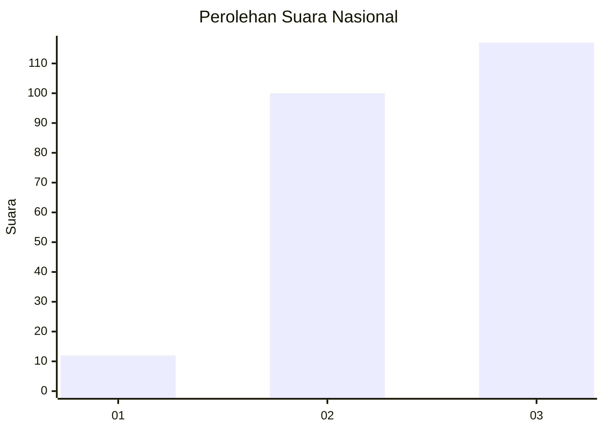
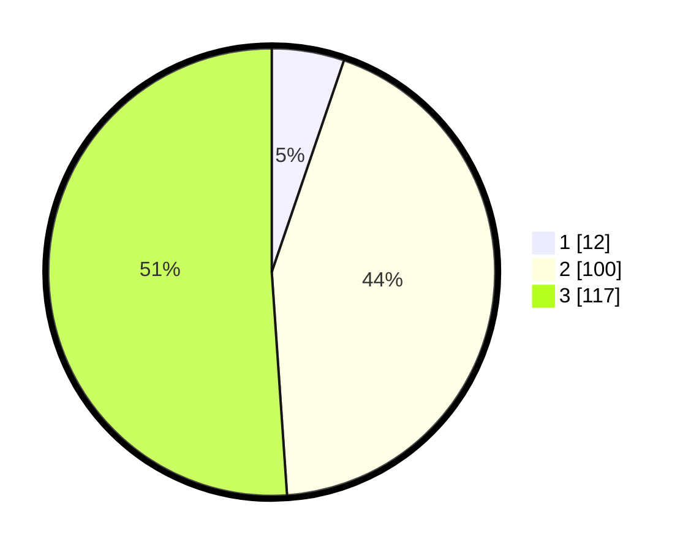

# Hasil

## Grafik

## Tabel

| No. | Nama Paslon    | Suara | Suara (raw) | Persentase |
|:--- |:-------------- | -----:| -----------:| ----------:|
| 1   | ANIES MUHAIMIN | 12    | [12][p-1]   | 5,24       |
| 2   | PRABOWO GIBRAN | 100   | [100][p-2]  | 43,67      |
| 3   | GANJAR MAHFUD  | 117   | [117][p-3]  | 51,09      |

[p-1]: https://github.com/gigit-pemilu/pemilu-2024/blob/main/pilpres/hitung-suara/sub/51-bali/sub/06-bangli/sub/04-kintamani/sub/2046-siakin/sub/004-tps/sub/paslon-1.txt
[p-2]: https://github.com/gigit-pemilu/pemilu-2024/blob/main/pilpres/hitung-suara/sub/51-bali/sub/06-bangli/sub/04-kintamani/sub/2046-siakin/sub/004-tps/sub/paslon-2.txt
[p-3]: https://github.com/gigit-pemilu/pemilu-2024/blob/main/pilpres/hitung-suara/sub/51-bali/sub/06-bangli/sub/04-kintamani/sub/2046-siakin/sub/004-tps/sub/paslon-3.txt

## Foto C Plano

https://sirekap-obj-formc.kpu.go.id/a051/pemilu/ppwp/51/06/04/20/46/5106042046004-20240215-014622--8e7c0ec5-38a1-493c-9497-fe074bdee2fa.jpg

https://sirekap-obj-formc.kpu.go.id/a051/pemilu/ppwp/51/06/04/20/46/5106042046004-20240215-014749--05c881de-69a4-403f-8142-eff9558b7b0f.jpg

https://sirekap-obj-formc.kpu.go.id/a051/pemilu/ppwp/51/06/04/20/46/5106042046004-20240215-014915--e7236e47-a470-42c9-8b34-9fd4e57a171e.jpg

## Metadata

| Key        | Value               |
| ---------- | ------------------- |
| Time Stamp | 2024-02-24 22:31:28 |

