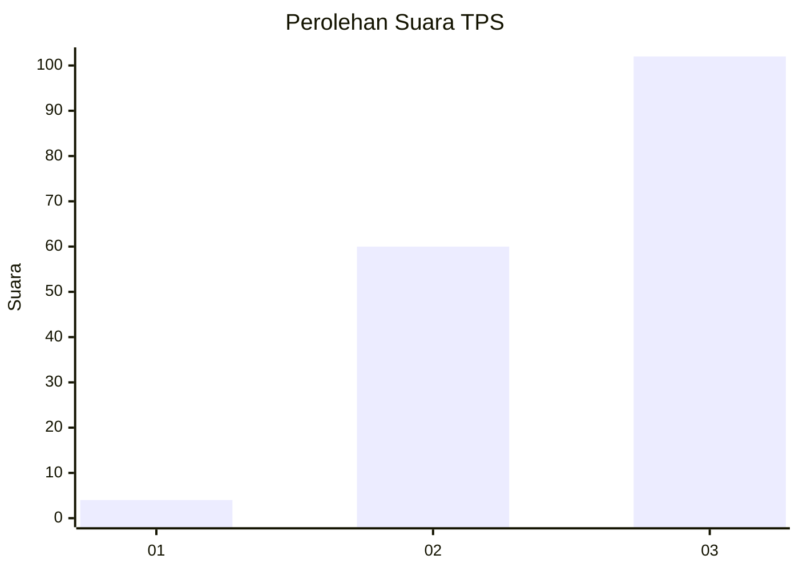
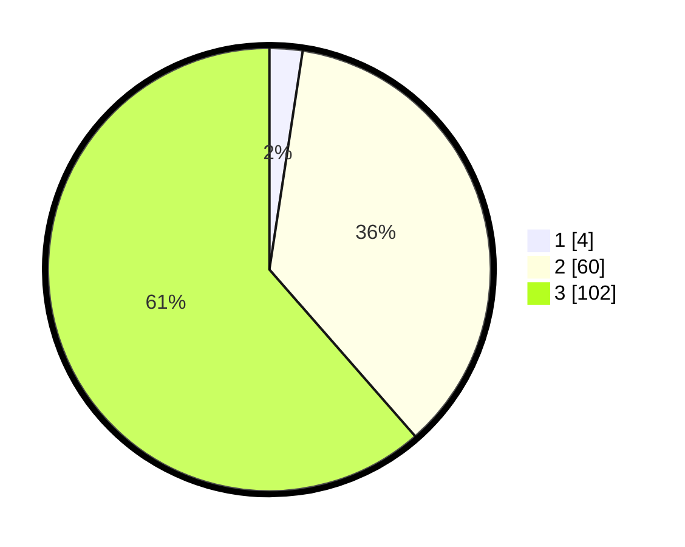

# Hasil

## Grafik

## Tabel

| No. | Nama Paslon    | Suara | Suara (raw) | Persentase |
|:--- |:-------------- | -----:| -----------:| ----------:|
| 1   | ANIES MUHAIMIN | 4     | [4][p-1]    | 2,41       |
| 2   | PRABOWO GIBRAN | 60    | [60][p-2]   | 36,14      |
| 3   | GANJAR MAHFUD  | 102   | [102][p-3]  | 61,45      |

[p-1]: https://github.com/gigit-pemilu/pemilu-2024-51-bali/blob/main/pilpres/hitung-suara/sub/51-bali/sub/06-bangli/sub/04-kintamani/sub/2046-siakin/sub/006-tps/sub/paslon-1.txt
[p-2]: https://github.com/gigit-pemilu/pemilu-2024-51-bali/blob/main/pilpres/hitung-suara/sub/51-bali/sub/06-bangli/sub/04-kintamani/sub/2046-siakin/sub/006-tps/sub/paslon-2.txt
[p-3]: https://github.com/gigit-pemilu/pemilu-2024-51-bali/blob/main/pilpres/hitung-suara/sub/51-bali/sub/06-bangli/sub/04-kintamani/sub/2046-siakin/sub/006-tps/sub/paslon-3.txt

## Foto C Plano

https://sirekap-obj-formc.kpu.go.id/dc26/pemilu/ppwp/51/06/04/20/46/5106042046006-20240215-005218--1b5a70aa-30cd-461f-a183-9f4ba43e8598.jpg

https://sirekap-obj-formc.kpu.go.id/dc26/pemilu/ppwp/51/06/04/20/46/5106042046006-20240215-005438--af6d147a-1681-4ac4-a8b0-e0cdf0f35172.jpg

https://sirekap-obj-formc.kpu.go.id/dc26/pemilu/ppwp/51/06/04/20/46/5106042046006-20240215-005627--c0b74a43-1a02-4d09-8a6d-15ee36c6427c.jpg

## Metadata

| Key        | Value               |
| ---------- | ------------------- |
| Time Stamp | 2024-02-24 22:31:28 |

