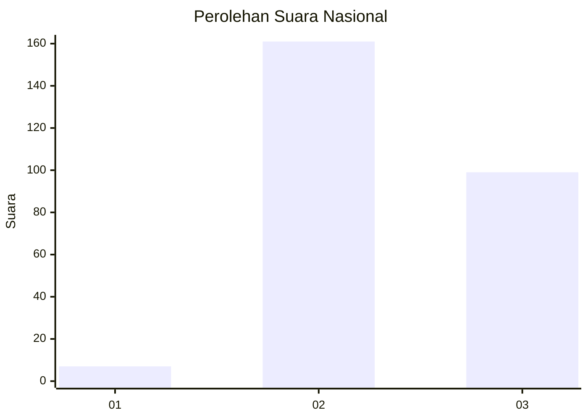
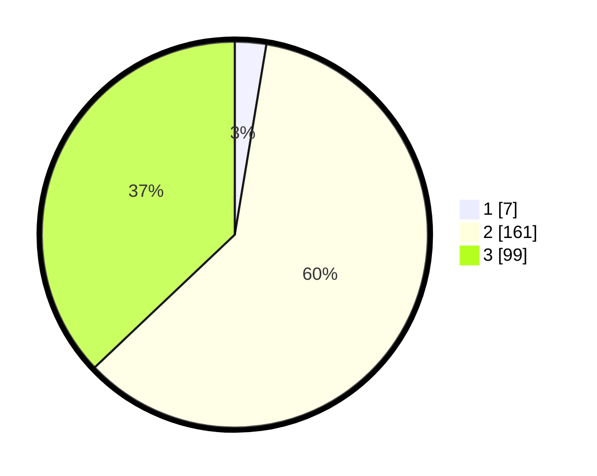

# Hasil

## Grafik

## Tabel

| No. | Nama Paslon    | Suara | Suara (raw) | Persentase |
|:--- |:-------------- | -----:| -----------:| ----------:|
| 1   | ANIES MUHAIMIN | 7     | [7][p-1]    | 2,62       |
| 2   | PRABOWO GIBRAN | 161   | [161][p-2]  | 60,30      |
| 3   | GANJAR MAHFUD  | 99    | [99][p-3]   | 37,08      |

[p-1]: https://github.com/gigit-pemilu/pemilu-2024/blob/main/pilpres/hitung-suara/sub/51-bali/sub/06-bangli/sub/04-kintamani/sub/2048-belandingan/sub/002-tps/sub/paslon-1.txt
[p-2]: https://github.com/gigit-pemilu/pemilu-2024/blob/main/pilpres/hitung-suara/sub/51-bali/sub/06-bangli/sub/04-kintamani/sub/2048-belandingan/sub/002-tps/sub/paslon-2.txt
[p-3]: https://github.com/gigit-pemilu/pemilu-2024/blob/main/pilpres/hitung-suara/sub/51-bali/sub/06-bangli/sub/04-kintamani/sub/2048-belandingan/sub/002-tps/sub/paslon-3.txt

## Foto C Plano

https://sirekap-obj-formc.kpu.go.id/1c37/pemilu/ppwp/51/06/04/20/48/5106042048002-20240214-220554--26eb840a-00db-4905-908b-139712300176.jpg

https://sirekap-obj-formc.kpu.go.id/1c37/pemilu/ppwp/51/06/04/20/48/5106042048002-20240214-214302--bed14879-0c80-408e-bfd9-cfff60f02fa2.jpg

https://sirekap-obj-formc.kpu.go.id/1c37/pemilu/ppwp/51/06/04/20/48/5106042048002-20240214-214647--19128069-bc9b-4d4f-96ac-f576abf85599.jpg

## Metadata

| Key        | Value               |
| ---------- | ------------------- |
| Time Stamp | 2024-02-24 22:31:28 |

