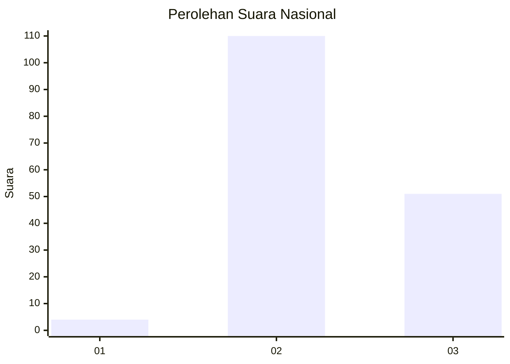
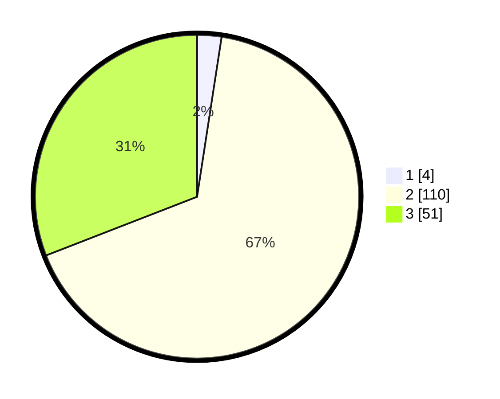

# Hasil

## Grafik

## Tabel

| No. | Nama Paslon    | Suara | Suara (raw) | Persentase |
|:--- |:-------------- | -----:| -----------:| ----------:|
| 1   | ANIES MUHAIMIN | 4     | [4][p-1]    | 2,42       |
| 2   | PRABOWO GIBRAN | 110   | [110][p-2]  | 66,67      |
| 3   | GANJAR MAHFUD  | 51    | [51][p-3]   | 30,91      |

[p-1]: https://github.com/gigit-pemilu/pemilu-2024/blob/main/pilpres/hitung-suara/sub/51-bali/sub/06-bangli/sub/04-kintamani/sub/2048-belandingan/sub/003-tps/sub/paslon-1.txt
[p-2]: https://github.com/gigit-pemilu/pemilu-2024/blob/main/pilpres/hitung-suara/sub/51-bali/sub/06-bangli/sub/04-kintamani/sub/2048-belandingan/sub/003-tps/sub/paslon-2.txt
[p-3]: https://github.com/gigit-pemilu/pemilu-2024/blob/main/pilpres/hitung-suara/sub/51-bali/sub/06-bangli/sub/04-kintamani/sub/2048-belandingan/sub/003-tps/sub/paslon-3.txt

## Foto C Plano

https://sirekap-obj-formc.kpu.go.id/3160/pemilu/ppwp/51/06/04/20/48/5106042048003-20240214-230353--3ce2af92-6ee2-4d0f-8b29-5eec7e315d32.jpg

https://sirekap-obj-formc.kpu.go.id/3160/pemilu/ppwp/51/06/04/20/48/5106042048003-20240214-230522--1f527bd3-585b-4970-99b2-7084a567ac47.jpg

https://sirekap-obj-formc.kpu.go.id/3160/pemilu/ppwp/51/06/04/20/48/5106042048003-20240214-230642--09868f91-2734-4cde-b784-d3a289f0cda5.jpg

## Metadata

| Key        | Value               |
| ---------- | ------------------- |
| Time Stamp | 2024-02-24 22:31:28 |

