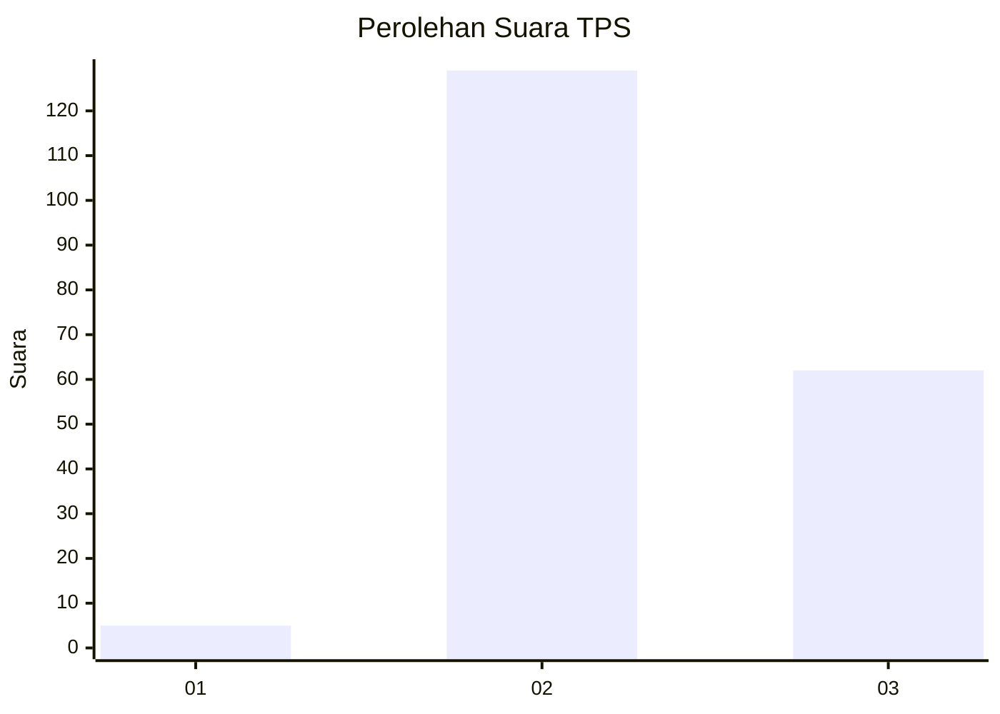
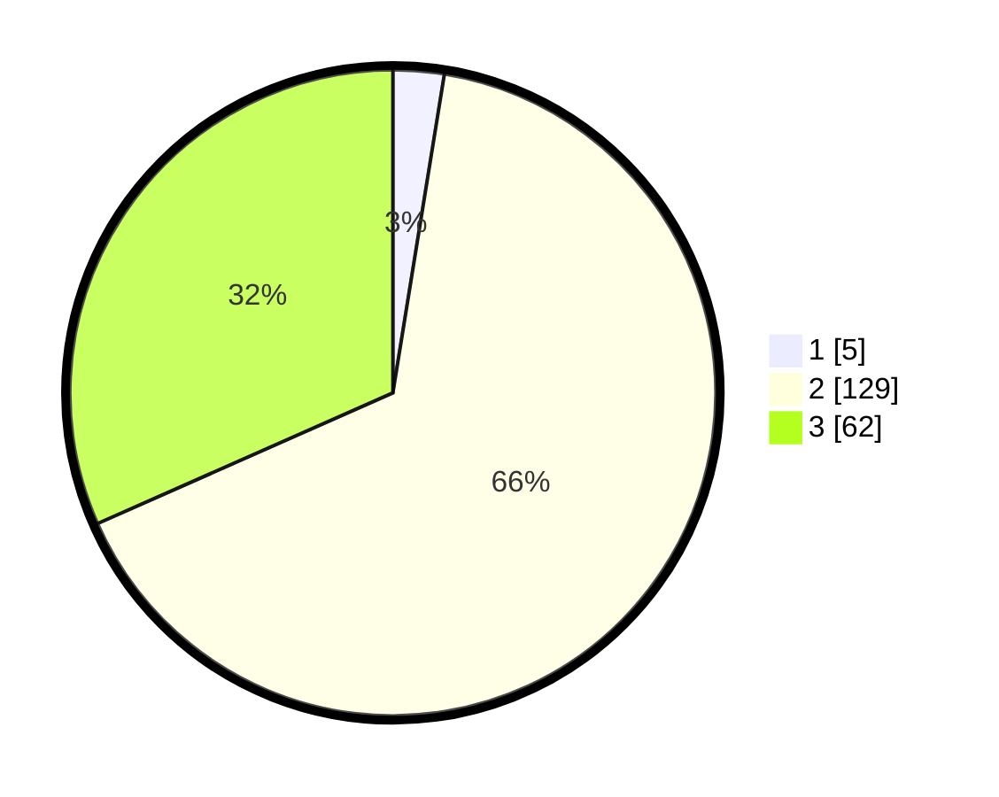

# Hasil

## Grafik

## Tabel

| No. | Nama Paslon    | Suara | Suara (raw) | Persentase |
|:--- |:-------------- | -----:| -----------:| ----------:|
| 1   | ANIES MUHAIMIN | 5     | [5][p-1]    | 2,55       |
| 2   | PRABOWO GIBRAN | 129   | [129][p-2]  | 65,82      |
| 3   | GANJAR MAHFUD  | 62    | [62][p-3]   | 31,63      |

[p-1]: https://github.com/gigit-pemilu/pemilu-2024-51-bali/blob/main/pilpres/hitung-suara/sub/51-bali/sub/07-karangasem/sub/01-rendang/sub/2001-nongan/sub/001-tps/sub/paslon-1.txt
[p-2]: https://github.com/gigit-pemilu/pemilu-2024-51-bali/blob/main/pilpres/hitung-suara/sub/51-bali/sub/07-karangasem/sub/01-rendang/sub/2001-nongan/sub/001-tps/sub/paslon-2.txt
[p-3]: https://github.com/gigit-pemilu/pemilu-2024-51-bali/blob/main/pilpres/hitung-suara/sub/51-bali/sub/07-karangasem/sub/01-rendang/sub/2001-nongan/sub/001-tps/sub/paslon-3.txt

## Foto C Plano

https://sirekap-obj-formc.kpu.go.id/2112/pemilu/ppwp/51/07/01/20/01/5107012001001-20240216-150122--1124b584-39f7-40c4-a7db-2a7aba746327.jpg

https://sirekap-obj-formc.kpu.go.id/2112/pemilu/ppwp/51/07/01/20/01/5107012001001-20240216-150124--ff786c39-0549-4a4a-bb65-31bfb128645c.jpg

https://sirekap-obj-formc.kpu.go.id/2112/pemilu/ppwp/51/07/01/20/01/5107012001001-20240216-150123--a3cadeff-4a96-4814-8382-d4c7f27769e6.jpg

## Metadata

| Key        | Value               |
| ---------- | ------------------- |
| Time Stamp | 2024-02-16 16:25:10 |

## DATA PEMILIH TETAP

Jumlah pemilih dalam DPT: **253**.
 * L: **124**.
 * P: **129**.

## DATA PENGGUNA HAK PILIH

Jumlah pengguna hak pilih dalam DPT: **209**.
 * L: **103**.
 * P: **106**.

Jumlah pengguna hak pilih dalam DPTb: **1**.
 * L: **0**.
 * P: **1**.

Jumlah pengguna hak pilih dalam DPK: **0**.
 * L: **0**.
 * P: **0**.

Jumlah pengguna hak pilih: **210**.
 * L: **103**.
 * P: **107**.

## JUMLAH SUARA SAH DAN TIDAK SAH

JUMLAH SELURUH SUARA SAH: **196**.

JUMLAH SUARA TIDAK SAH: **14**.

JUMLAH SELURUH SUARA SAH DAN SUARA TIDAK SAH: **210**.

