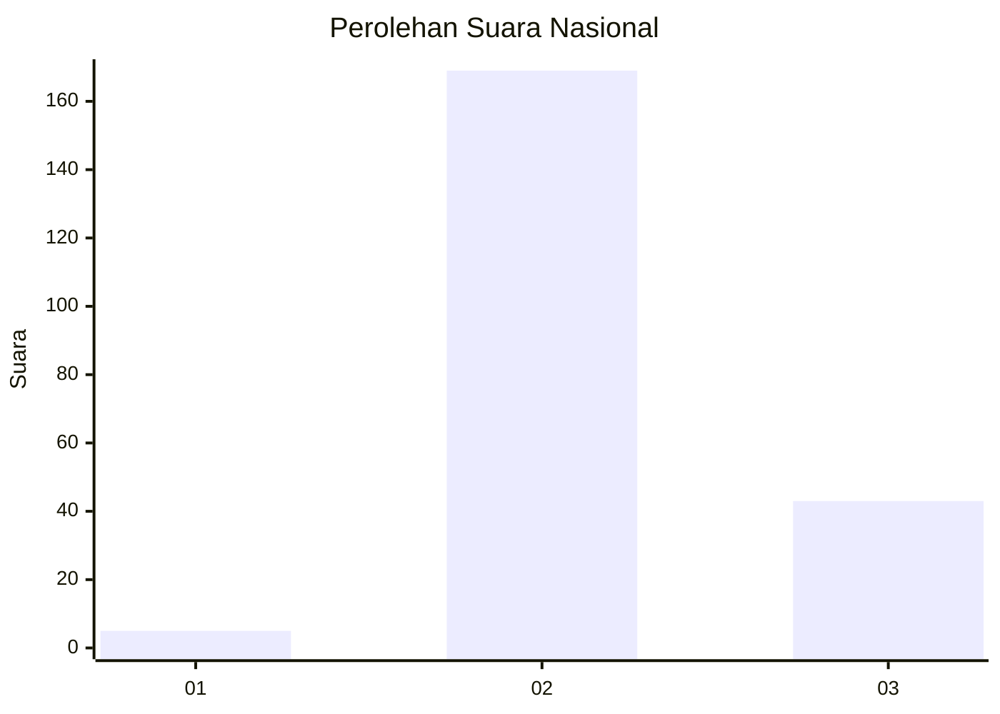

# Hasil

## Grafik

## Tabel

| No. | Nama Paslon    | Suara | Suara (raw) | Persentase |
|:--- |:-------------- | -----:| -----------:| ----------:|
| 1   | ANIES MUHAIMIN | 5     | [5][p-1]    | 2,30       |
| 2   | PRABOWO GIBRAN | 169   | [169][p-2]  | 77,88      |
| 3   | GANJAR MAHFUD  | 43    | [43][p-3]   | 19,82      |

[p-1]: https://github.com/gigit-pemilu/pemilu-2024/blob/main/pilpres/hitung-suara/sub/51-bali/sub/07-karangasem/sub/01-rendang/sub/2001-nongan/sub/002-tps/sub/paslon-1.txt
[p-2]: https://github.com/gigit-pemilu/pemilu-2024/blob/main/pilpres/hitung-suara/sub/51-bali/sub/07-karangasem/sub/01-rendang/sub/2001-nongan/sub/002-tps/sub/paslon-2.txt
[p-3]: https://github.com/gigit-pemilu/pemilu-2024/blob/main/pilpres/hitung-suara/sub/51-bali/sub/07-karangasem/sub/01-rendang/sub/2001-nongan/sub/002-tps/sub/paslon-3.txt

## Foto C Plano

https://sirekap-obj-formc.kpu.go.id/d17b/pemilu/ppwp/51/07/01/20/01/5107012001002-20240214-132619--2746f5f2-f786-415c-90aa-319af492ee62.jpg

## Metadata

| Key        | Value               |
| ---------- | ------------------- |
| Time Stamp | 2024-02-15 00:41:44 |

