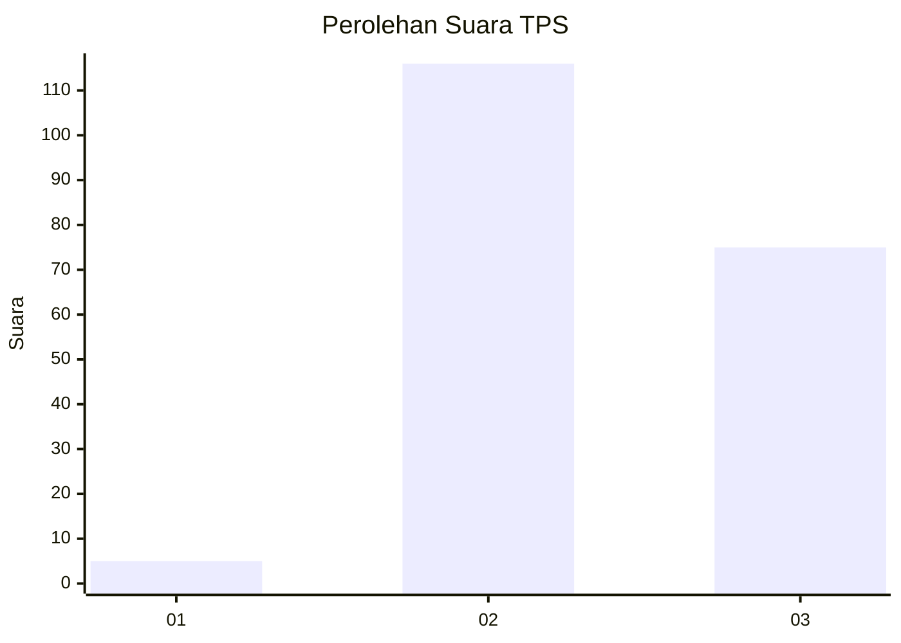
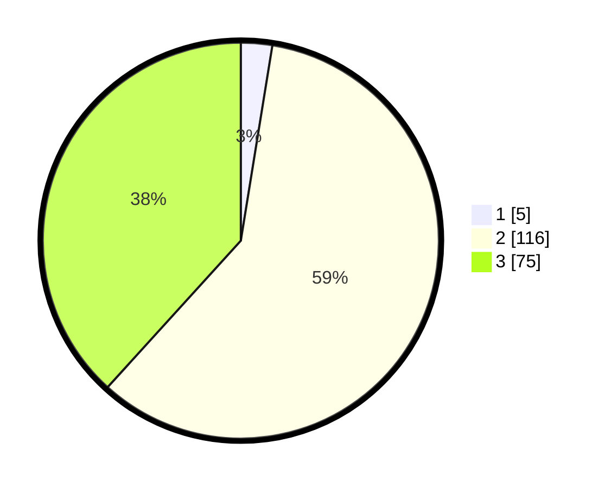

# Hasil

## Grafik

## Tabel

| No. | Nama Paslon    | Suara | Suara (raw) | Persentase |
|:--- |:-------------- | -----:| -----------:| ----------:|
| 1   | ANIES MUHAIMIN | 5     | [5][p-1]    | 2,55       |
| 2   | PRABOWO GIBRAN | 116   | [116][p-2]  | 59,18      |
| 3   | GANJAR MAHFUD  | 75    | [75][p-3]   | 38,27      |

[p-1]: https://github.com/gigit-pemilu/pemilu-2024-51-bali/blob/main/pilpres/hitung-suara/sub/51-bali/sub/07-karangasem/sub/01-rendang/sub/2001-nongan/sub/003-tps/sub/paslon-1.txt
[p-2]: https://github.com/gigit-pemilu/pemilu-2024-51-bali/blob/main/pilpres/hitung-suara/sub/51-bali/sub/07-karangasem/sub/01-rendang/sub/2001-nongan/sub/003-tps/sub/paslon-2.txt
[p-3]: https://github.com/gigit-pemilu/pemilu-2024-51-bali/blob/main/pilpres/hitung-suara/sub/51-bali/sub/07-karangasem/sub/01-rendang/sub/2001-nongan/sub/003-tps/sub/paslon-3.txt

## Foto C Plano

https://sirekap-obj-formc.kpu.go.id/c41e/pemilu/ppwp/51/07/01/20/01/5107012001003-20240216-144807--1f41581e-c2f9-4be8-8d52-5b4b29c45f00.jpg

https://sirekap-obj-formc.kpu.go.id/c41e/pemilu/ppwp/51/07/01/20/01/5107012001003-20240216-144809--404e98de-e215-4575-8b7f-7da82afa723b.jpg

https://sirekap-obj-formc.kpu.go.id/c41e/pemilu/ppwp/51/07/01/20/01/5107012001003-20240216-144808--0b5ea324-8ffd-4ec5-86bf-f0fe7c45e593.jpg

## Metadata

| Key        | Value               |
| ---------- | ------------------- |
| Time Stamp | 2024-02-16 16:25:10 |

## DATA PEMILIH TETAP

Jumlah pemilih dalam DPT: **248**.
 * L: **133**.
 * P: **115**.

## DATA PENGGUNA HAK PILIH

Jumlah pengguna hak pilih dalam DPT: **211**.
 * L: **117**.
 * P: **94**.

Jumlah pengguna hak pilih dalam DPTb: **0**.
 * L: **0**.
 * P: **0**.

Jumlah pengguna hak pilih dalam DPK: **0**.
 * L: **0**.
 * P: **0**.

Jumlah pengguna hak pilih: **211**.
 * L: **117**.
 * P: **94**.

## JUMLAH SUARA SAH DAN TIDAK SAH

JUMLAH SELURUH SUARA SAH: **196**.

JUMLAH SUARA TIDAK SAH: **15**.

JUMLAH SELURUH SUARA SAH DAN SUARA TIDAK SAH: **211**.

