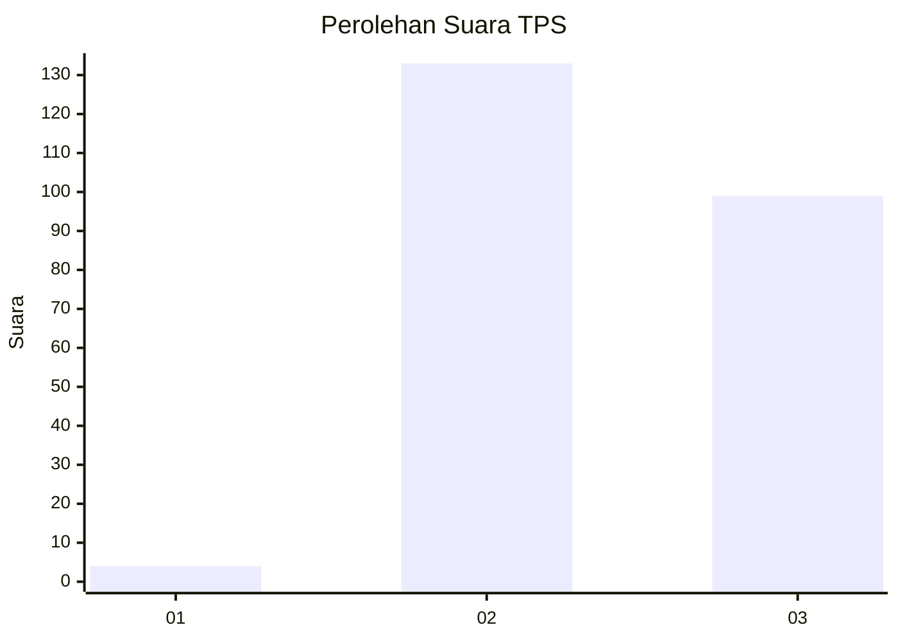
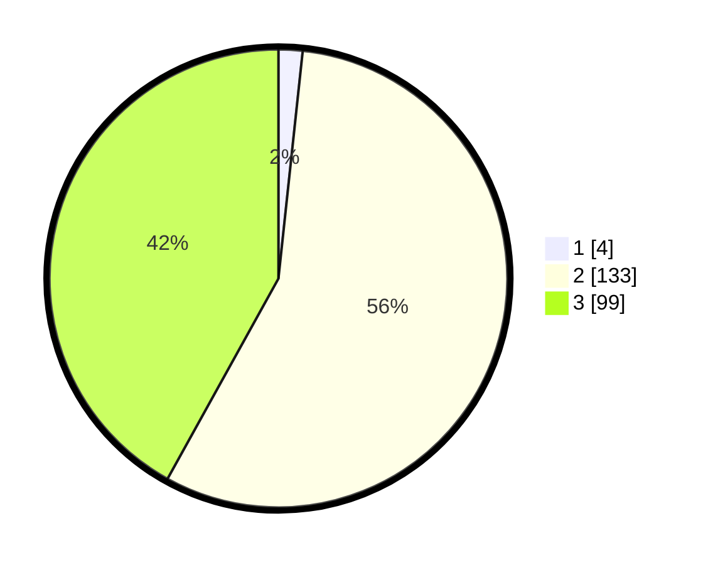

# Hasil

## Grafik

## Tabel

| No. | Nama Paslon    | Suara | Suara (raw) | Persentase |
|:--- |:-------------- | -----:| -----------:| ----------:|
| 1   | ANIES MUHAIMIN | 4     | [4][p-1]    | 1,69       |
| 2   | PRABOWO GIBRAN | 133   | [133][p-2]  | 56,36      |
| 3   | GANJAR MAHFUD  | 99    | [99][p-3]   | 41,95      |

[p-1]: https://github.com/gigit-pemilu/pemilu-2024-51-bali/blob/main/pilpres/hitung-suara/sub/51-bali/sub/07-karangasem/sub/01-rendang/sub/2001-nongan/sub/004-tps/sub/paslon-1.txt
[p-2]: https://github.com/gigit-pemilu/pemilu-2024-51-bali/blob/main/pilpres/hitung-suara/sub/51-bali/sub/07-karangasem/sub/01-rendang/sub/2001-nongan/sub/004-tps/sub/paslon-2.txt
[p-3]: https://github.com/gigit-pemilu/pemilu-2024-51-bali/blob/main/pilpres/hitung-suara/sub/51-bali/sub/07-karangasem/sub/01-rendang/sub/2001-nongan/sub/004-tps/sub/paslon-3.txt

## Foto C Plano

https://sirekap-obj-formc.kpu.go.id/4aad/pemilu/ppwp/51/07/01/20/01/5107012001004-20240216-160248--5aebfa54-1542-4abe-80b7-e727e2c343cb.jpg

https://sirekap-obj-formc.kpu.go.id/4aad/pemilu/ppwp/51/07/01/20/01/5107012001004-20240216-160250--e6df9e93-f55d-4807-897f-16e28c0b083f.jpg

https://sirekap-obj-formc.kpu.go.id/4aad/pemilu/ppwp/51/07/01/20/01/5107012001004-20240216-160249--19a6580e-0ec9-4b71-8ba6-6d25fd15adae.jpg

## Metadata

| Key        | Value               |
| ---------- | ------------------- |
| Time Stamp | 2024-02-16 21:01:00 |

## DATA PEMILIH TETAP

Jumlah pemilih dalam DPT: **275**.
 * L: **132**.
 * P: **143**.

## DATA PENGGUNA HAK PILIH

Jumlah pengguna hak pilih dalam DPT: **236**.
 * L: **114**.
 * P: **122**.

Jumlah pengguna hak pilih dalam DPTb: **0**.
 * L: **0**.
 * P: **0**.

Jumlah pengguna hak pilih dalam DPK: **2**.
 * L: **0**.
 * P: **2**.

Jumlah pengguna hak pilih: **238**.
 * L: **114**.
 * P: **124**.

## JUMLAH SUARA SAH DAN TIDAK SAH

JUMLAH SELURUH SUARA SAH: **236**.

JUMLAH SUARA TIDAK SAH: **2**.

JUMLAH SELURUH SUARA SAH DAN SUARA TIDAK SAH: **238**.

