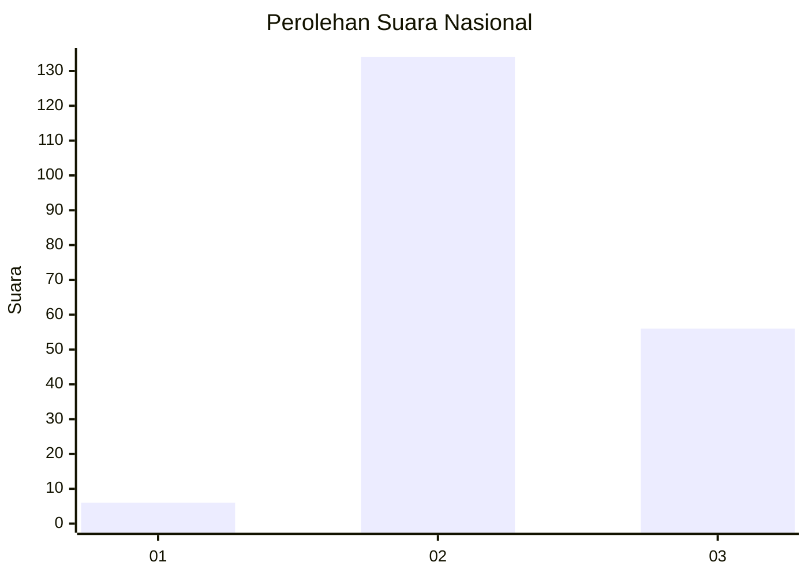
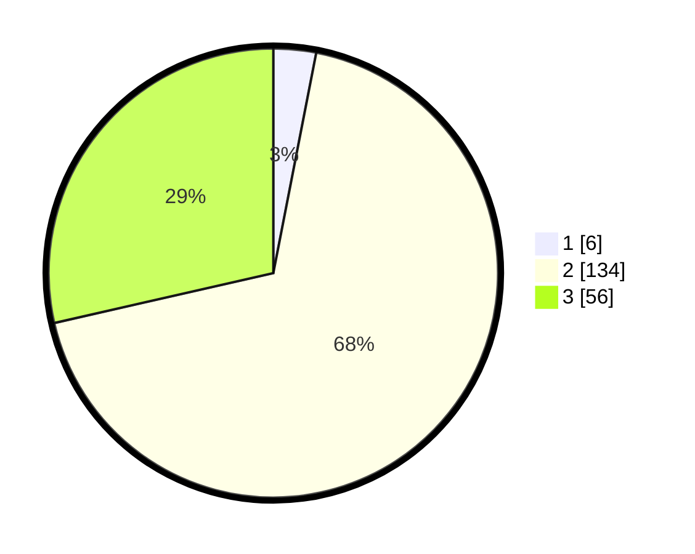

# Hasil

## Grafik

## Tabel

| No. | Nama Paslon    | Suara | Suara (raw) | Persentase |
|:--- |:-------------- | -----:| -----------:| ----------:|
| 1   | ANIES MUHAIMIN | 6     | [6][p-1]    | 3,06       |
| 2   | PRABOWO GIBRAN | 134   | [134][p-2]  | 68,37      |
| 3   | GANJAR MAHFUD  | 56    | [56][p-3]   | 28,57      |

[p-1]: https://github.com/gigit-pemilu/pemilu-2024/blob/main/pilpres/hitung-suara/sub/51-bali/sub/07-karangasem/sub/01-rendang/sub/2001-nongan/sub/005-tps/sub/paslon-1.txt
[p-2]: https://github.com/gigit-pemilu/pemilu-2024/blob/main/pilpres/hitung-suara/sub/51-bali/sub/07-karangasem/sub/01-rendang/sub/2001-nongan/sub/005-tps/sub/paslon-2.txt
[p-3]: https://github.com/gigit-pemilu/pemilu-2024/blob/main/pilpres/hitung-suara/sub/51-bali/sub/07-karangasem/sub/01-rendang/sub/2001-nongan/sub/005-tps/sub/paslon-3.txt

## Foto C Plano

https://sirekap-obj-formc.kpu.go.id/1b37/pemilu/ppwp/51/07/01/20/01/5107012001005-20240216-013130--92c968e4-e0a8-4878-bc82-8c78c36e9362.jpg

https://sirekap-obj-formc.kpu.go.id/1b37/pemilu/ppwp/51/07/01/20/01/5107012001005-20240216-015639--be6f24f3-cb3c-4fce-9ec1-c73551e0d428.jpg

https://sirekap-obj-formc.kpu.go.id/1b37/pemilu/ppwp/51/07/01/20/01/5107012001005-20240216-013131--ca8ed9f0-a5a3-4477-8b33-66add479a62e.jpg

## Metadata

| Key        | Value               |
| ---------- | ------------------- |
| Time Stamp | 2024-02-16 09:30:28 |

## DATA PEMILIH TETAP

Jumlah pemilih dalam DPT: **234**.
 * L: **112**.
 * P: **122**.

## DATA PENGGUNA HAK PILIH

Jumlah pengguna hak pilih dalam DPT: **197**.
 * L: **97**.
 * P: **100**.

Jumlah pengguna hak pilih dalam DPTb: **0**.
 * L: **0**.
 * P: **0**.

Jumlah pengguna hak pilih dalam DPK: **1**.
 * L: **0**.
 * P: **1**.

Jumlah pengguna hak pilih: **198**.
 * L: **97**.
 * P: **101**.

## JUMLAH SUARA SAH DAN TIDAK SAH

JUMLAH SELURUH SUARA SAH: **196**.

JUMLAH SUARA TIDAK SAH: **2**.

JUMLAH SELURUH SUARA SAH DAN SUARA TIDAK SAH: **198**.

