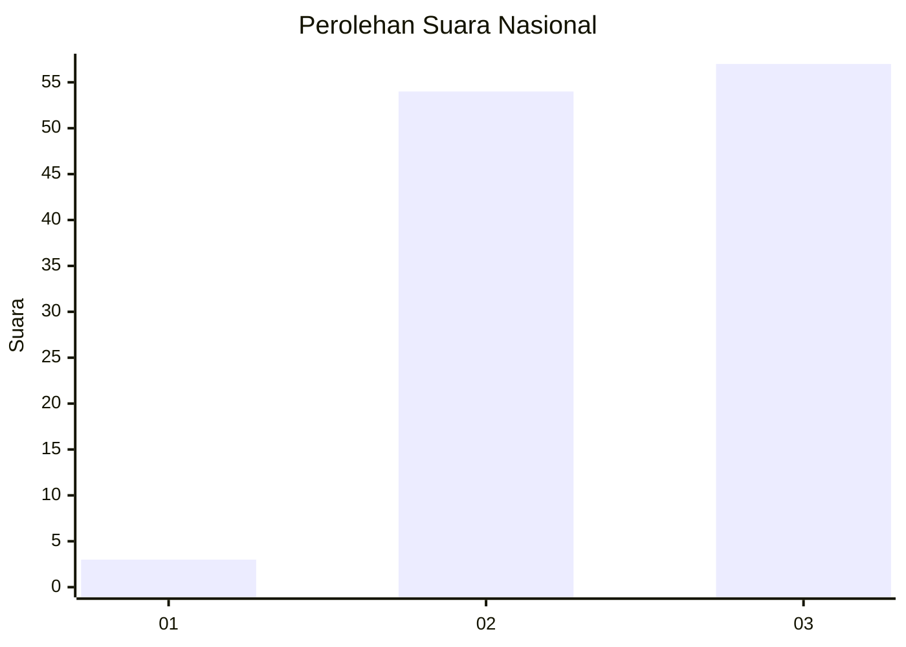
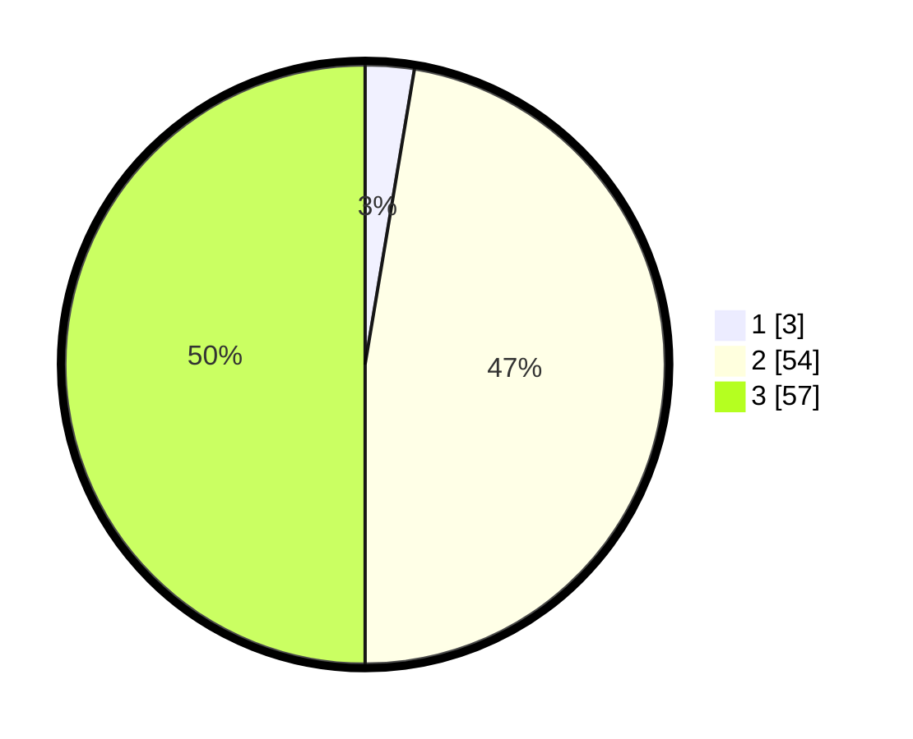

# Hasil

## Grafik

## Tabel

| No. | Nama Paslon    | Suara | Suara (raw) | Persentase |
|:--- |:-------------- | -----:| -----------:| ----------:|
| 1   | ANIES MUHAIMIN | 3     | [3][p-1]    | 2,63       |
| 2   | PRABOWO GIBRAN | 54    | [54][p-2]   | 47,37      |
| 3   | GANJAR MAHFUD  | 57    | [57][p-3]   | 50,00      |

[p-1]: https://github.com/gigit-pemilu/pemilu-2024/blob/main/pilpres/hitung-suara/sub/51-bali/sub/07-karangasem/sub/01-rendang/sub/2001-nongan/sub/011-tps/sub/paslon-1.txt
[p-2]: https://github.com/gigit-pemilu/pemilu-2024/blob/main/pilpres/hitung-suara/sub/51-bali/sub/07-karangasem/sub/01-rendang/sub/2001-nongan/sub/011-tps/sub/paslon-2.txt
[p-3]: https://github.com/gigit-pemilu/pemilu-2024/blob/main/pilpres/hitung-suara/sub/51-bali/sub/07-karangasem/sub/01-rendang/sub/2001-nongan/sub/011-tps/sub/paslon-3.txt

## Foto C Plano

https://sirekap-obj-formc.kpu.go.id/f625/pemilu/ppwp/51/07/01/20/01/5107012001011-20240215-205942--aea895a7-e9fc-4965-af43-69b9ad3198c0.jpg

https://sirekap-obj-formc.kpu.go.id/f625/pemilu/ppwp/51/07/01/20/01/5107012001011-20240215-205944--754a3a06-e1f7-417d-ae84-aef5f58e0ff9.jpg

https://sirekap-obj-formc.kpu.go.id/f625/pemilu/ppwp/51/07/01/20/01/5107012001011-20240215-205943--f4ebe211-7b29-44c0-969a-5a1848f46471.jpg

## Metadata

| Key        | Value               |
| ---------- | ------------------- |
| Time Stamp | 2024-02-16 09:30:28 |

## DATA PEMILIH TETAP

Jumlah pemilih dalam DPT: **145**.
 * L: **78**.
 * P: **67**.

## DATA PENGGUNA HAK PILIH

Jumlah pengguna hak pilih dalam DPT: **127**.
 * L: **70**.
 * P: **57**.

Jumlah pengguna hak pilih dalam DPTb: **0**.
 * L: **0**.
 * P: **0**.

Jumlah pengguna hak pilih dalam DPK: **0**.
 * L: **0**.
 * P: **0**.

Jumlah pengguna hak pilih: **127**.
 * L: **70**.
 * P: **57**.

## JUMLAH SUARA SAH DAN TIDAK SAH

JUMLAH SELURUH SUARA SAH: **114**.

JUMLAH SUARA TIDAK SAH: **13**.

JUMLAH SELURUH SUARA SAH DAN SUARA TIDAK SAH: **127**.

