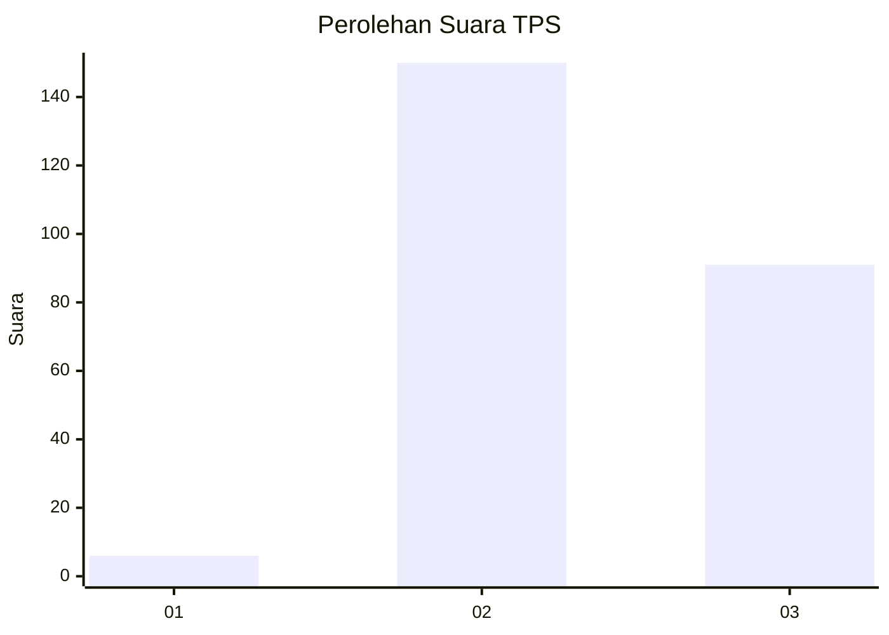
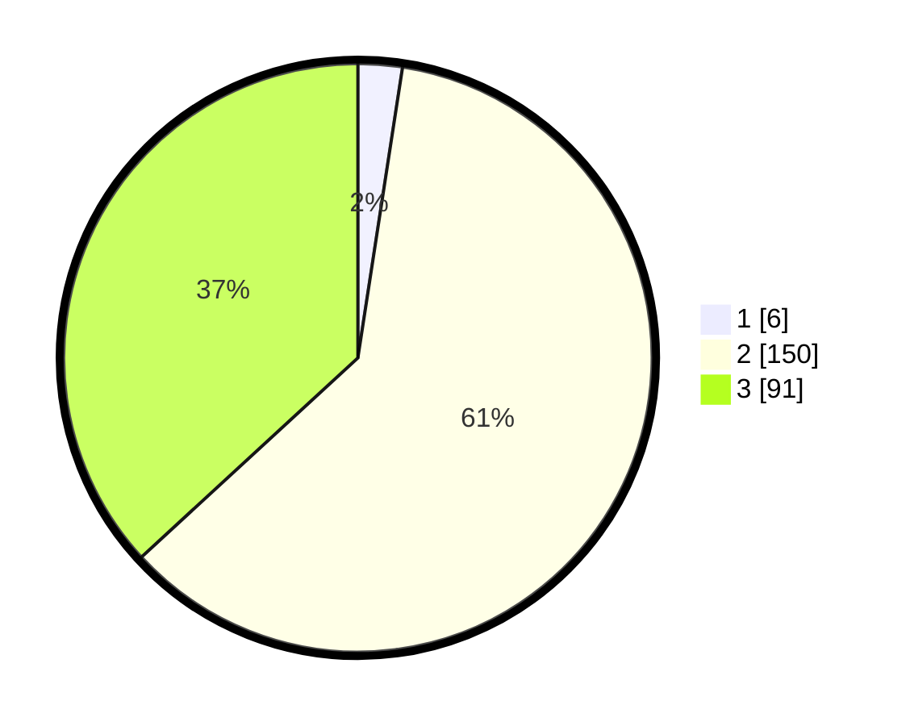

# Hasil

## Grafik

## Tabel

| No. | Nama Paslon    | Suara | Suara (raw) | Persentase |
|:--- |:-------------- | -----:| -----------:| ----------:|
| 1   | ANIES MUHAIMIN | 6     | [6][p-1]    | 2,43       |
| 2   | PRABOWO GIBRAN | 150   | [150][p-2]  | 60,73      |
| 3   | GANJAR MAHFUD  | 91    | [91][p-3]   | 36,84      |

[p-1]: https://github.com/gigit-pemilu/pemilu-2024-51-bali/blob/main/pilpres/hitung-suara/sub/51-bali/sub/07-karangasem/sub/01-rendang/sub/2001-nongan/sub/013-tps/sub/paslon-1.txt
[p-2]: https://github.com/gigit-pemilu/pemilu-2024-51-bali/blob/main/pilpres/hitung-suara/sub/51-bali/sub/07-karangasem/sub/01-rendang/sub/2001-nongan/sub/013-tps/sub/paslon-2.txt
[p-3]: https://github.com/gigit-pemilu/pemilu-2024-51-bali/blob/main/pilpres/hitung-suara/sub/51-bali/sub/07-karangasem/sub/01-rendang/sub/2001-nongan/sub/013-tps/sub/paslon-3.txt

## Foto C Plano

https://sirekap-obj-formc.kpu.go.id/b4a3/pemilu/ppwp/51/07/01/20/01/5107012001013-20240222-090423--8b0f7183-5c8b-484a-a710-082f0855c520.jpg

https://sirekap-obj-formc.kpu.go.id/b4a3/pemilu/ppwp/51/07/01/20/01/5107012001013-20240222-090234--9e98bf85-2dff-4dd8-b077-a79481243530.jpg

https://sirekap-obj-formc.kpu.go.id/b4a3/pemilu/ppwp/51/07/01/20/01/5107012001013-20240222-091248--3ba85b3d-2dde-4ff2-b520-891772f5eca9.jpg

## Metadata

| Key        | Value               |
| ---------- | ------------------- |
| Time Stamp | 2024-02-22 10:00:00 |

## DATA PEMILIH TETAP

Jumlah pemilih dalam DPT: **278**.
 * L: **542**.
 * P: **136**.

## DATA PENGGUNA HAK PILIH

Jumlah pengguna hak pilih dalam DPT: **258**.
 * L: **632**.
 * P: **526**.

Jumlah pengguna hak pilih dalam DPTb: **888**.
 * L: **228**.
 * P: **888**.

Jumlah pengguna hak pilih dalam DPK: **0**.
 * L: **0**.
 * P: **0**.

Jumlah pengguna hak pilih: **258**.
 * L: **132**.
 * P: **126**.

## JUMLAH SUARA SAH DAN TIDAK SAH

JUMLAH SELURUH SUARA SAH: **247**.

JUMLAH SUARA TIDAK SAH: **11**.

JUMLAH SELURUH SUARA SAH DAN SUARA TIDAK SAH: **258**.

