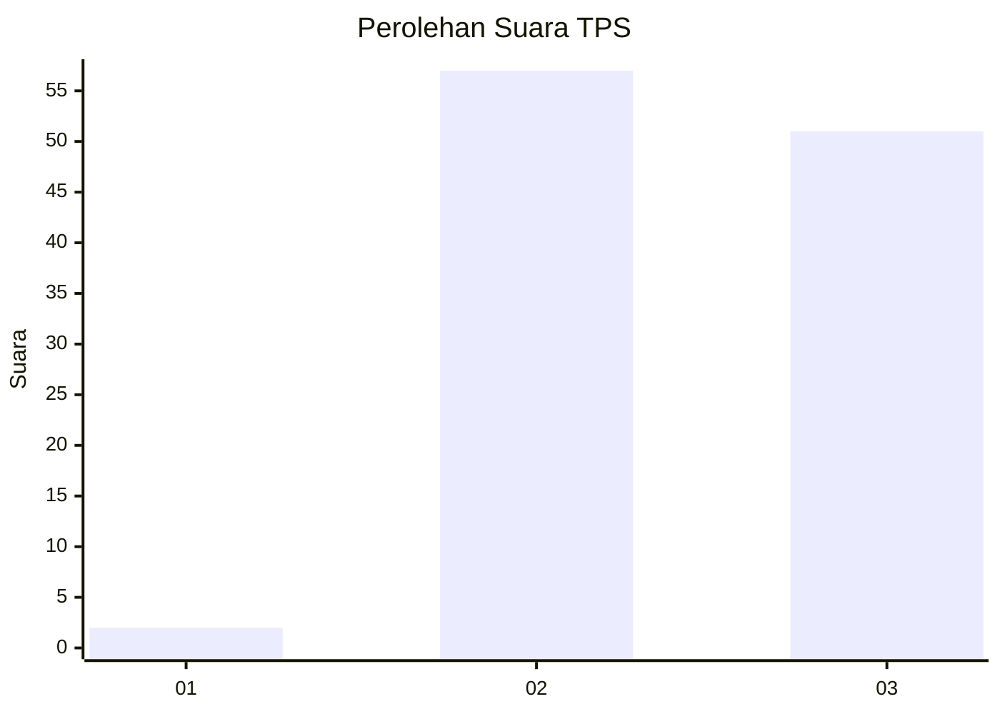
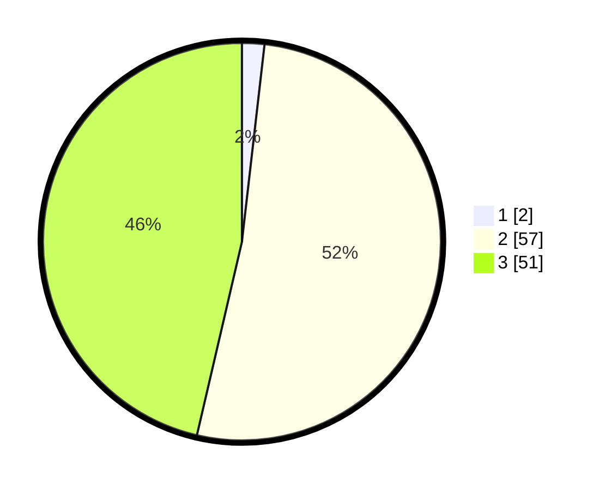

# Hasil

## Grafik

## Tabel

| No. | Nama Paslon    | Suara | Suara (raw) | Persentase |
|:--- |:-------------- | -----:| -----------:| ----------:|
| 1   | ANIES MUHAIMIN | 2     | [2][p-1]    | 1,82       |
| 2   | PRABOWO GIBRAN | 57    | [57][p-2]   | 51,82      |
| 3   | GANJAR MAHFUD  | 51    | [51][p-3]   | 46,36      |

[p-1]: https://github.com/gigit-pemilu/pemilu-2024-51-bali/blob/main/pilpres/hitung-suara/sub/51-bali/sub/07-karangasem/sub/01-rendang/sub/2001-nongan/sub/015-tps/sub/paslon-1.txt
[p-2]: https://github.com/gigit-pemilu/pemilu-2024-51-bali/blob/main/pilpres/hitung-suara/sub/51-bali/sub/07-karangasem/sub/01-rendang/sub/2001-nongan/sub/015-tps/sub/paslon-2.txt
[p-3]: https://github.com/gigit-pemilu/pemilu-2024-51-bali/blob/main/pilpres/hitung-suara/sub/51-bali/sub/07-karangasem/sub/01-rendang/sub/2001-nongan/sub/015-tps/sub/paslon-3.txt

## Foto C Plano

https://sirekap-obj-formc.kpu.go.id/6c2a/pemilu/ppwp/51/07/01/20/01/5107012001015-20240223-150445--94336e22-3628-481f-a6e6-22790faf9187.jpg

https://sirekap-obj-formc.kpu.go.id/6c2a/pemilu/ppwp/51/07/01/20/01/5107012001015-20240223-150610--1d104830-9d41-4e59-ad8d-0f72d980d13c.jpg

https://sirekap-obj-formc.kpu.go.id/6c2a/pemilu/ppwp/51/07/01/20/01/5107012001015-20240223-150709--29ee1106-a20d-49dd-bf4b-cef77491fe81.jpg

## Metadata

| Key        | Value               |
| ---------- | ------------------- |
| Time Stamp | 2024-02-24 22:31:28 |

## DATA PEMILIH TETAP

Jumlah pemilih dalam DPT: **130**.
 * L: **61**.
 * P: **69**.

## DATA PENGGUNA HAK PILIH

Jumlah pengguna hak pilih dalam DPT: **142**.
 * L: **52**.
 * P: **60**.

Jumlah pengguna hak pilih dalam DPTb: **802**.
 * L: **800**.
 * P: **85**.

Jumlah pengguna hak pilih dalam DPK: **0**.
 * L: **600**.
 * P: **0**.

Jumlah pengguna hak pilih: **113**.
 * L: **52**.
 * P: **61**.

## JUMLAH SUARA SAH DAN TIDAK SAH

JUMLAH SELURUH SUARA SAH: **110**.

JUMLAH SUARA TIDAK SAH: **3**.

JUMLAH SELURUH SUARA SAH DAN SUARA TIDAK SAH: **113**.

