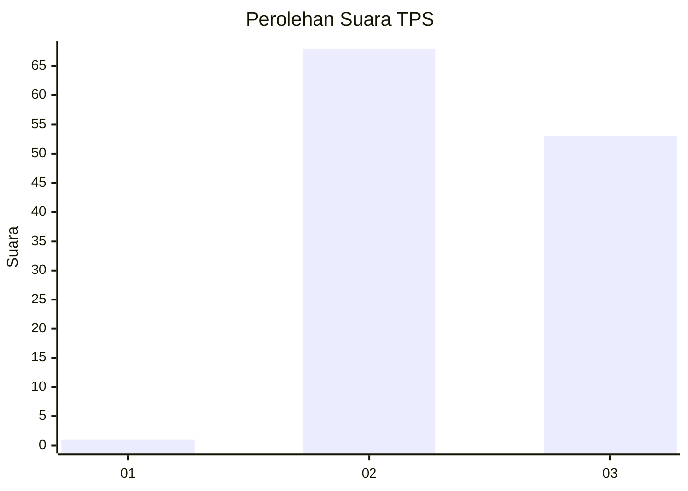
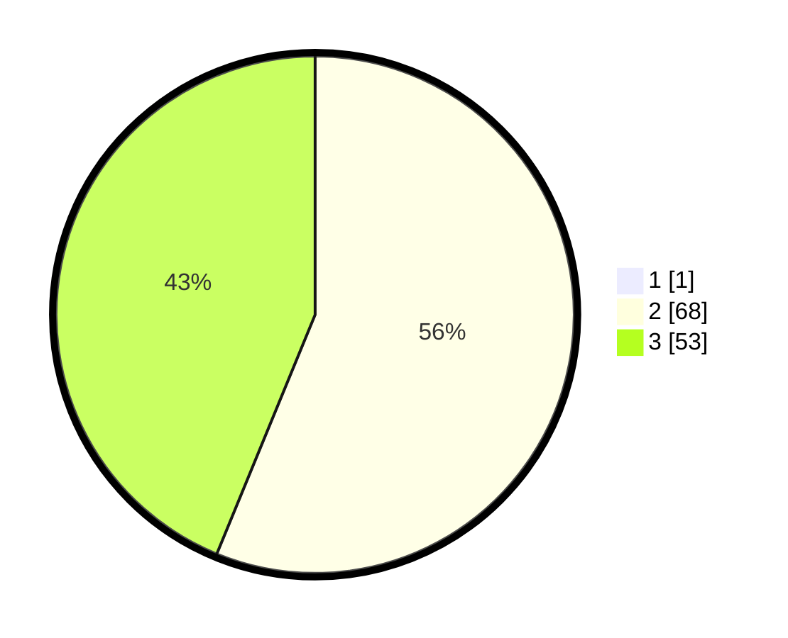

# Hasil

## Grafik

## Tabel

| No. | Nama Paslon    | Suara | Suara (raw) | Persentase |
|:--- |:-------------- | -----:| -----------:| ----------:|
| 1   | ANIES MUHAIMIN | 1     | [1][p-1]    | 0,82       |
| 2   | PRABOWO GIBRAN | 68    | [68][p-2]   | 55,74      |
| 3   | GANJAR MAHFUD  | 53    | [53][p-3]   | 43,44      |

[p-1]: https://github.com/gigit-pemilu/pemilu-2024-51-bali/blob/main/pilpres/hitung-suara/sub/51-bali/sub/07-karangasem/sub/01-rendang/sub/2001-nongan/sub/018-tps/sub/paslon-1.txt
[p-2]: https://github.com/gigit-pemilu/pemilu-2024-51-bali/blob/main/pilpres/hitung-suara/sub/51-bali/sub/07-karangasem/sub/01-rendang/sub/2001-nongan/sub/018-tps/sub/paslon-2.txt
[p-3]: https://github.com/gigit-pemilu/pemilu-2024-51-bali/blob/main/pilpres/hitung-suara/sub/51-bali/sub/07-karangasem/sub/01-rendang/sub/2001-nongan/sub/018-tps/sub/paslon-3.txt

## Foto C Plano

https://sirekap-obj-formc.kpu.go.id/8d0a/pemilu/ppwp/51/07/01/20/01/5107012001018-20240216-131126--f7878e5c-2c90-4d17-b53e-dc40bd73ffba.jpg

https://sirekap-obj-formc.kpu.go.id/8d0a/pemilu/ppwp/51/07/01/20/01/5107012001018-20240216-131128--a223270b-29ea-4d3d-adba-a199c976f821.jpg

https://sirekap-obj-formc.kpu.go.id/8d0a/pemilu/ppwp/51/07/01/20/01/5107012001018-20240216-131127--829db83b-70b3-460a-a7d9-b7457606e9cd.jpg

## Metadata

| Key        | Value               |
| ---------- | ------------------- |
| Time Stamp | 2024-02-16 14:00:34 |

## DATA PEMILIH TETAP

Jumlah pemilih dalam DPT: **150**.
 * L: **72**.
 * P: **78**.

## DATA PENGGUNA HAK PILIH

Jumlah pengguna hak pilih dalam DPT: **123**.
 * L: **61**.
 * P: **62**.

Jumlah pengguna hak pilih dalam DPTb: **0**.
 * L: **0**.
 * P: **0**.

Jumlah pengguna hak pilih dalam DPK: **0**.
 * L: **0**.
 * P: **0**.

Jumlah pengguna hak pilih: **123**.
 * L: **61**.
 * P: **62**.

## JUMLAH SUARA SAH DAN TIDAK SAH

JUMLAH SELURUH SUARA SAH: **122**.

JUMLAH SUARA TIDAK SAH: **1**.

JUMLAH SELURUH SUARA SAH DAN SUARA TIDAK SAH: **123**.

