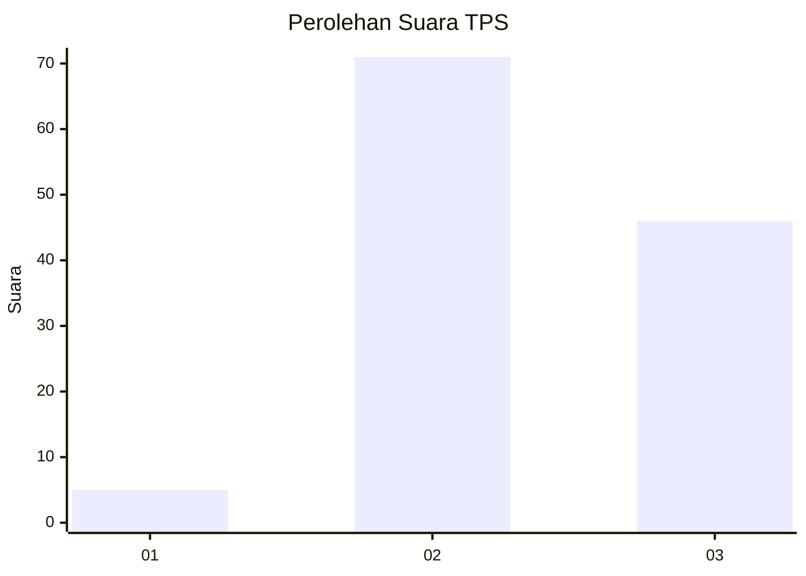
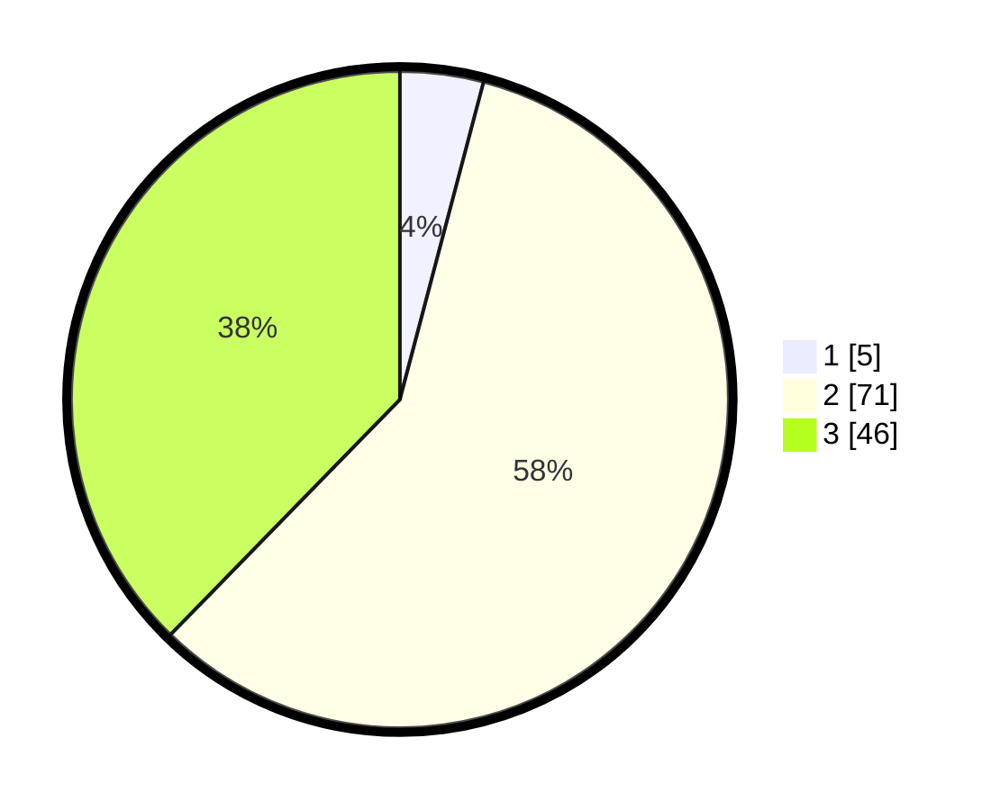

# Hasil

## Grafik

## Tabel

| No. | Nama Paslon    | Suara | Suara (raw) | Persentase |
|:--- |:-------------- | -----:| -----------:| ----------:|
| 1   | ANIES MUHAIMIN | 5     | [5][p-1]    | 4,10       |
| 2   | PRABOWO GIBRAN | 71    | [71][p-2]   | 58,20      |
| 3   | GANJAR MAHFUD  | 46    | [46][p-3]   | 37,70      |

[p-1]: https://github.com/gigit-pemilu/pemilu-2024-51-bali/blob/main/pilpres/hitung-suara/sub/51-bali/sub/07-karangasem/sub/01-rendang/sub/2001-nongan/sub/023-tps/sub/paslon-1.txt
[p-2]: https://github.com/gigit-pemilu/pemilu-2024-51-bali/blob/main/pilpres/hitung-suara/sub/51-bali/sub/07-karangasem/sub/01-rendang/sub/2001-nongan/sub/023-tps/sub/paslon-2.txt
[p-3]: https://github.com/gigit-pemilu/pemilu-2024-51-bali/blob/main/pilpres/hitung-suara/sub/51-bali/sub/07-karangasem/sub/01-rendang/sub/2001-nongan/sub/023-tps/sub/paslon-3.txt

## Foto C Plano

https://sirekap-obj-formc.kpu.go.id/7a78/pemilu/ppwp/51/07/01/20/01/5107012001023-20240216-130427--4952069c-8232-4718-a928-584b31a9ef59.jpg

https://sirekap-obj-formc.kpu.go.id/7a78/pemilu/ppwp/51/07/01/20/01/5107012001023-20240216-130430--238dceee-ab1a-4971-bbcb-347d4873a516.jpg

https://sirekap-obj-formc.kpu.go.id/7a78/pemilu/ppwp/51/07/01/20/01/5107012001023-20240216-130428--a6b998eb-3d5c-4fc3-a72a-793baac84a9d.jpg

## Metadata

| Key        | Value               |
| ---------- | ------------------- |
| Time Stamp | 2024-02-16 14:00:34 |

## DATA PEMILIH TETAP

Jumlah pemilih dalam DPT: **146**.
 * L: **72**.
 * P: **74**.

## DATA PENGGUNA HAK PILIH

Jumlah pengguna hak pilih dalam DPT: **124**.
 * L: **63**.
 * P: **61**.

Jumlah pengguna hak pilih dalam DPTb: **0**.
 * L: **0**.
 * P: **0**.

Jumlah pengguna hak pilih dalam DPK: **4**.
 * L: **3**.
 * P: **1**.

Jumlah pengguna hak pilih: **128**.
 * L: **66**.
 * P: **62**.

## JUMLAH SUARA SAH DAN TIDAK SAH

JUMLAH SELURUH SUARA SAH: **122**.

JUMLAH SUARA TIDAK SAH: **6**.

JUMLAH SELURUH SUARA SAH DAN SUARA TIDAK SAH: **128**.

