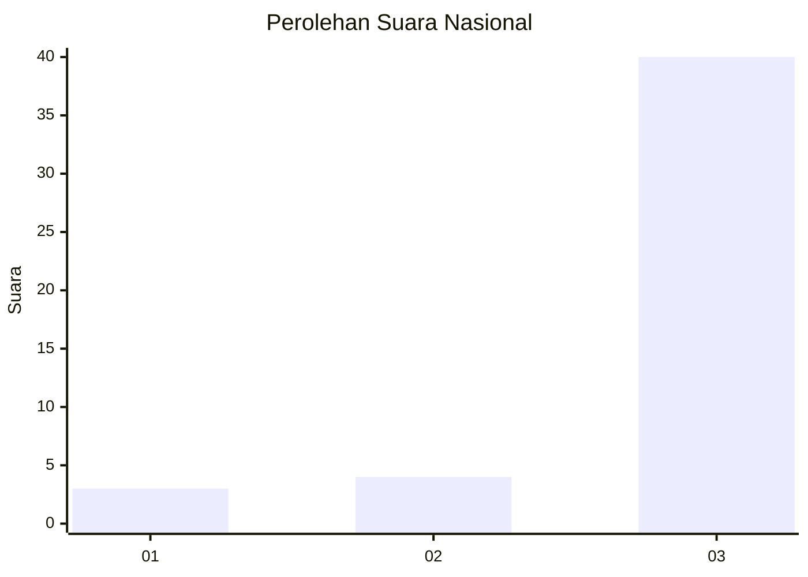
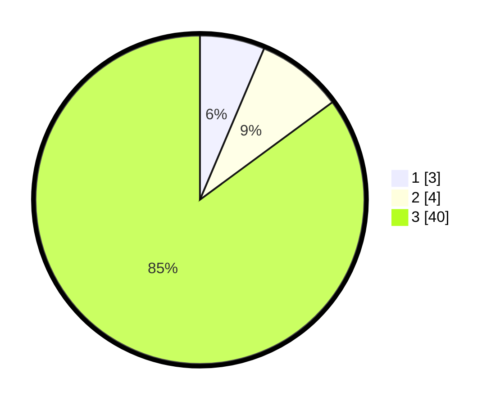

# Hasil

## Grafik

## Tabel

| No. | Nama Paslon    | Suara | Suara (raw) | Persentase |
|:--- |:-------------- | -----:| -----------:| ----------:|
| 1   | ANIES MUHAIMIN | 3     | [3][p-1]    | 6,38       |
| 2   | PRABOWO GIBRAN | 4     | [4][p-2]    | 8,51       |
| 3   | GANJAR MAHFUD  | 40    | [40][p-3]   | 85,11      |

[p-1]: https://github.com/gigit-pemilu/pemilu-2024/blob/main/pilpres/hitung-suara/sub/51-bali/sub/07-karangasem/sub/01-rendang/sub/2002-rendang/sub/001-tps/sub/paslon-1.txt
[p-2]: https://github.com/gigit-pemilu/pemilu-2024/blob/main/pilpres/hitung-suara/sub/51-bali/sub/07-karangasem/sub/01-rendang/sub/2002-rendang/sub/001-tps/sub/paslon-2.txt
[p-3]: https://github.com/gigit-pemilu/pemilu-2024/blob/main/pilpres/hitung-suara/sub/51-bali/sub/07-karangasem/sub/01-rendang/sub/2002-rendang/sub/001-tps/sub/paslon-3.txt

## Foto C Plano

https://sirekap-obj-formc.kpu.go.id/b5a3/pemilu/ppwp/51/07/01/20/02/5107012002001-20240222-153209--6d348e78-3689-4f79-984f-79678d199a4b.jpg

https://sirekap-obj-formc.kpu.go.id/b5a3/pemilu/ppwp/51/07/01/20/02/5107012002001-20240222-153318--332171da-b9f2-4360-95fe-a90887e0d446.jpg

https://sirekap-obj-formc.kpu.go.id/b5a3/pemilu/ppwp/51/07/01/20/02/5107012002001-20240222-153406--7d106fec-9523-4c47-9a61-4de4dd1288e1.jpg

## Metadata

| Key        | Value               |
| ---------- | ------------------- |
| Time Stamp | 2024-02-22 16:00:00 |

## DATA PEMILIH TETAP

Jumlah pemilih dalam DPT: **193**.
 * L: **109**.
 * P: **84**.

## DATA PENGGUNA HAK PILIH

Jumlah pengguna hak pilih dalam DPT: **150**.
 * L: **89**.
 * P: **61**.

Jumlah pengguna hak pilih dalam DPTb: **887**.
 * L: **888**.
 * P: **887**.

Jumlah pengguna hak pilih dalam DPK: **2**.
 * L: **4**.
 * P: **1**.

Jumlah pengguna hak pilih: **753**.
 * L: **90**.
 * P: **63**.

## JUMLAH SUARA SAH DAN TIDAK SAH

JUMLAH SELURUH SUARA SAH: **147**.

JUMLAH SUARA TIDAK SAH: **86**.

JUMLAH SELURUH SUARA SAH DAN SUARA TIDAK SAH: **153**.

