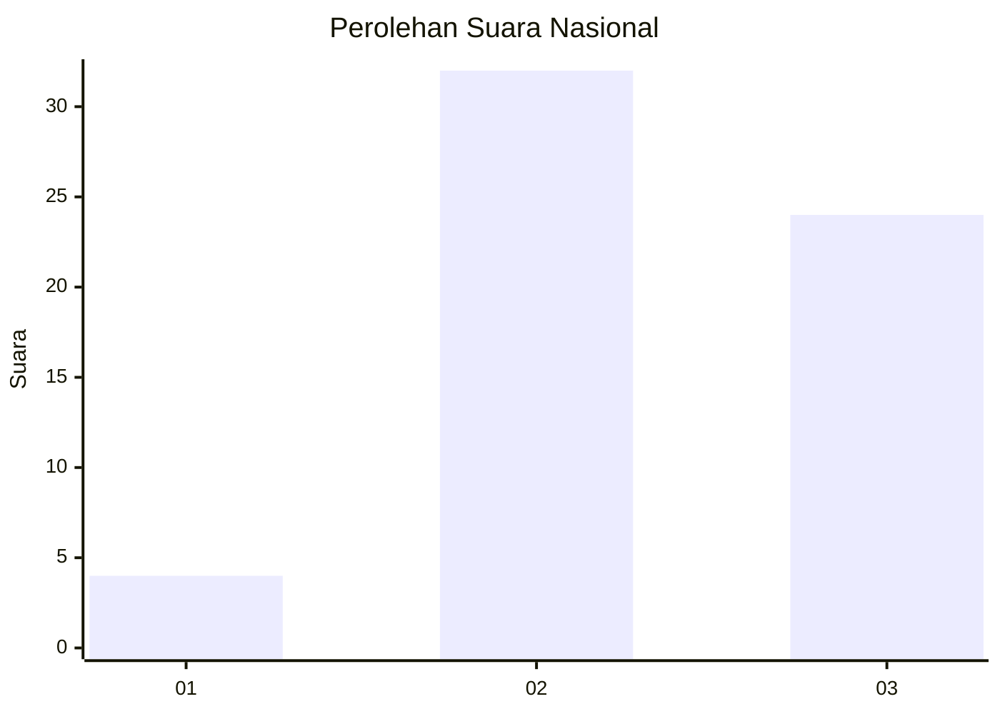
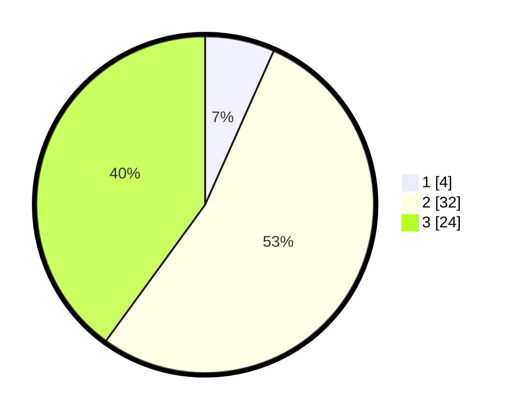

# Hasil

## Grafik

## Tabel

| No. | Nama Paslon    | Suara | Suara (raw) | Persentase |
|:--- |:-------------- | -----:| -----------:| ----------:|
| 1   | ANIES MUHAIMIN | 4     | [4][p-1]    | 6,67       |
| 2   | PRABOWO GIBRAN | 32    | [32][p-2]   | 53,33      |
| 3   | GANJAR MAHFUD  | 24    | [24][p-3]   | 40,00      |

[p-1]: https://github.com/gigit-pemilu/pemilu-2024/blob/main/pilpres/hitung-suara/sub/51-bali/sub/07-karangasem/sub/01-rendang/sub/2002-rendang/sub/002-tps/sub/paslon-1.txt
[p-2]: https://github.com/gigit-pemilu/pemilu-2024/blob/main/pilpres/hitung-suara/sub/51-bali/sub/07-karangasem/sub/01-rendang/sub/2002-rendang/sub/002-tps/sub/paslon-2.txt
[p-3]: https://github.com/gigit-pemilu/pemilu-2024/blob/main/pilpres/hitung-suara/sub/51-bali/sub/07-karangasem/sub/01-rendang/sub/2002-rendang/sub/002-tps/sub/paslon-3.txt

## Foto C Plano

https://sirekap-obj-formc.kpu.go.id/297c/pemilu/ppwp/51/07/01/20/02/5107012002002-20240222-160516--9ac7fbc7-7a22-4805-befa-80cdd2356e1f.jpg

https://sirekap-obj-formc.kpu.go.id/297c/pemilu/ppwp/51/07/01/20/02/5107012002002-20240222-160547--dfd26a66-1f4b-4cf0-98a3-7f8f1f69c521.jpg

https://sirekap-obj-formc.kpu.go.id/297c/pemilu/ppwp/51/07/01/20/02/5107012002002-20240222-160615--f95a6c0b-f770-4763-9937-f35a4a04ddb0.jpg

## Metadata

| Key        | Value               |
| ---------- | ------------------- |
| Time Stamp | 2024-02-22 17:00:00 |

## DATA PEMILIH TETAP

Jumlah pemilih dalam DPT: **196**.
 * L: **111**.
 * P: **85**.

## DATA PENGGUNA HAK PILIH

Jumlah pengguna hak pilih dalam DPT: **167**.
 * L: **100**.
 * P: **67**.

Jumlah pengguna hak pilih dalam DPTb: **7**.
 * L: **0**.
 * P: **7**.

Jumlah pengguna hak pilih dalam DPK: **0**.
 * L: **0**.
 * P: **0**.

Jumlah pengguna hak pilih: **168**.
 * L: **100**.
 * P: **68**.

## JUMLAH SUARA SAH DAN TIDAK SAH

JUMLAH SELURUH SUARA SAH: **163**.

JUMLAH SUARA TIDAK SAH: **5**.

JUMLAH SELURUH SUARA SAH DAN SUARA TIDAK SAH: **168**.

