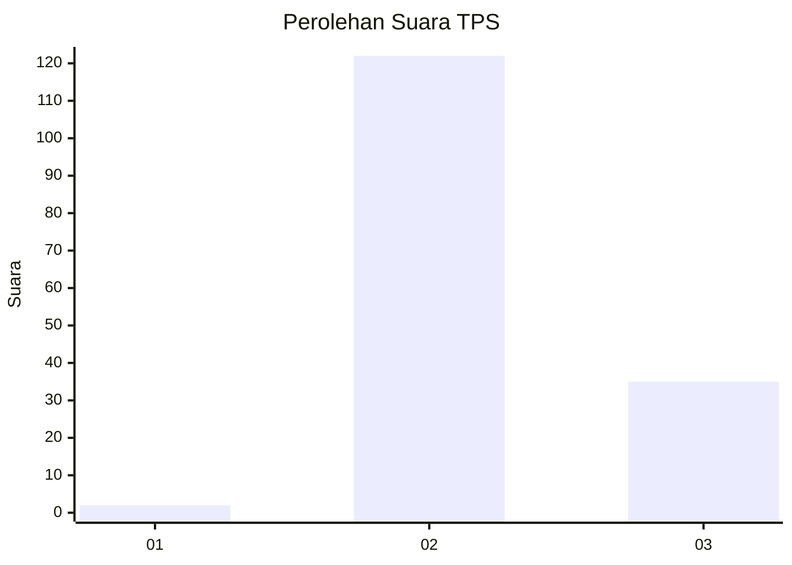
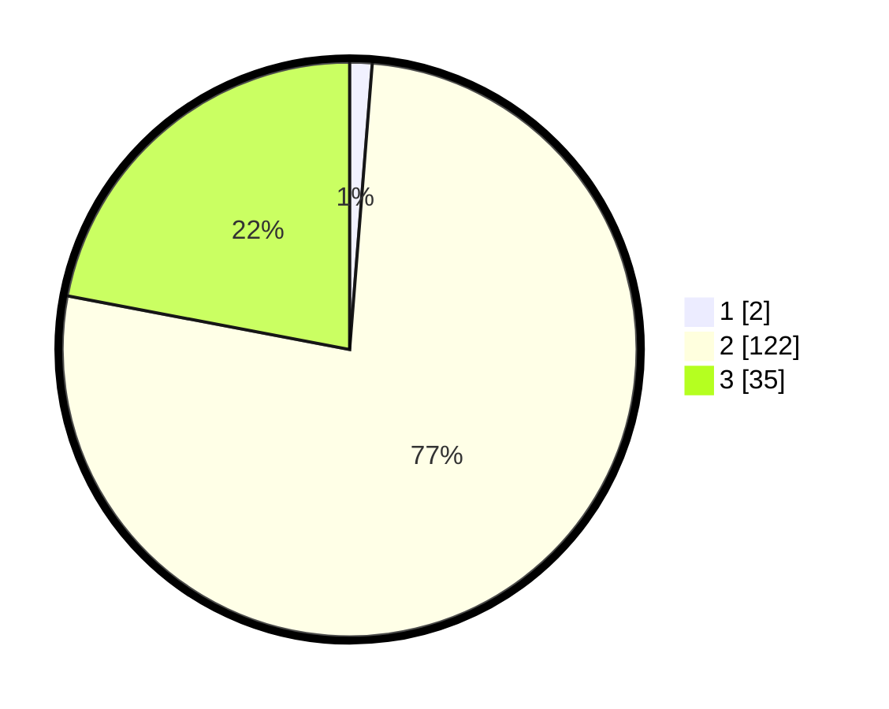

# Hasil

## Grafik

## Tabel

| No. | Nama Paslon    | Suara | Suara (raw) | Persentase |
|:--- |:-------------- | -----:| -----------:| ----------:|
| 1   | ANIES MUHAIMIN | 2     | [2][p-1]    | 1,26       |
| 2   | PRABOWO GIBRAN | 122   | [122][p-2]  | 76,73      |
| 3   | GANJAR MAHFUD  | 35    | [35][p-3]   | 22,01      |

[p-1]: https://github.com/gigit-pemilu/pemilu-2024-51-bali/blob/main/pilpres/hitung-suara/sub/51-bali/sub/07-karangasem/sub/01-rendang/sub/2002-rendang/sub/003-tps/sub/paslon-1.txt
[p-2]: https://github.com/gigit-pemilu/pemilu-2024-51-bali/blob/main/pilpres/hitung-suara/sub/51-bali/sub/07-karangasem/sub/01-rendang/sub/2002-rendang/sub/003-tps/sub/paslon-2.txt
[p-3]: https://github.com/gigit-pemilu/pemilu-2024-51-bali/blob/main/pilpres/hitung-suara/sub/51-bali/sub/07-karangasem/sub/01-rendang/sub/2002-rendang/sub/003-tps/sub/paslon-3.txt

## Foto C Plano

https://sirekap-obj-formc.kpu.go.id/99f8/pemilu/ppwp/51/07/01/20/02/5107012002003-20240222-164134--aaf5e96f-5a2e-49d9-993e-36f0aada4df9.jpg

https://sirekap-obj-formc.kpu.go.id/99f8/pemilu/ppwp/51/07/01/20/02/5107012002003-20240222-164243--84d1a0b6-b0cf-4b6e-bcef-b54b878ff7c3.jpg

https://sirekap-obj-formc.kpu.go.id/99f8/pemilu/ppwp/51/07/01/20/02/5107012002003-20240222-164324--c3765496-76e2-4d82-97fc-b48723e1b90b.jpg

## Metadata

| Key        | Value               |
| ---------- | ------------------- |
| Time Stamp | 2024-02-24 22:31:28 |

## DATA PEMILIH TETAP

Jumlah pemilih dalam DPT: **441**.
 * L: **0**.
 * P: **444**.

## DATA PENGGUNA HAK PILIH

Jumlah pengguna hak pilih dalam DPT: **444**.
 * L: **75**.
 * P: **444**.

Jumlah pengguna hak pilih dalam DPTb: **554**.
 * L: **332**.
 * P: **224**.

Jumlah pengguna hak pilih dalam DPK: **524**.
 * L: **777**.
 * P: **724**.

Jumlah pengguna hak pilih: **222**.
 * L: **100**.
 * P: **222**.

## JUMLAH SUARA SAH DAN TIDAK SAH

JUMLAH SELURUH SUARA SAH: **159**.

JUMLAH SUARA TIDAK SAH: **8**.

JUMLAH SELURUH SUARA SAH DAN SUARA TIDAK SAH: **167**.

