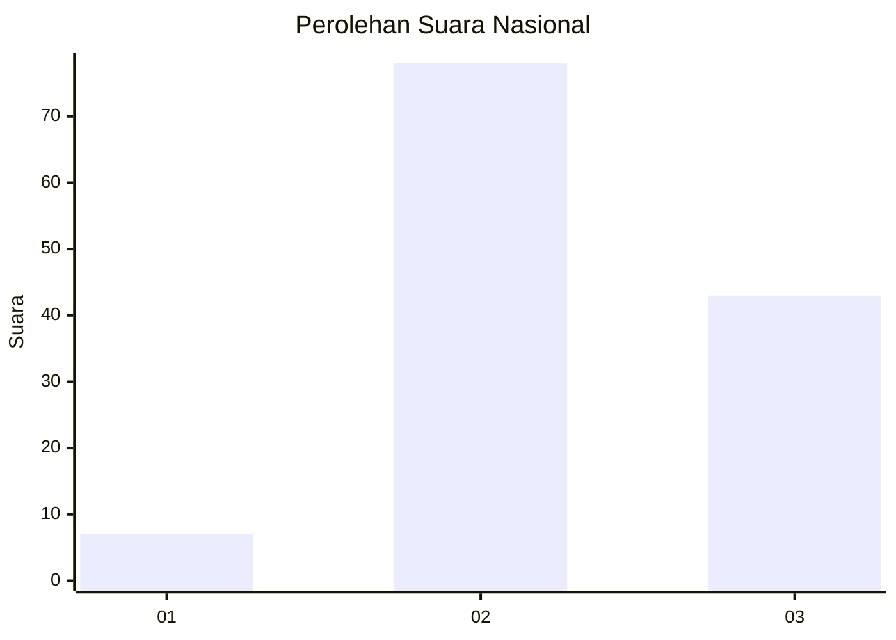
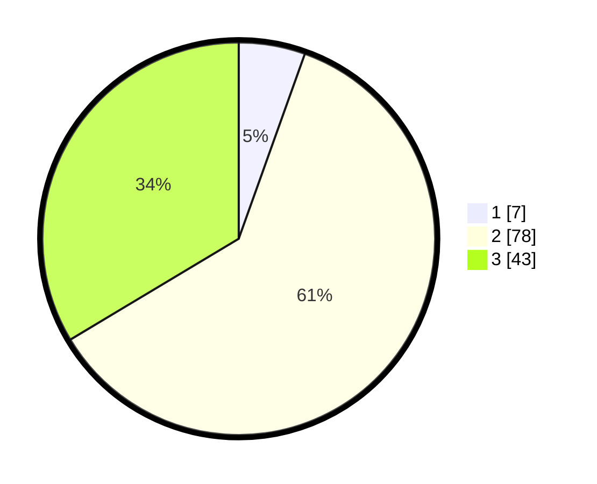

# Hasil

## Grafik

## Tabel

| No. | Nama Paslon    | Suara | Suara (raw) | Persentase |
|:--- |:-------------- | -----:| -----------:| ----------:|
| 1   | ANIES MUHAIMIN | 7     | [7][p-1]    | 5,47       |
| 2   | PRABOWO GIBRAN | 78    | [78][p-2]   | 60,94      |
| 3   | GANJAR MAHFUD  | 43    | [43][p-3]   | 33,59      |

[p-1]: https://github.com/gigit-pemilu/pemilu-2024/blob/main/pilpres/hitung-suara/sub/51-bali/sub/07-karangasem/sub/01-rendang/sub/2002-rendang/sub/013-tps/sub/paslon-1.txt
[p-2]: https://github.com/gigit-pemilu/pemilu-2024/blob/main/pilpres/hitung-suara/sub/51-bali/sub/07-karangasem/sub/01-rendang/sub/2002-rendang/sub/013-tps/sub/paslon-2.txt
[p-3]: https://github.com/gigit-pemilu/pemilu-2024/blob/main/pilpres/hitung-suara/sub/51-bali/sub/07-karangasem/sub/01-rendang/sub/2002-rendang/sub/013-tps/sub/paslon-3.txt

## Foto C Plano

https://sirekap-obj-formc.kpu.go.id/3ab9/pemilu/ppwp/51/07/01/20/02/5107012002013-20240223-104136--4941fc83-262b-4986-8183-4b7645ac067b.jpg

https://sirekap-obj-formc.kpu.go.id/3ab9/pemilu/ppwp/51/07/01/20/02/5107012002013-20240223-104337--6d7dec42-095f-40e7-8588-45ef608a82ca.jpg

https://sirekap-obj-formc.kpu.go.id/3ab9/pemilu/ppwp/51/07/01/20/02/5107012002013-20240223-104433--b0af9a4f-c1c3-490b-868b-86de1b44477e.jpg

## Metadata

| Key        | Value               |
| ---------- | ------------------- |
| Time Stamp | 2024-02-24 22:31:28 |

## DATA PEMILIH TETAP

Jumlah pemilih dalam DPT: **143**.
 * L: **69**.
 * P: **74**.

## DATA PENGGUNA HAK PILIH

Jumlah pengguna hak pilih dalam DPT: **24**.
 * L: **59**.
 * P: **65**.

Jumlah pengguna hak pilih dalam DPTb: **285**.
 * L: **755**.
 * P: **873**.

Jumlah pengguna hak pilih dalam DPK: **700**.
 * L: **0**.
 * P: **0**.

Jumlah pengguna hak pilih: **129**.
 * L: **67**.
 * P: **268**.

## JUMLAH SUARA SAH DAN TIDAK SAH

JUMLAH SELURUH SUARA SAH: **124**.

JUMLAH SUARA TIDAK SAH: **5**.

JUMLAH SELURUH SUARA SAH DAN SUARA TIDAK SAH: **129**.

