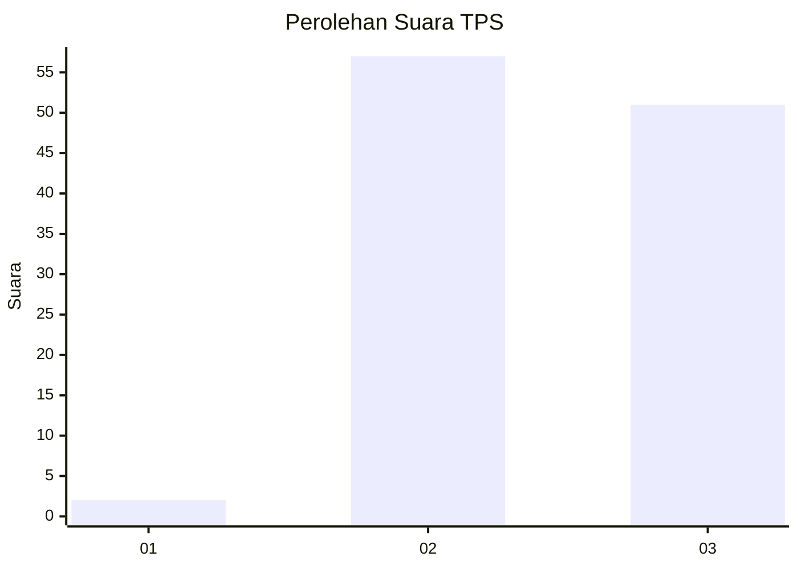
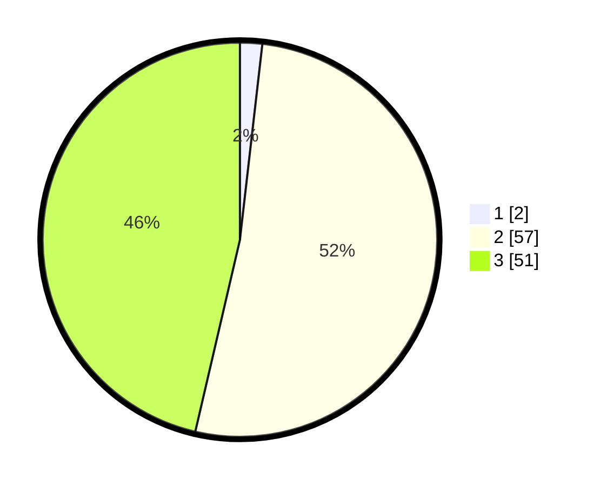

# Hasil

## Grafik

## Tabel

| No. | Nama Paslon    | Suara | Suara (raw) | Persentase |
|:--- |:-------------- | -----:| -----------:| ----------:|
| 1   | ANIES MUHAIMIN | 2     | [2][p-1]    | 1,82       |
| 2   | PRABOWO GIBRAN | 57    | [57][p-2]   | 51,82      |
| 3   | GANJAR MAHFUD  | 51    | [51][p-3]   | 46,36      |

[p-1]: https://github.com/gigit-pemilu/pemilu-2024-51-bali/blob/main/pilpres/hitung-suara/sub/51-bali/sub/07-karangasem/sub/01-rendang/sub/2002-rendang/sub/015-tps/sub/paslon-1.txt
[p-2]: https://github.com/gigit-pemilu/pemilu-2024-51-bali/blob/main/pilpres/hitung-suara/sub/51-bali/sub/07-karangasem/sub/01-rendang/sub/2002-rendang/sub/015-tps/sub/paslon-2.txt
[p-3]: https://github.com/gigit-pemilu/pemilu-2024-51-bali/blob/main/pilpres/hitung-suara/sub/51-bali/sub/07-karangasem/sub/01-rendang/sub/2002-rendang/sub/015-tps/sub/paslon-3.txt

## Foto C Plano

https://sirekap-obj-formc.kpu.go.id/d282/pemilu/ppwp/51/07/01/20/02/5107012002015-20240216-123706--982884e6-ebcb-45f0-a26d-4e5a5cbc9a82.jpg

https://sirekap-obj-formc.kpu.go.id/d282/pemilu/ppwp/51/07/01/20/02/5107012002015-20240216-123709--672e7788-eb6e-425b-adfc-b78f8368599a.jpg

https://sirekap-obj-formc.kpu.go.id/d282/pemilu/ppwp/51/07/01/20/02/5107012002015-20240216-123707--7d377de7-3438-46f6-ae76-1b09a40385dd.jpg

## Metadata

| Key        | Value               |
| ---------- | ------------------- |
| Time Stamp | 2024-02-16 14:00:34 |

## DATA PEMILIH TETAP

Jumlah pemilih dalam DPT: **130**.
 * L: **61**.
 * P: **69**.

## DATA PENGGUNA HAK PILIH

Jumlah pengguna hak pilih dalam DPT: **112**.
 * L: **52**.
 * P: **60**.

Jumlah pengguna hak pilih dalam DPTb: **1**.
 * L: **0**.
 * P: **1**.

Jumlah pengguna hak pilih dalam DPK: **0**.
 * L: **0**.
 * P: **0**.

Jumlah pengguna hak pilih: **113**.
 * L: **52**.
 * P: **61**.

## JUMLAH SUARA SAH DAN TIDAK SAH

JUMLAH SELURUH SUARA SAH: **110**.

JUMLAH SUARA TIDAK SAH: **3**.

JUMLAH SELURUH SUARA SAH DAN SUARA TIDAK SAH: **113**.

