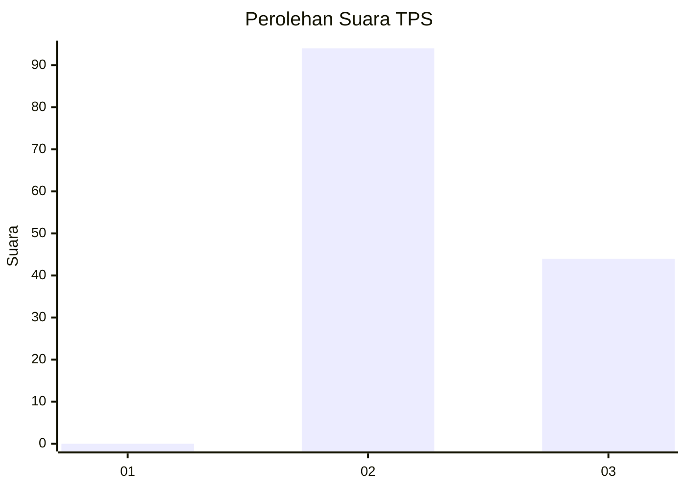
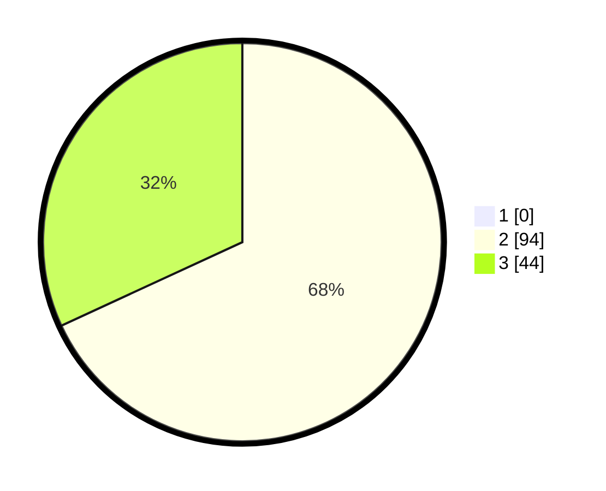

# Hasil

## Grafik

## Tabel

| No. | Nama Paslon    | Suara | Suara (raw) | Persentase |
|:--- |:-------------- | -----:| -----------:| ----------:|
| 1   | ANIES MUHAIMIN | 0     | [0][p-1]    | 0,00       |
| 2   | PRABOWO GIBRAN | 94    | [94][p-2]   | 68,12      |
| 3   | GANJAR MAHFUD  | 44    | [44][p-3]   | 31,88      |

[p-1]: https://github.com/gigit-pemilu/pemilu-2024-51-bali/blob/main/pilpres/hitung-suara/sub/51-bali/sub/07-karangasem/sub/01-rendang/sub/2002-rendang/sub/019-tps/sub/paslon-1.txt
[p-2]: https://github.com/gigit-pemilu/pemilu-2024-51-bali/blob/main/pilpres/hitung-suara/sub/51-bali/sub/07-karangasem/sub/01-rendang/sub/2002-rendang/sub/019-tps/sub/paslon-2.txt
[p-3]: https://github.com/gigit-pemilu/pemilu-2024-51-bali/blob/main/pilpres/hitung-suara/sub/51-bali/sub/07-karangasem/sub/01-rendang/sub/2002-rendang/sub/019-tps/sub/paslon-3.txt

## Foto C Plano

https://sirekap-obj-formc.kpu.go.id/215d/pemilu/ppwp/51/07/01/20/02/5107012002019-20240223-132538--fb0ff31c-df2c-485d-a45f-ccb6cc941e6a.jpg

https://sirekap-obj-formc.kpu.go.id/215d/pemilu/ppwp/51/07/01/20/02/5107012002019-20240223-132631--9f93302b-a5a6-4ef3-8674-1244032be4fd.jpg

https://sirekap-obj-formc.kpu.go.id/215d/pemilu/ppwp/51/07/01/20/02/5107012002019-20240223-132714--fc366ec8-15de-41e6-8cb2-4e126f310766.jpg

## Metadata

| Key        | Value               |
| ---------- | ------------------- |
| Time Stamp | 2024-02-24 22:31:28 |

## DATA PEMILIH TETAP

Jumlah pemilih dalam DPT: **176**.
 * L: **87**.
 * P: **89**.

## DATA PENGGUNA HAK PILIH

Jumlah pengguna hak pilih dalam DPT: **442**.
 * L: **70**.
 * P: **72**.

Jumlah pengguna hak pilih dalam DPTb: **885**.
 * L: **888**.
 * P: **888**.

Jumlah pengguna hak pilih dalam DPK: **0**.
 * L: **0**.
 * P: **0**.

Jumlah pengguna hak pilih: **142**.
 * L: **70**.
 * P: **72**.

## JUMLAH SUARA SAH DAN TIDAK SAH

JUMLAH SELURUH SUARA SAH: **139**.

JUMLAH SUARA TIDAK SAH: **3**.

JUMLAH SELURUH SUARA SAH DAN SUARA TIDAK SAH: **142**.

