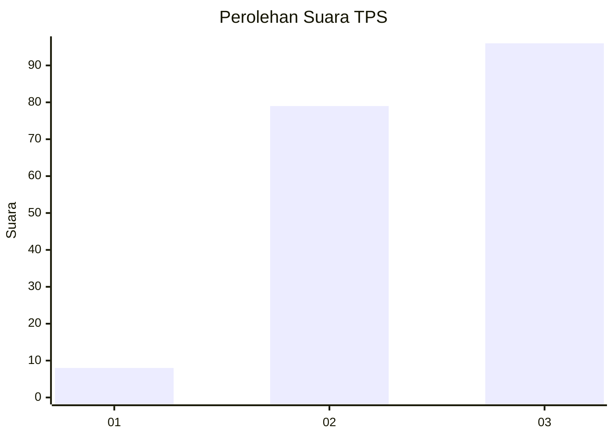
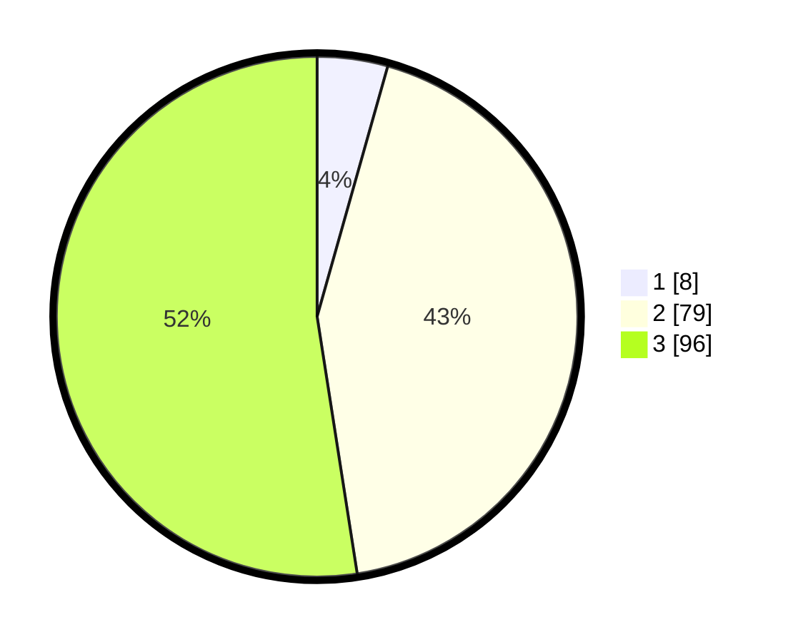

# Hasil

## Grafik

## Tabel

| No. | Nama Paslon    | Suara | Suara (raw) | Persentase |
|:--- |:-------------- | -----:| -----------:| ----------:|
| 1   | ANIES MUHAIMIN | 8     | [8][p-1]    | 4,37       |
| 2   | PRABOWO GIBRAN | 79    | [79][p-2]   | 43,17      |
| 3   | GANJAR MAHFUD  | 96    | [96][p-3]   | 52,46      |

[p-1]: https://github.com/gigit-pemilu/pemilu-2024-51-bali/blob/main/pilpres/hitung-suara/sub/51-bali/sub/07-karangasem/sub/01-rendang/sub/2002-rendang/sub/022-tps/sub/paslon-1.txt
[p-2]: https://github.com/gigit-pemilu/pemilu-2024-51-bali/blob/main/pilpres/hitung-suara/sub/51-bali/sub/07-karangasem/sub/01-rendang/sub/2002-rendang/sub/022-tps/sub/paslon-2.txt
[p-3]: https://github.com/gigit-pemilu/pemilu-2024-51-bali/blob/main/pilpres/hitung-suara/sub/51-bali/sub/07-karangasem/sub/01-rendang/sub/2002-rendang/sub/022-tps/sub/paslon-3.txt

## Foto C Plano

https://sirekap-obj-formc.kpu.go.id/0916/pemilu/ppwp/51/07/01/20/02/5107012002022-20240223-153820--9b77e7e1-20f4-4b5e-8ad6-7b6fc3060a0b.jpg

https://sirekap-obj-formc.kpu.go.id/0916/pemilu/ppwp/51/07/01/20/02/5107012002022-20240223-153606--eb5ed314-e4a9-464e-8269-340188e35432.jpg

https://sirekap-obj-formc.kpu.go.id/0916/pemilu/ppwp/51/07/01/20/02/5107012002022-20240223-153708--0ec85ae0-ad96-4414-b66e-1f1b1ef736ca.jpg

## Metadata

| Key        | Value               |
| ---------- | ------------------- |
| Time Stamp | 2024-02-24 22:31:28 |

## DATA PEMILIH TETAP

Jumlah pemilih dalam DPT: **214**.
 * L: **105**.
 * P: **109**.

## DATA PENGGUNA HAK PILIH

Jumlah pengguna hak pilih dalam DPT: **188**.
 * L: **95**.
 * P: **93**.

Jumlah pengguna hak pilih dalam DPTb: **0**.
 * L: **870**.
 * P: **0**.

Jumlah pengguna hak pilih dalam DPK: **0**.
 * L: **0**.
 * P: **0**.

Jumlah pengguna hak pilih: **188**.
 * L: **95**.
 * P: **93**.

## JUMLAH SUARA SAH DAN TIDAK SAH

JUMLAH SELURUH SUARA SAH: **183**.

JUMLAH SUARA TIDAK SAH: **5**.

JUMLAH SELURUH SUARA SAH DAN SUARA TIDAK SAH: **188**.

