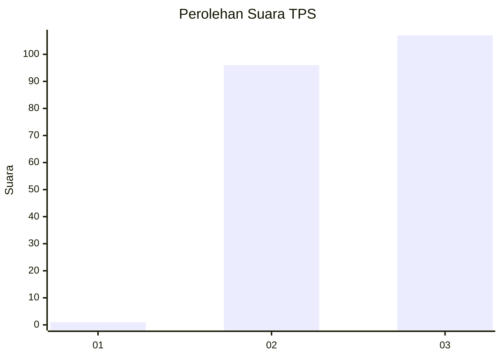
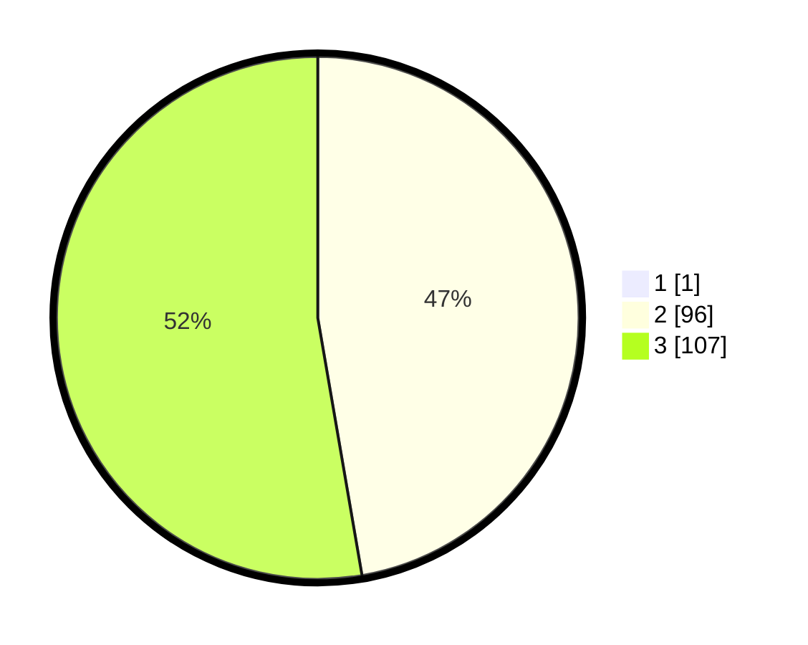

# Hasil

## Grafik

## Tabel

| No. | Nama Paslon    | Suara | Suara (raw) | Persentase |
|:--- |:-------------- | -----:| -----------:| ----------:|
| 1   | ANIES MUHAIMIN | 1     | [1][p-1]    | 0,49       |
| 2   | PRABOWO GIBRAN | 96    | [96][p-2]   | 47,06      |
| 3   | GANJAR MAHFUD  | 107   | [107][p-3]  | 52,45      |

[p-1]: https://github.com/gigit-pemilu/pemilu-2024-51-bali/blob/main/pilpres/hitung-suara/sub/51-bali/sub/07-karangasem/sub/01-rendang/sub/2003-menanga/sub/003-tps/sub/paslon-1.txt
[p-2]: https://github.com/gigit-pemilu/pemilu-2024-51-bali/blob/main/pilpres/hitung-suara/sub/51-bali/sub/07-karangasem/sub/01-rendang/sub/2003-menanga/sub/003-tps/sub/paslon-2.txt
[p-3]: https://github.com/gigit-pemilu/pemilu-2024-51-bali/blob/main/pilpres/hitung-suara/sub/51-bali/sub/07-karangasem/sub/01-rendang/sub/2003-menanga/sub/003-tps/sub/paslon-3.txt

## Foto C Plano

https://sirekap-obj-formc.kpu.go.id/c770/pemilu/ppwp/51/07/01/20/03/5107012003003-20240214-132853--9858b4b7-5e08-4e3c-b5ca-31abab47d914.jpg

https://sirekap-obj-formc.kpu.go.id/c770/pemilu/ppwp/51/07/01/20/03/5107012003003-20240214-132933--c1107293-675b-45b2-aba4-f63a48a565d8.jpg

https://sirekap-obj-formc.kpu.go.id/c770/pemilu/ppwp/51/07/01/20/03/5107012003003-20240214-133417--d622a2c3-1433-4907-a9f8-fb35089eac99.jpg

## Metadata

| Key        | Value               |
| ---------- | ------------------- |
| Time Stamp | 2024-02-17 11:00:02 |

