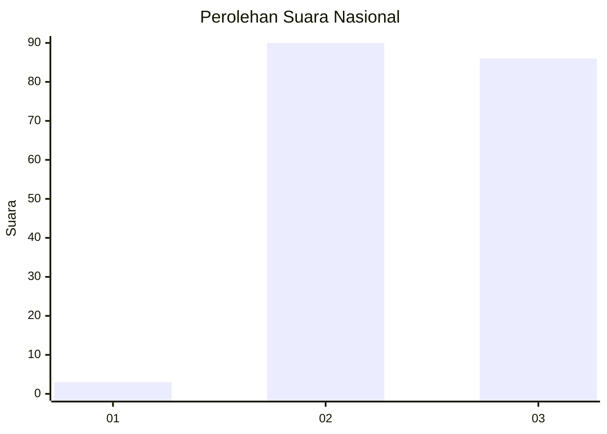
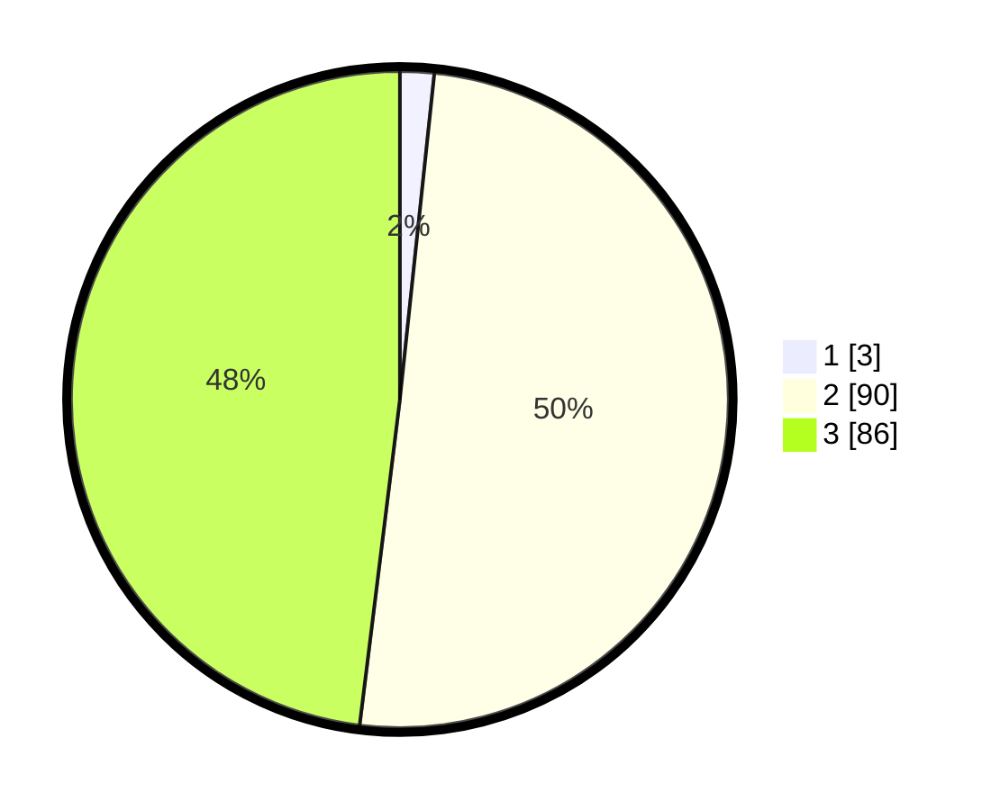

# Hasil

## Grafik

## Tabel

| No. | Nama Paslon    | Suara | Suara (raw) | Persentase |
|:--- |:-------------- | -----:| -----------:| ----------:|
| 1   | ANIES MUHAIMIN | 3     | [3][p-1]    | 1,68       |
| 2   | PRABOWO GIBRAN | 90    | [90][p-2]   | 50,28      |
| 3   | GANJAR MAHFUD  | 86    | [86][p-3]   | 48,04      |

[p-1]: https://github.com/gigit-pemilu/pemilu-2024/blob/main/pilpres/hitung-suara/sub/51-bali/sub/07-karangasem/sub/01-rendang/sub/2003-menanga/sub/006-tps/sub/paslon-1.txt
[p-2]: https://github.com/gigit-pemilu/pemilu-2024/blob/main/pilpres/hitung-suara/sub/51-bali/sub/07-karangasem/sub/01-rendang/sub/2003-menanga/sub/006-tps/sub/paslon-2.txt
[p-3]: https://github.com/gigit-pemilu/pemilu-2024/blob/main/pilpres/hitung-suara/sub/51-bali/sub/07-karangasem/sub/01-rendang/sub/2003-menanga/sub/006-tps/sub/paslon-3.txt

## Foto C Plano

https://sirekap-obj-formc.kpu.go.id/46bf/pemilu/ppwp/51/07/01/20/03/5107012003006-20240214-202707--3aa70923-9c54-472c-8a5f-6a7df2f25f91.jpg

https://sirekap-obj-formc.kpu.go.id/46bf/pemilu/ppwp/51/07/01/20/03/5107012003006-20240214-202719--9b1d3503-d9a4-476e-a950-d45a383779a7.jpg

https://sirekap-obj-formc.kpu.go.id/46bf/pemilu/ppwp/51/07/01/20/03/5107012003006-20240214-224143--16d90327-c3b9-40bf-8d9c-1cb71a5839b7.jpg

## Metadata

| Key        | Value               |
| ---------- | ------------------- |
| Time Stamp | 2024-02-17 11:00:02 |

