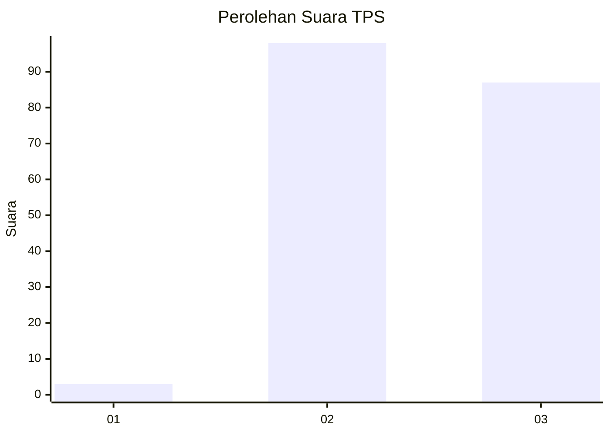
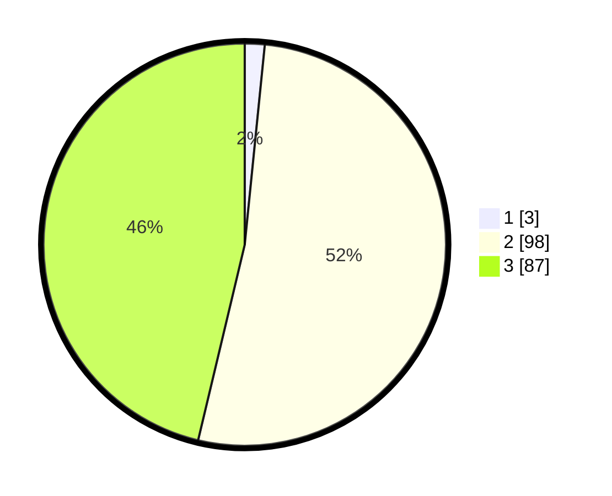

# Hasil

## Grafik

## Tabel

| No. | Nama Paslon    | Suara | Suara (raw) | Persentase |
|:--- |:-------------- | -----:| -----------:| ----------:|
| 1   | ANIES MUHAIMIN | 3     | [3][p-1]    | 1,60       |
| 2   | PRABOWO GIBRAN | 98    | [98][p-2]   | 52,13      |
| 3   | GANJAR MAHFUD  | 87    | [87][p-3]   | 46,28      |

[p-1]: https://github.com/gigit-pemilu/pemilu-2024-51-bali/blob/main/pilpres/hitung-suara/sub/51-bali/sub/07-karangasem/sub/01-rendang/sub/2003-menanga/sub/007-tps/sub/paslon-1.txt
[p-2]: https://github.com/gigit-pemilu/pemilu-2024-51-bali/blob/main/pilpres/hitung-suara/sub/51-bali/sub/07-karangasem/sub/01-rendang/sub/2003-menanga/sub/007-tps/sub/paslon-2.txt
[p-3]: https://github.com/gigit-pemilu/pemilu-2024-51-bali/blob/main/pilpres/hitung-suara/sub/51-bali/sub/07-karangasem/sub/01-rendang/sub/2003-menanga/sub/007-tps/sub/paslon-3.txt

## Foto C Plano

https://sirekap-obj-formc.kpu.go.id/1cf9/pemilu/ppwp/51/07/01/20/03/5107012003007-20240214-224116--21125570-a548-4c55-851a-ae5fb741978a.jpg

https://sirekap-obj-formc.kpu.go.id/1cf9/pemilu/ppwp/51/07/01/20/03/5107012003007-20240214-224127--3ef0c53b-b2a1-4d7c-8242-f1407ef6f877.jpg

https://sirekap-obj-formc.kpu.go.id/1cf9/pemilu/ppwp/51/07/01/20/03/5107012003007-20240214-224140--ef6ae1d9-faf0-4fce-a496-6732a1d718a3.jpg

## Metadata

| Key        | Value               |
| ---------- | ------------------- |
| Time Stamp | 2024-02-17 11:00:02 |

## DATA PEMILIH TETAP

Jumlah pemilih dalam DPT: **226**.
 * L: **117**.
 * P: **109**.

## DATA PENGGUNA HAK PILIH

Jumlah pengguna hak pilih dalam DPT: **192**.
 * L: **103**.
 * P: **91**.

Jumlah pengguna hak pilih dalam DPTb: **1**.
 * L: **0**.
 * P: **1**.

Jumlah pengguna hak pilih dalam DPK: **1**.
 * L: **0**.
 * P: **1**.

Jumlah pengguna hak pilih: **196**.
 * L: **103**.
 * P: **93**.

## JUMLAH SUARA SAH DAN TIDAK SAH

JUMLAH SELURUH SUARA SAH: **188**.

JUMLAH SUARA TIDAK SAH: **8**.

JUMLAH SELURUH SUARA SAH DAN SUARA TIDAK SAH: **196**.

