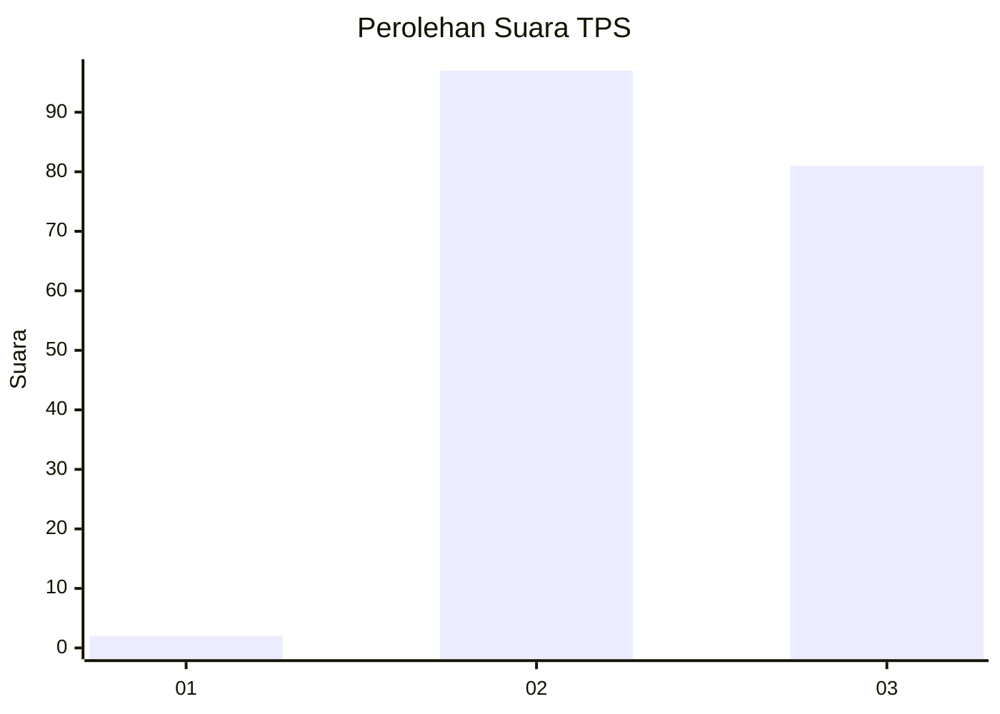
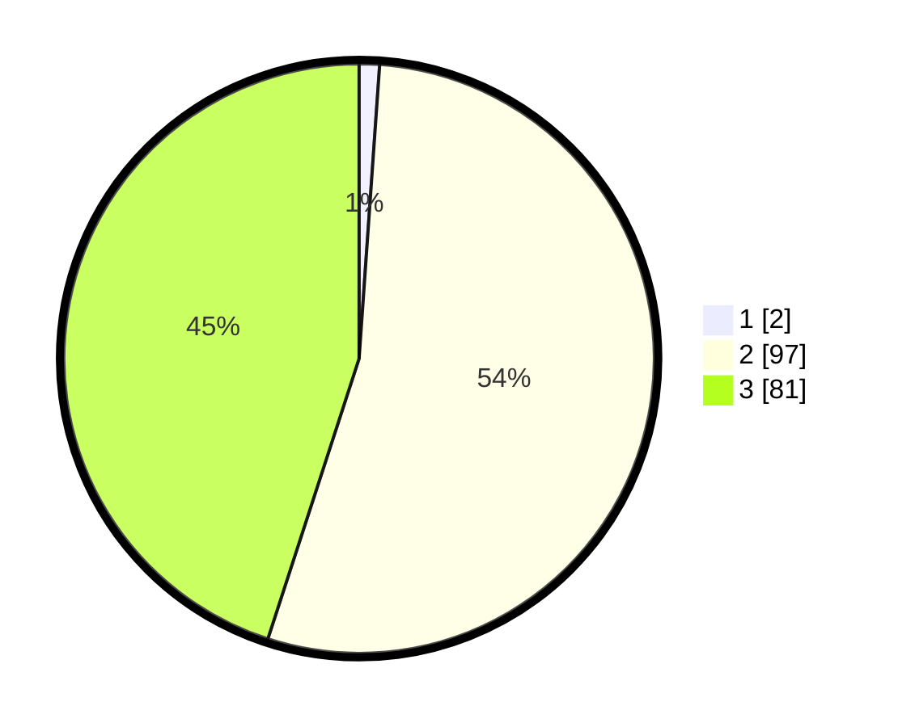

# Hasil

## Grafik

## Tabel

| No. | Nama Paslon    | Suara | Suara (raw) | Persentase |
|:--- |:-------------- | -----:| -----------:| ----------:|
| 1   | ANIES MUHAIMIN | 2     | [2][p-1]    | 1,11       |
| 2   | PRABOWO GIBRAN | 97    | [97][p-2]   | 53,89      |
| 3   | GANJAR MAHFUD  | 81    | [81][p-3]   | 45,00      |

[p-1]: https://github.com/gigit-pemilu/pemilu-2024-51-bali/blob/main/pilpres/hitung-suara/sub/51-bali/sub/07-karangasem/sub/01-rendang/sub/2003-menanga/sub/008-tps/sub/paslon-1.txt
[p-2]: https://github.com/gigit-pemilu/pemilu-2024-51-bali/blob/main/pilpres/hitung-suara/sub/51-bali/sub/07-karangasem/sub/01-rendang/sub/2003-menanga/sub/008-tps/sub/paslon-2.txt
[p-3]: https://github.com/gigit-pemilu/pemilu-2024-51-bali/blob/main/pilpres/hitung-suara/sub/51-bali/sub/07-karangasem/sub/01-rendang/sub/2003-menanga/sub/008-tps/sub/paslon-3.txt

## Foto C Plano

https://sirekap-obj-formc.kpu.go.id/6a19/pemilu/ppwp/51/07/01/20/03/5107012003008-20240214-230227--a9d7ec72-ca6f-4366-9c41-e149a17e3676.jpg

https://sirekap-obj-formc.kpu.go.id/6a19/pemilu/ppwp/51/07/01/20/03/5107012003008-20240214-230422--b7c428e8-7935-403a-a906-4871d0891f7b.jpg

https://sirekap-obj-formc.kpu.go.id/6a19/pemilu/ppwp/51/07/01/20/03/5107012003008-20240214-230558--c2c8817a-0a06-43dd-a91f-04014cf60894.jpg

## Metadata

| Key        | Value               |
| ---------- | ------------------- |
| Time Stamp | 2024-02-17 11:00:02 |

