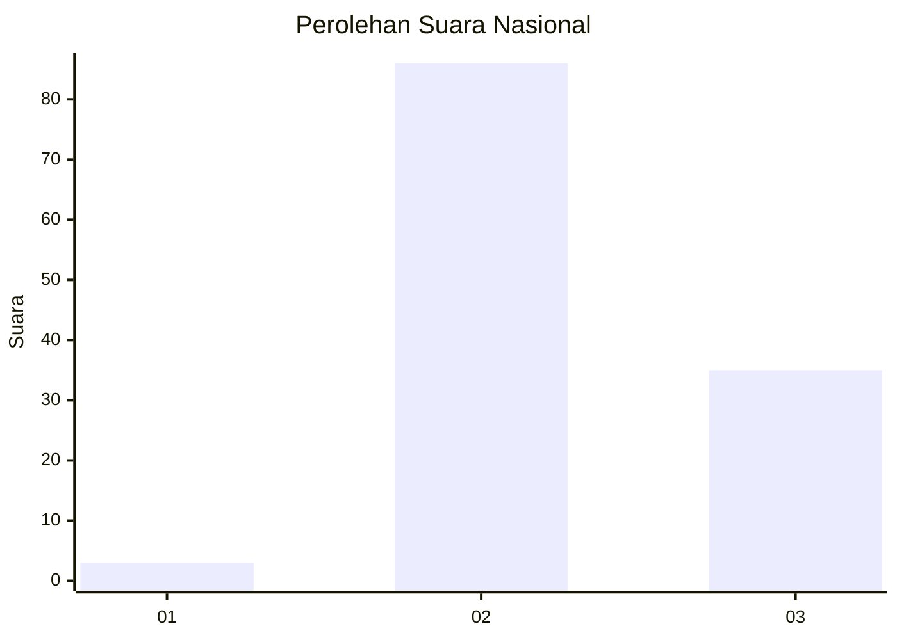
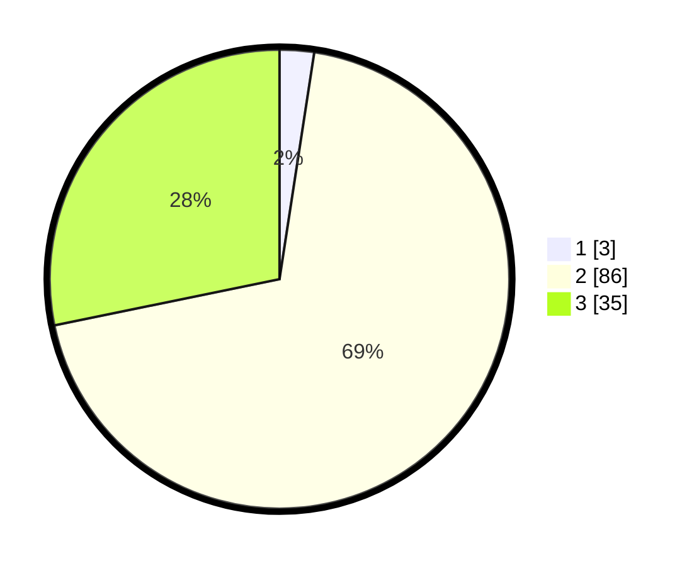

# Hasil

## Grafik

## Tabel

| No. | Nama Paslon    | Suara | Suara (raw) | Persentase |
|:--- |:-------------- | -----:| -----------:| ----------:|
| 1   | ANIES MUHAIMIN | 3     | [3][p-1]    | 2,42       |
| 2   | PRABOWO GIBRAN | 86    | [86][p-2]   | 69,35      |
| 3   | GANJAR MAHFUD  | 35    | [35][p-3]   | 28,23      |

[p-1]: https://github.com/gigit-pemilu/pemilu-2024/blob/main/pilpres/hitung-suara/sub/51-bali/sub/07-karangasem/sub/01-rendang/sub/2004-besakih/sub/022-tps/sub/paslon-1.txt
[p-2]: https://github.com/gigit-pemilu/pemilu-2024/blob/main/pilpres/hitung-suara/sub/51-bali/sub/07-karangasem/sub/01-rendang/sub/2004-besakih/sub/022-tps/sub/paslon-2.txt
[p-3]: https://github.com/gigit-pemilu/pemilu-2024/blob/main/pilpres/hitung-suara/sub/51-bali/sub/07-karangasem/sub/01-rendang/sub/2004-besakih/sub/022-tps/sub/paslon-3.txt

## Foto C Plano

https://sirekap-obj-formc.kpu.go.id/28d2/pemilu/ppwp/51/07/01/20/04/5107012004022-20240214-130636--c27a82b7-3e5e-46e5-9009-75ed89bf7d93.jpg

https://sirekap-obj-formc.kpu.go.id/28d2/pemilu/ppwp/51/07/01/20/04/5107012004022-20240214-130758--194e71e3-7dc8-4ca9-b012-b1f375b21f7a.jpg

https://sirekap-obj-formc.kpu.go.id/28d2/pemilu/ppwp/51/07/01/20/04/5107012004022-20240214-131436--0511d501-c231-4bd6-96c9-bb26c7012002.jpg

## Metadata

| Key        | Value               |
| ---------- | ------------------- |
| Time Stamp | 2024-02-16 14:30:33 |

## DATA PEMILIH TETAP

Jumlah pemilih dalam DPT: **145**.
 * L: **68**.
 * P: **77**.

## DATA PENGGUNA HAK PILIH

Jumlah pengguna hak pilih dalam DPT: **127**.
 * L: **58**.
 * P: **69**.

Jumlah pengguna hak pilih dalam DPTb: **0**.
 * L: **0**.
 * P: **0**.

Jumlah pengguna hak pilih dalam DPK: **0**.
 * L: **0**.
 * P: **0**.

Jumlah pengguna hak pilih: **127**.
 * L: **58**.
 * P: **69**.

## JUMLAH SUARA SAH DAN TIDAK SAH

JUMLAH SELURUH SUARA SAH: **124**.

JUMLAH SUARA TIDAK SAH: **3**.

JUMLAH SELURUH SUARA SAH DAN SUARA TIDAK SAH: **127**.

