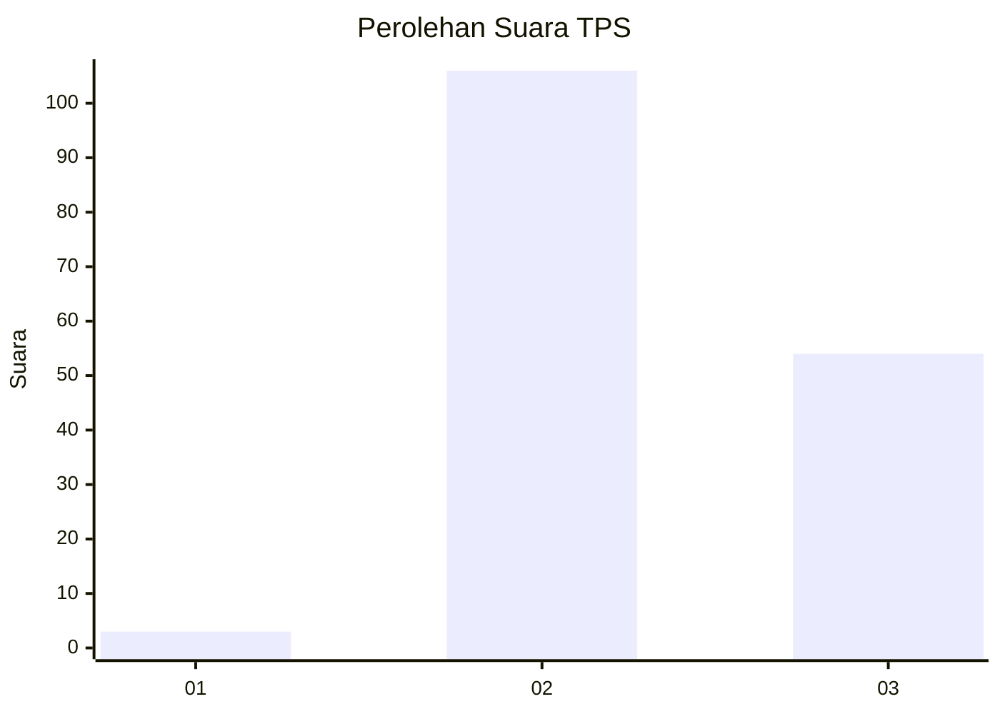
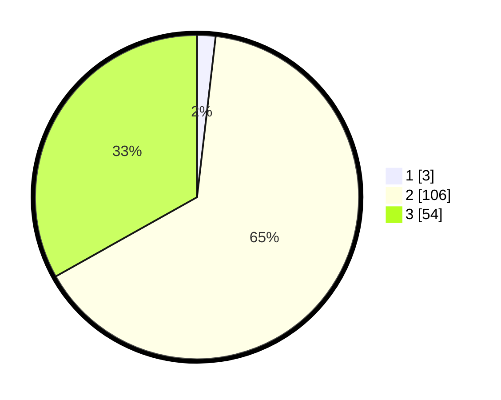

# Hasil

## Grafik

## Tabel

| No. | Nama Paslon    | Suara | Suara (raw) | Persentase |
|:--- |:-------------- | -----:| -----------:| ----------:|
| 1   | ANIES MUHAIMIN | 3     | [3][p-1]    | 1,84       |
| 2   | PRABOWO GIBRAN | 106   | [106][p-2]  | 65,03      |
| 3   | GANJAR MAHFUD  | 54    | [54][p-3]   | 33,13      |

[p-1]: https://github.com/gigit-pemilu/pemilu-2024-51-bali/blob/main/pilpres/hitung-suara/sub/51-bali/sub/07-karangasem/sub/01-rendang/sub/2005-pempatan/sub/005-tps/sub/paslon-1.txt
[p-2]: https://github.com/gigit-pemilu/pemilu-2024-51-bali/blob/main/pilpres/hitung-suara/sub/51-bali/sub/07-karangasem/sub/01-rendang/sub/2005-pempatan/sub/005-tps/sub/paslon-2.txt
[p-3]: https://github.com/gigit-pemilu/pemilu-2024-51-bali/blob/main/pilpres/hitung-suara/sub/51-bali/sub/07-karangasem/sub/01-rendang/sub/2005-pempatan/sub/005-tps/sub/paslon-3.txt

## Foto C Plano

https://sirekap-obj-formc.kpu.go.id/7e53/pemilu/ppwp/51/07/01/20/05/5107012005005-20240215-181451--60aa4f3d-3940-47f9-8a39-0cfc894a7ebd.jpg

https://sirekap-obj-formc.kpu.go.id/7e53/pemilu/ppwp/51/07/01/20/05/5107012005005-20240215-181554--ec106b12-fe76-426b-9f70-53214a3965dd.jpg

https://sirekap-obj-formc.kpu.go.id/7e53/pemilu/ppwp/51/07/01/20/05/5107012005005-20240220-214253--b12f8020-be2e-443a-806d-005ae3ff4482.jpg

## Metadata

| Key        | Value               |
| ---------- | ------------------- |
| Time Stamp | 2024-02-20 22:00:00 |

## DATA PEMILIH TETAP

Jumlah pemilih dalam DPT: **217**.
 * L: **109**.
 * P: **108**.

## DATA PENGGUNA HAK PILIH

Jumlah pengguna hak pilih dalam DPT: **176**.
 * L: **88**.
 * P: **88**.

Jumlah pengguna hak pilih dalam DPTb: **0**.
 * L: **0**.
 * P: **0**.

Jumlah pengguna hak pilih dalam DPK: **0**.
 * L: **0**.
 * P: **0**.

Jumlah pengguna hak pilih: **176**.
 * L: **88**.
 * P: **88**.

## JUMLAH SUARA SAH DAN TIDAK SAH

JUMLAH SELURUH SUARA SAH: **163**.

JUMLAH SUARA TIDAK SAH: **13**.

JUMLAH SELURUH SUARA SAH DAN SUARA TIDAK SAH: **176**.

