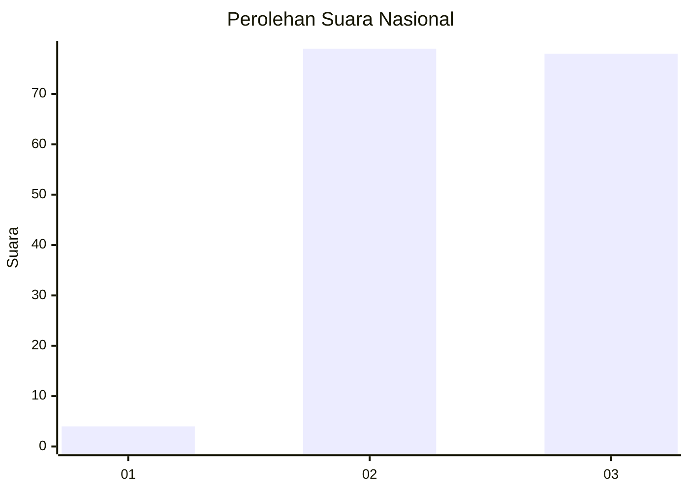
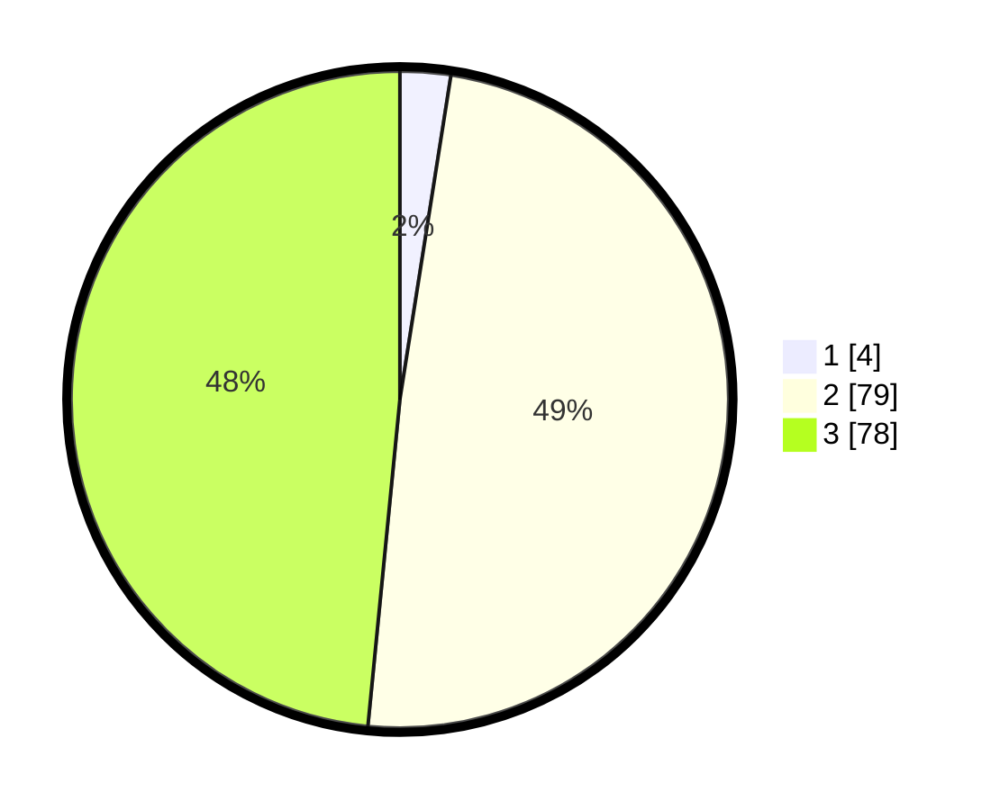

# Hasil

## Grafik

## Tabel

| No. | Nama Paslon    | Suara | Suara (raw) | Persentase |
|:--- |:-------------- | -----:| -----------:| ----------:|
| 1   | ANIES MUHAIMIN | 4     | [4][p-1]    | 2,48       |
| 2   | PRABOWO GIBRAN | 79    | [79][p-2]   | 49,07      |
| 3   | GANJAR MAHFUD  | 78    | [78][p-3]   | 48,45      |

[p-1]: https://github.com/gigit-pemilu/pemilu-2024/blob/main/pilpres/hitung-suara/sub/51-bali/sub/07-karangasem/sub/01-rendang/sub/2005-pempatan/sub/006-tps/sub/paslon-1.txt
[p-2]: https://github.com/gigit-pemilu/pemilu-2024/blob/main/pilpres/hitung-suara/sub/51-bali/sub/07-karangasem/sub/01-rendang/sub/2005-pempatan/sub/006-tps/sub/paslon-2.txt
[p-3]: https://github.com/gigit-pemilu/pemilu-2024/blob/main/pilpres/hitung-suara/sub/51-bali/sub/07-karangasem/sub/01-rendang/sub/2005-pempatan/sub/006-tps/sub/paslon-3.txt

## Foto C Plano

https://sirekap-obj-formc.kpu.go.id/29fc/pemilu/ppwp/51/07/01/20/05/5107012005006-20240221-095218--b38e8891-4d32-4c01-9391-9f4dbaca338e.jpg

https://sirekap-obj-formc.kpu.go.id/29fc/pemilu/ppwp/51/07/01/20/05/5107012005006-20240221-095057--e3f9c337-cbcf-4e62-a6c7-81178a619169.jpg

https://sirekap-obj-formc.kpu.go.id/29fc/pemilu/ppwp/51/07/01/20/05/5107012005006-20240221-095135--712c7f94-3b62-43d8-84f9-75d735b907e0.jpg

## Metadata

| Key        | Value               |
| ---------- | ------------------- |
| Time Stamp | 2024-02-21 10:00:00 |

## DATA PEMILIH TETAP

Jumlah pemilih dalam DPT: **213**.
 * L: **13**.
 * P: **100**.

## DATA PENGGUNA HAK PILIH

Jumlah pengguna hak pilih dalam DPT: **80**.
 * L: **17**.
 * P: **393**.

Jumlah pengguna hak pilih dalam DPTb: **0**.
 * L: **0**.
 * P: **0**.

Jumlah pengguna hak pilih dalam DPK: **388**.
 * L: **533**.
 * P: **558**.

Jumlah pengguna hak pilih: **173**.
 * L: **93**.
 * P: **80**.

## JUMLAH SUARA SAH DAN TIDAK SAH

JUMLAH SELURUH SUARA SAH: **161**.

JUMLAH SUARA TIDAK SAH: **12**.

JUMLAH SELURUH SUARA SAH DAN SUARA TIDAK SAH: **173**.

