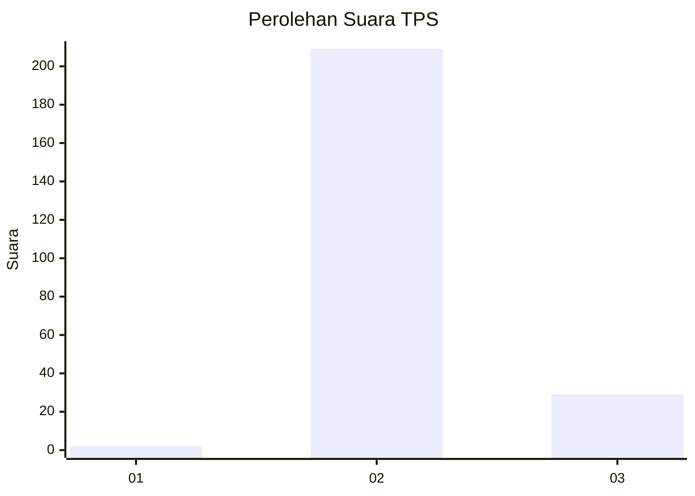
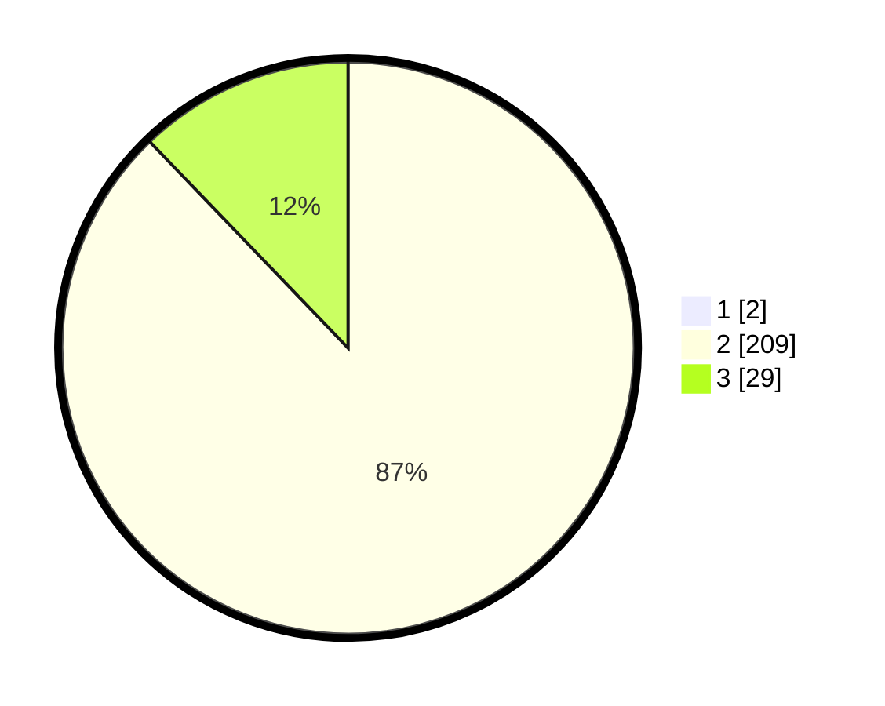

# Hasil

## Grafik

## Tabel

| No. | Nama Paslon    | Suara | Suara (raw) | Persentase |
|:--- |:-------------- | -----:| -----------:| ----------:|
| 1   | ANIES MUHAIMIN | 2     | [2][p-1]    | 0,83       |
| 2   | PRABOWO GIBRAN | 209   | [209][p-2]  | 87,08      |
| 3   | GANJAR MAHFUD  | 29    | [29][p-3]   | 12,08      |

[p-1]: https://github.com/gigit-pemilu/pemilu-2024-51-bali/blob/main/pilpres/hitung-suara/sub/51-bali/sub/07-karangasem/sub/01-rendang/sub/2005-pempatan/sub/022-tps/sub/paslon-1.txt
[p-2]: https://github.com/gigit-pemilu/pemilu-2024-51-bali/blob/main/pilpres/hitung-suara/sub/51-bali/sub/07-karangasem/sub/01-rendang/sub/2005-pempatan/sub/022-tps/sub/paslon-2.txt
[p-3]: https://github.com/gigit-pemilu/pemilu-2024-51-bali/blob/main/pilpres/hitung-suara/sub/51-bali/sub/07-karangasem/sub/01-rendang/sub/2005-pempatan/sub/022-tps/sub/paslon-3.txt

## Foto C Plano

https://sirekap-obj-formc.kpu.go.id/7e98/pemilu/ppwp/51/07/01/20/05/5107012005022-20240214-141452--650e464c-2b4a-48c0-8734-a6f97b0e350c.jpg

https://sirekap-obj-formc.kpu.go.id/7e98/pemilu/ppwp/51/07/01/20/05/5107012005022-20240214-141330--32b1e237-50c4-48a4-bcc7-1cbf24a260c6.jpg

https://sirekap-obj-formc.kpu.go.id/7e98/pemilu/ppwp/51/07/01/20/05/5107012005022-20240218-092850--e28c36ee-2790-4ac5-87a3-6ddb8478f69b.jpg

## Metadata

| Key        | Value               |
| ---------- | ------------------- |
| Time Stamp | 2024-02-19 06:16:00 |

