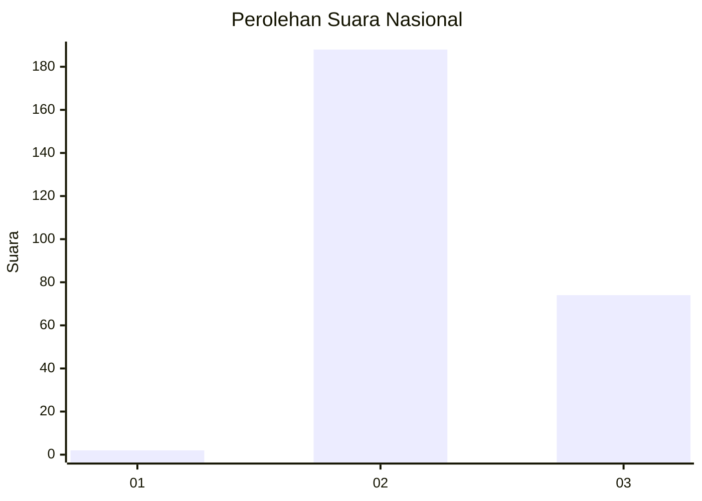
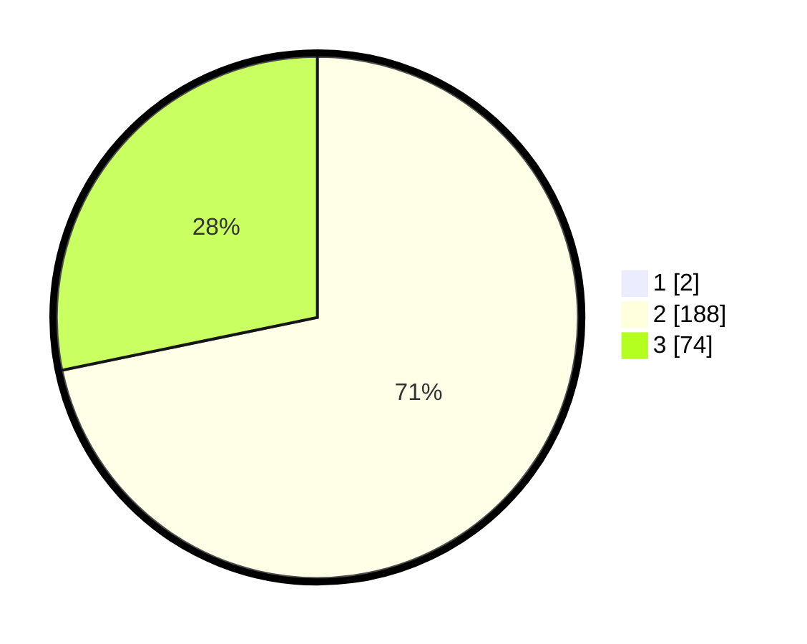

# Hasil

## Grafik

## Tabel

| No. | Nama Paslon    | Suara | Suara (raw) | Persentase |
|:--- |:-------------- | -----:| -----------:| ----------:|
| 1   | ANIES MUHAIMIN | 2     | [2][p-1]    | 0,76       |
| 2   | PRABOWO GIBRAN | 188   | [188][p-2]  | 71,21      |
| 3   | GANJAR MAHFUD  | 74    | [74][p-3]   | 28,03      |

[p-1]: https://github.com/gigit-pemilu/pemilu-2024/blob/main/pilpres/hitung-suara/sub/51-bali/sub/07-karangasem/sub/01-rendang/sub/2005-pempatan/sub/031-tps/sub/paslon-1.txt
[p-2]: https://github.com/gigit-pemilu/pemilu-2024/blob/main/pilpres/hitung-suara/sub/51-bali/sub/07-karangasem/sub/01-rendang/sub/2005-pempatan/sub/031-tps/sub/paslon-2.txt
[p-3]: https://github.com/gigit-pemilu/pemilu-2024/blob/main/pilpres/hitung-suara/sub/51-bali/sub/07-karangasem/sub/01-rendang/sub/2005-pempatan/sub/031-tps/sub/paslon-3.txt

## Foto C Plano

https://sirekap-obj-formc.kpu.go.id/1743/pemilu/ppwp/51/07/01/20/05/5107012005031-20240222-115308--91bf226b-fdf9-40d2-b998-c0c56be419f9.jpg

https://sirekap-obj-formc.kpu.go.id/1743/pemilu/ppwp/51/07/01/20/05/5107012005031-20240222-115345--c9f1a534-04cf-48e7-a83d-518bb8ff929a.jpg

https://sirekap-obj-formc.kpu.go.id/1743/pemilu/ppwp/51/07/01/20/05/5107012005031-20240222-115423--3ff93ca2-bd6b-4b67-974c-5804b9e89727.jpg

## Metadata

| Key        | Value               |
| ---------- | ------------------- |
| Time Stamp | 2024-02-22 12:00:00 |

## DATA PEMILIH TETAP

Jumlah pemilih dalam DPT: **268**.
 * L: **227**.
 * P: **243**.

## DATA PENGGUNA HAK PILIH

Jumlah pengguna hak pilih dalam DPT: **268**.
 * L: **727**.
 * P: **244**.

Jumlah pengguna hak pilih dalam DPTb: **228**.
 * L: **0**.
 * P: **282**.

Jumlah pengguna hak pilih dalam DPK: **0**.
 * L: **0**.
 * P: **0**.

Jumlah pengguna hak pilih: **268**.
 * L: **127**.
 * P: **146**.

## JUMLAH SUARA SAH DAN TIDAK SAH

JUMLAH SELURUH SUARA SAH: **264**.

JUMLAH SUARA TIDAK SAH: **4**.

JUMLAH SELURUH SUARA SAH DAN SUARA TIDAK SAH: **268**.

