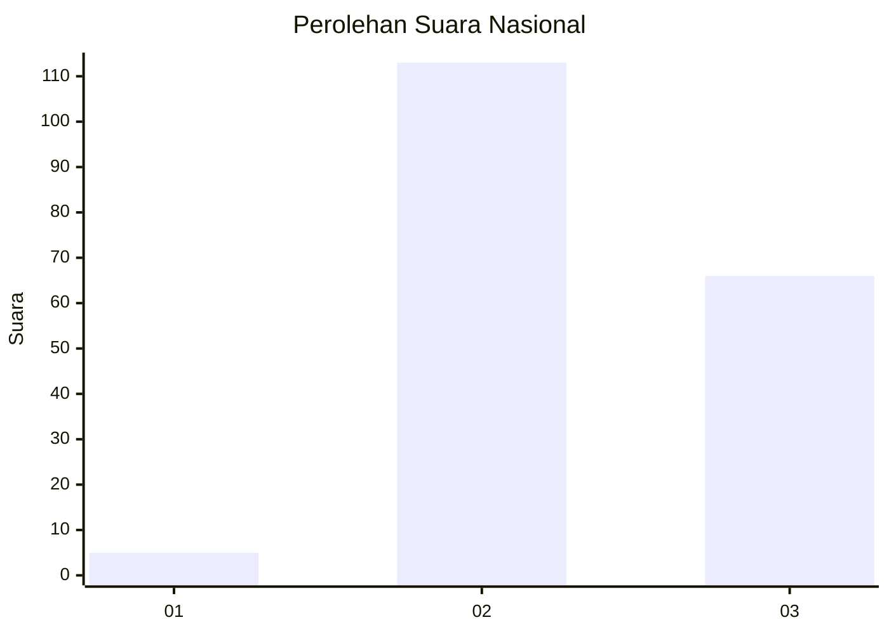
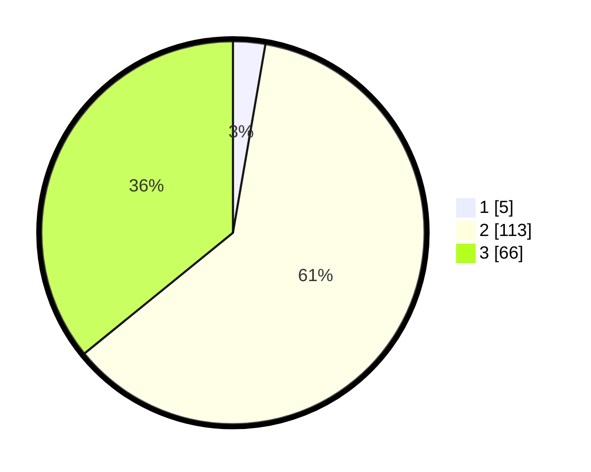

# Hasil

## Grafik

## Tabel

| No. | Nama Paslon    | Suara | Suara (raw) | Persentase |
|:--- |:-------------- | -----:| -----------:| ----------:|
| 1   | ANIES MUHAIMIN | 5     | [5][p-1]    | 2,72       |
| 2   | PRABOWO GIBRAN | 113   | [113][p-2]  | 61,41      |
| 3   | GANJAR MAHFUD  | 66    | [66][p-3]   | 35,87      |

[p-1]: https://github.com/gigit-pemilu/pemilu-2024/blob/main/pilpres/hitung-suara/sub/51-bali/sub/07-karangasem/sub/02-sidemen/sub/2001-tangkup/sub/001-tps/sub/paslon-1.txt
[p-2]: https://github.com/gigit-pemilu/pemilu-2024/blob/main/pilpres/hitung-suara/sub/51-bali/sub/07-karangasem/sub/02-sidemen/sub/2001-tangkup/sub/001-tps/sub/paslon-2.txt
[p-3]: https://github.com/gigit-pemilu/pemilu-2024/blob/main/pilpres/hitung-suara/sub/51-bali/sub/07-karangasem/sub/02-sidemen/sub/2001-tangkup/sub/001-tps/sub/paslon-3.txt

## Foto C Plano

https://sirekap-obj-formc.kpu.go.id/44dc/pemilu/ppwp/51/07/02/20/01/5107022001001-20240216-030425--552984db-4557-4e26-a0bc-45d09f9a0b9e.jpg

https://sirekap-obj-formc.kpu.go.id/44dc/pemilu/ppwp/51/07/02/20/01/5107022001001-20240216-030439--ccbd8ace-07ec-454c-b6ab-cf6e2424c201.jpg

https://sirekap-obj-formc.kpu.go.id/44dc/pemilu/ppwp/51/07/02/20/01/5107022001001-20240216-030431--a9a75aaf-2c74-476e-acd4-87869be1b9d9.jpg

## Metadata

| Key        | Value               |
| ---------- | ------------------- |
| Time Stamp | 2024-02-16 10:30:29 |

## DATA PEMILIH TETAP

Jumlah pemilih dalam DPT: **230**.
 * L: **119**.
 * P: **111**.

## DATA PENGGUNA HAK PILIH

Jumlah pengguna hak pilih dalam DPT: **181**.
 * L: **101**.
 * P: **80**.

Jumlah pengguna hak pilih dalam DPTb: **0**.
 * L: **0**.
 * P: **0**.

Jumlah pengguna hak pilih dalam DPK: **7**.
 * L: **4**.
 * P: **3**.

Jumlah pengguna hak pilih: **118**.
 * L: **105**.
 * P: **83**.

## JUMLAH SUARA SAH DAN TIDAK SAH

JUMLAH SELURUH SUARA SAH: **184**.

JUMLAH SUARA TIDAK SAH: **4**.

JUMLAH SELURUH SUARA SAH DAN SUARA TIDAK SAH: **188**.

