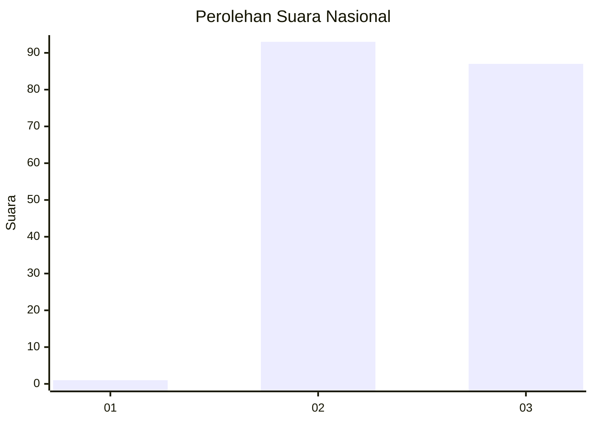
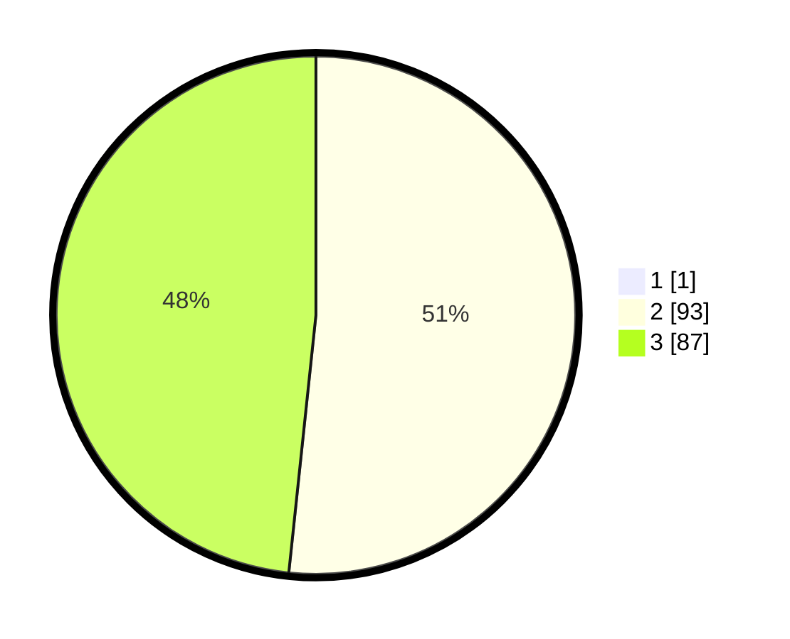

# Hasil

## Grafik

## Tabel

| No. | Nama Paslon    | Suara | Suara (raw) | Persentase |
|:--- |:-------------- | -----:| -----------:| ----------:|
| 1   | ANIES MUHAIMIN | 1     | [1][p-1]    | 0,55       |
| 2   | PRABOWO GIBRAN | 93    | [93][p-2]   | 51,38      |
| 3   | GANJAR MAHFUD  | 87    | [87][p-3]   | 48,07      |

[p-1]: https://github.com/gigit-pemilu/pemilu-2024/blob/main/pilpres/hitung-suara/sub/51-bali/sub/07-karangasem/sub/02-sidemen/sub/2001-tangkup/sub/003-tps/sub/paslon-1.txt
[p-2]: https://github.com/gigit-pemilu/pemilu-2024/blob/main/pilpres/hitung-suara/sub/51-bali/sub/07-karangasem/sub/02-sidemen/sub/2001-tangkup/sub/003-tps/sub/paslon-2.txt
[p-3]: https://github.com/gigit-pemilu/pemilu-2024/blob/main/pilpres/hitung-suara/sub/51-bali/sub/07-karangasem/sub/02-sidemen/sub/2001-tangkup/sub/003-tps/sub/paslon-3.txt

## Foto C Plano

https://sirekap-obj-formc.kpu.go.id/b1d7/pemilu/ppwp/51/07/02/20/01/5107022001003-20240221-133106--59d04eb9-9c2a-4298-9bd0-b6c76084ccde.jpg

https://sirekap-obj-formc.kpu.go.id/b1d7/pemilu/ppwp/51/07/02/20/01/5107022001003-20240221-133126--0e2fc1b9-6650-4232-892a-63daa841044f.jpg

https://sirekap-obj-formc.kpu.go.id/b1d7/pemilu/ppwp/51/07/02/20/01/5107022001003-20240221-133154--9b1f0aa4-8731-4ee8-892c-5fcefe20723b.jpg

## Metadata

| Key        | Value               |
| ---------- | ------------------- |
| Time Stamp | 2024-02-21 14:00:00 |

## DATA PEMILIH TETAP

Jumlah pemilih dalam DPT: **231**.
 * L: **124**.
 * P: **107**.

## DATA PENGGUNA HAK PILIH

Jumlah pengguna hak pilih dalam DPT: **177**.
 * L: **105**.
 * P: **72**.

Jumlah pengguna hak pilih dalam DPTb: **1**.
 * L: **0**.
 * P: **1**.

Jumlah pengguna hak pilih dalam DPK: **5**.
 * L: **1**.
 * P: **4**.

Jumlah pengguna hak pilih: **183**.
 * L: **106**.
 * P: **77**.

## JUMLAH SUARA SAH DAN TIDAK SAH

JUMLAH SELURUH SUARA SAH: **181**.

JUMLAH SUARA TIDAK SAH: **2**.

JUMLAH SELURUH SUARA SAH DAN SUARA TIDAK SAH: **183**.

