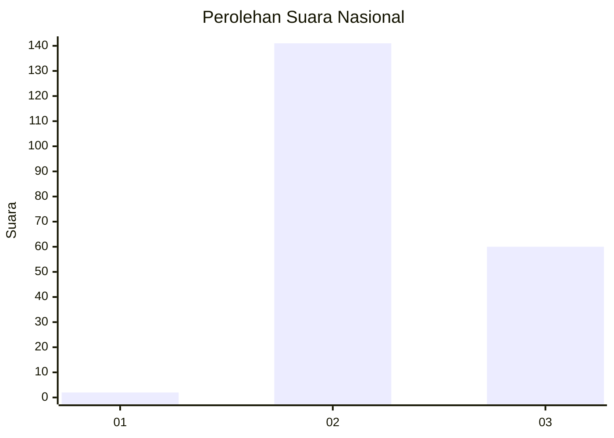
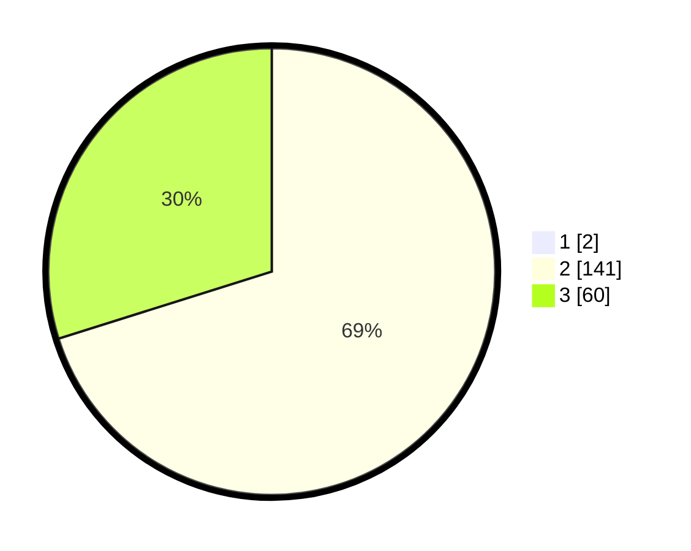

# Hasil

## Grafik

## Tabel

| No. | Nama Paslon    | Suara | Suara (raw) | Persentase |
|:--- |:-------------- | -----:| -----------:| ----------:|
| 1   | ANIES MUHAIMIN | 2     | [2][p-1]    | 0,99       |
| 2   | PRABOWO GIBRAN | 141   | [141][p-2]  | 69,46      |
| 3   | GANJAR MAHFUD  | 60    | [60][p-3]   | 29,56      |

[p-1]: https://github.com/gigit-pemilu/pemilu-2024/blob/main/pilpres/hitung-suara/sub/51-bali/sub/07-karangasem/sub/02-sidemen/sub/2001-tangkup/sub/004-tps/sub/paslon-1.txt
[p-2]: https://github.com/gigit-pemilu/pemilu-2024/blob/main/pilpres/hitung-suara/sub/51-bali/sub/07-karangasem/sub/02-sidemen/sub/2001-tangkup/sub/004-tps/sub/paslon-2.txt
[p-3]: https://github.com/gigit-pemilu/pemilu-2024/blob/main/pilpres/hitung-suara/sub/51-bali/sub/07-karangasem/sub/02-sidemen/sub/2001-tangkup/sub/004-tps/sub/paslon-3.txt

## Foto C Plano

https://sirekap-obj-formc.kpu.go.id/7e07/pemilu/ppwp/51/07/02/20/01/5107022001004-20240216-043717--f57d2979-cb11-4b1c-b7e9-34de563644c9.jpg

https://sirekap-obj-formc.kpu.go.id/7e07/pemilu/ppwp/51/07/02/20/01/5107022001004-20240216-043718--fb2f4dea-83f9-4343-8db8-dd2b5858841a.jpg

https://sirekap-obj-formc.kpu.go.id/7e07/pemilu/ppwp/51/07/02/20/01/5107022001004-20240216-043717--12621f5b-bc37-41dd-a012-80e2c4fc945a.jpg

## Metadata

| Key        | Value               |
| ---------- | ------------------- |
| Time Stamp | 2024-02-16 10:30:29 |

## DATA PEMILIH TETAP

Jumlah pemilih dalam DPT: **228**.
 * L: **110**.
 * P: **118**.

## DATA PENGGUNA HAK PILIH

Jumlah pengguna hak pilih dalam DPT: **207**.
 * L: **102**.
 * P: **105**.

Jumlah pengguna hak pilih dalam DPTb: **0**.
 * L: **0**.
 * P: **0**.

Jumlah pengguna hak pilih dalam DPK: **2**.
 * L: **1**.
 * P: **1**.

Jumlah pengguna hak pilih: **209**.
 * L: **103**.
 * P: **106**.

## JUMLAH SUARA SAH DAN TIDAK SAH

JUMLAH SELURUH SUARA SAH: **203**.

JUMLAH SUARA TIDAK SAH: **6**.

JUMLAH SELURUH SUARA SAH DAN SUARA TIDAK SAH: **209**.

