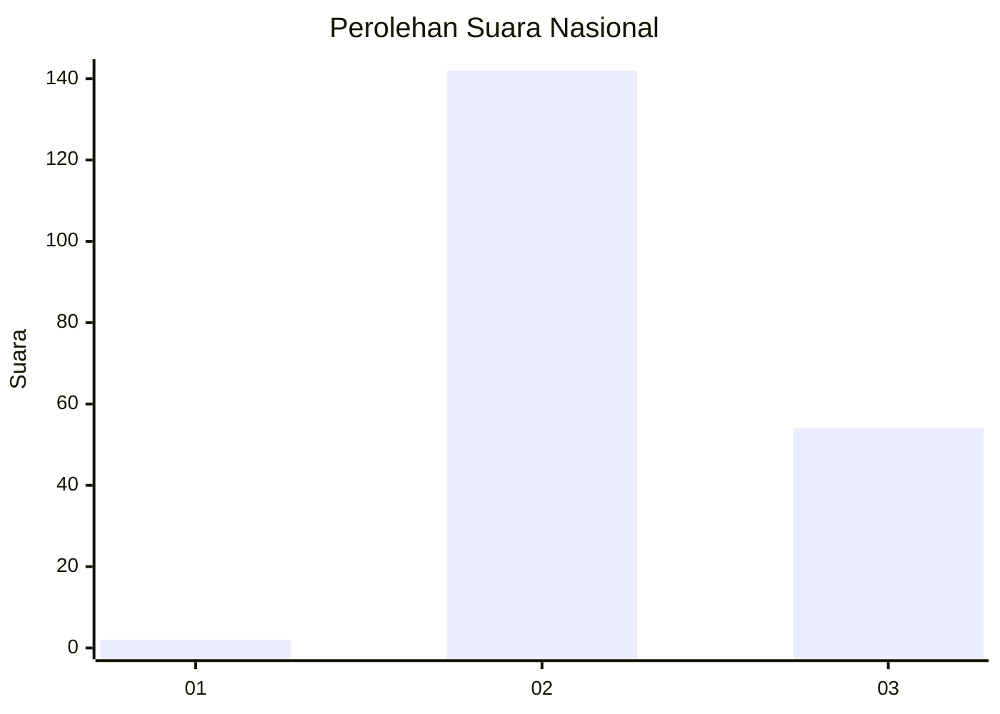
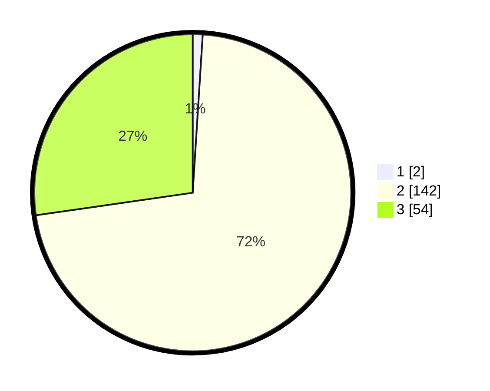

# Hasil

## Grafik

## Tabel

| No. | Nama Paslon    | Suara | Suara (raw) | Persentase |
|:--- |:-------------- | -----:| -----------:| ----------:|
| 1   | ANIES MUHAIMIN | 2     | [2][p-1]    | 1,01       |
| 2   | PRABOWO GIBRAN | 142   | [142][p-2]  | 71,72      |
| 3   | GANJAR MAHFUD  | 54    | [54][p-3]   | 27,27      |

[p-1]: https://github.com/gigit-pemilu/pemilu-2024/blob/main/pilpres/hitung-suara/sub/51-bali/sub/07-karangasem/sub/02-sidemen/sub/2001-tangkup/sub/005-tps/sub/paslon-1.txt
[p-2]: https://github.com/gigit-pemilu/pemilu-2024/blob/main/pilpres/hitung-suara/sub/51-bali/sub/07-karangasem/sub/02-sidemen/sub/2001-tangkup/sub/005-tps/sub/paslon-2.txt
[p-3]: https://github.com/gigit-pemilu/pemilu-2024/blob/main/pilpres/hitung-suara/sub/51-bali/sub/07-karangasem/sub/02-sidemen/sub/2001-tangkup/sub/005-tps/sub/paslon-3.txt

## Foto C Plano

https://sirekap-obj-formc.kpu.go.id/de11/pemilu/ppwp/51/07/02/20/01/5107022001005-20240216-023459--f4ae1198-3a4b-486f-8eb8-1964f2e624af.jpg

https://sirekap-obj-formc.kpu.go.id/de11/pemilu/ppwp/51/07/02/20/01/5107022001005-20240216-023501--a3717669-db51-4f88-abfe-c130ab6eba38.jpg

https://sirekap-obj-formc.kpu.go.id/de11/pemilu/ppwp/51/07/02/20/01/5107022001005-20240216-023459--e9d71758-2ceb-48dd-b5b3-68d76da36df8.jpg

## Metadata

| Key        | Value               |
| ---------- | ------------------- |
| Time Stamp | 2024-02-16 10:30:29 |

## DATA PEMILIH TETAP

Jumlah pemilih dalam DPT: **228**.
 * L: **120**.
 * P: **108**.

## DATA PENGGUNA HAK PILIH

Jumlah pengguna hak pilih dalam DPT: **197**.
 * L: **109**.
 * P: **88**.

Jumlah pengguna hak pilih dalam DPTb: **1**.
 * L: **0**.
 * P: **1**.

Jumlah pengguna hak pilih dalam DPK: **3**.
 * L: **1**.
 * P: **2**.

Jumlah pengguna hak pilih: **201**.
 * L: **110**.
 * P: **91**.

## JUMLAH SUARA SAH DAN TIDAK SAH

JUMLAH SELURUH SUARA SAH: **198**.

JUMLAH SUARA TIDAK SAH: **3**.

JUMLAH SELURUH SUARA SAH DAN SUARA TIDAK SAH: **201**.

