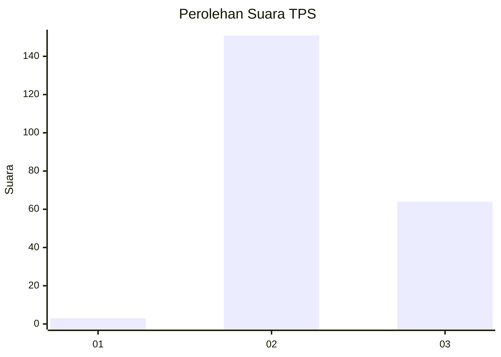

# Hasil

## Grafik

## Tabel

| No. | Nama Paslon    | Suara | Suara (raw) | Persentase |
|:--- |:-------------- | -----:| -----------:| ----------:|
| 1   | ANIES MUHAIMIN | 3     | [3][p-1]    | 1,38       |
| 2   | PRABOWO GIBRAN | 151   | [151][p-2]  | 69,27      |
| 3   | GANJAR MAHFUD  | 64    | [64][p-3]   | 29,36      |

[p-1]: https://github.com/gigit-pemilu/pemilu-2024-51-bali/blob/main/pilpres/hitung-suara/sub/51-bali/sub/07-karangasem/sub/02-sidemen/sub/2001-tangkup/sub/006-tps/sub/paslon-1.txt
[p-2]: https://github.com/gigit-pemilu/pemilu-2024-51-bali/blob/main/pilpres/hitung-suara/sub/51-bali/sub/07-karangasem/sub/02-sidemen/sub/2001-tangkup/sub/006-tps/sub/paslon-2.txt
[p-3]: https://github.com/gigit-pemilu/pemilu-2024-51-bali/blob/main/pilpres/hitung-suara/sub/51-bali/sub/07-karangasem/sub/02-sidemen/sub/2001-tangkup/sub/006-tps/sub/paslon-3.txt

## Foto C Plano

https://sirekap-obj-formc.kpu.go.id/69d8/pemilu/ppwp/51/07/02/20/01/5107022001006-20240216-021349--aa06a655-1772-44cd-baac-b02b41e4970a.jpg

https://sirekap-obj-formc.kpu.go.id/69d8/pemilu/ppwp/51/07/02/20/01/5107022001006-20240216-021352--61273b65-32c9-4584-b785-b31a81d5f731.jpg

https://sirekap-obj-formc.kpu.go.id/69d8/pemilu/ppwp/51/07/02/20/01/5107022001006-20240216-021350--402f9a17-ce43-44a2-96ce-a0cbcfe95803.jpg

## Metadata

| Key        | Value               |
| ---------- | ------------------- |
| Time Stamp | 2024-02-16 10:30:29 |

## DATA PEMILIH TETAP

Jumlah pemilih dalam DPT: **272**.
 * L: **137**.
 * P: **135**.

## DATA PENGGUNA HAK PILIH

Jumlah pengguna hak pilih dalam DPT: **222**.
 * L: **112**.
 * P: **110**.

Jumlah pengguna hak pilih dalam DPTb: **1**.
 * L: **0**.
 * P: **1**.

Jumlah pengguna hak pilih dalam DPK: **4**.
 * L: **2**.
 * P: **2**.

Jumlah pengguna hak pilih: **227**.
 * L: **114**.
 * P: **113**.

## JUMLAH SUARA SAH DAN TIDAK SAH

JUMLAH SELURUH SUARA SAH: **218**.

JUMLAH SUARA TIDAK SAH: **9**.

JUMLAH SELURUH SUARA SAH DAN SUARA TIDAK SAH: **227**.

