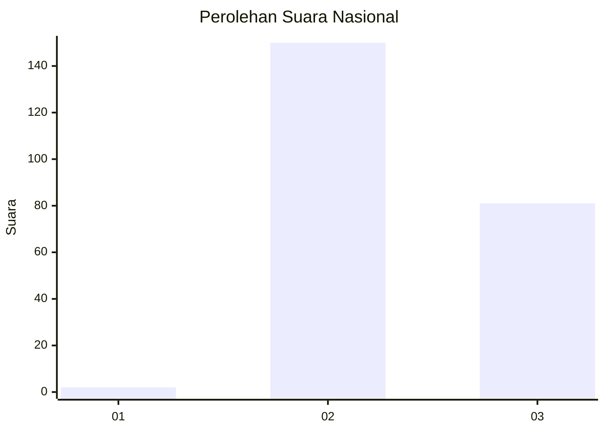
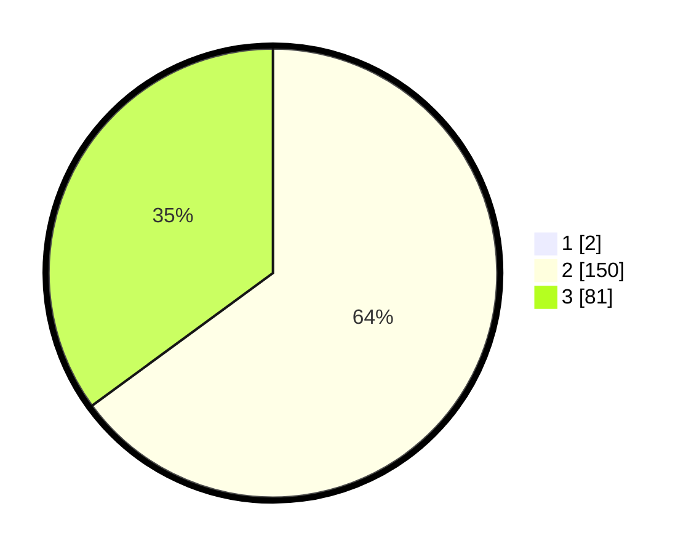

# Hasil

## Grafik

## Tabel

| No. | Nama Paslon    | Suara | Suara (raw) | Persentase |
|:--- |:-------------- | -----:| -----------:| ----------:|
| 1   | ANIES MUHAIMIN | 2     | [2][p-1]    | 0,86       |
| 2   | PRABOWO GIBRAN | 150   | [150][p-2]  | 64,38      |
| 3   | GANJAR MAHFUD  | 81    | [81][p-3]   | 34,76      |

[p-1]: https://github.com/gigit-pemilu/pemilu-2024/blob/main/pilpres/hitung-suara/sub/51-bali/sub/07-karangasem/sub/02-sidemen/sub/2001-tangkup/sub/009-tps/sub/paslon-1.txt
[p-2]: https://github.com/gigit-pemilu/pemilu-2024/blob/main/pilpres/hitung-suara/sub/51-bali/sub/07-karangasem/sub/02-sidemen/sub/2001-tangkup/sub/009-tps/sub/paslon-2.txt
[p-3]: https://github.com/gigit-pemilu/pemilu-2024/blob/main/pilpres/hitung-suara/sub/51-bali/sub/07-karangasem/sub/02-sidemen/sub/2001-tangkup/sub/009-tps/sub/paslon-3.txt

## Foto C Plano

https://sirekap-obj-formc.kpu.go.id/8098/pemilu/ppwp/51/07/02/20/01/5107022001009-20240224-104817--b12b3c67-2ce1-430b-9ed3-63e594402550.jpg

https://sirekap-obj-formc.kpu.go.id/8098/pemilu/ppwp/51/07/02/20/01/5107022001009-20240224-105002--01556424-9cd7-4850-87df-ec658e81a88c.jpg

https://sirekap-obj-formc.kpu.go.id/8098/pemilu/ppwp/51/07/02/20/01/5107022001009-20240224-105030--b745fead-7b8c-4e96-ad42-304fe5511423.jpg

## Metadata

| Key        | Value               |
| ---------- | ------------------- |
| Time Stamp | 2024-02-24 22:31:28 |

