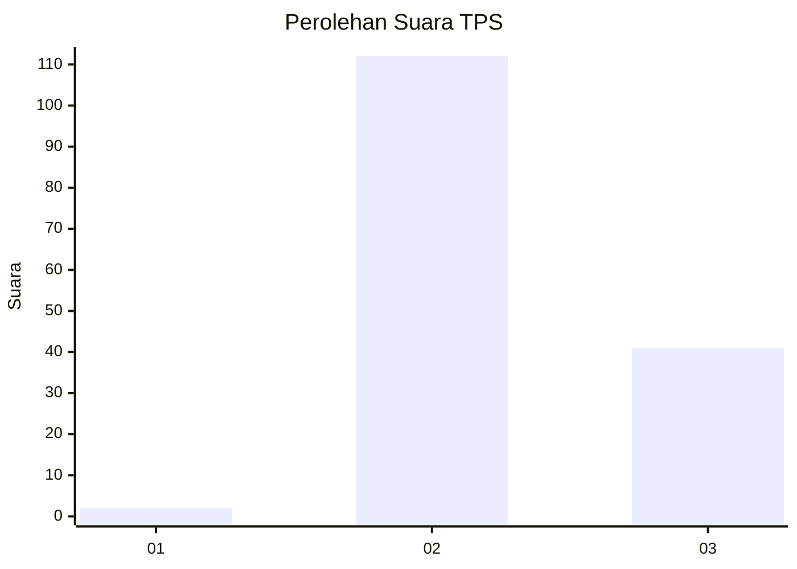
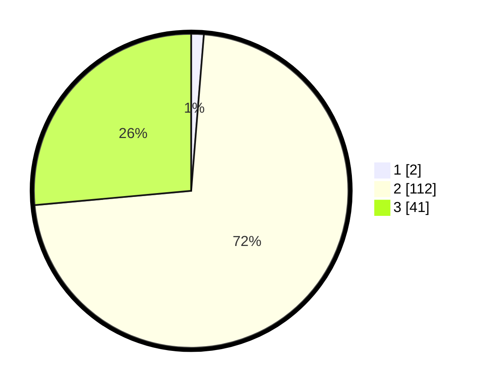

# Hasil

## Grafik

## Tabel

| No. | Nama Paslon    | Suara | Suara (raw) | Persentase |
|:--- |:-------------- | -----:| -----------:| ----------:|
| 1   | ANIES MUHAIMIN | 2     | [2][p-1]    | 1,29       |
| 2   | PRABOWO GIBRAN | 112   | [112][p-2]  | 72,26      |
| 3   | GANJAR MAHFUD  | 41    | [41][p-3]   | 26,45      |

[p-1]: https://github.com/gigit-pemilu/pemilu-2024-51-bali/blob/main/pilpres/hitung-suara/sub/51-bali/sub/07-karangasem/sub/02-sidemen/sub/2002-talibeng/sub/004-tps/sub/paslon-1.txt
[p-2]: https://github.com/gigit-pemilu/pemilu-2024-51-bali/blob/main/pilpres/hitung-suara/sub/51-bali/sub/07-karangasem/sub/02-sidemen/sub/2002-talibeng/sub/004-tps/sub/paslon-2.txt
[p-3]: https://github.com/gigit-pemilu/pemilu-2024-51-bali/blob/main/pilpres/hitung-suara/sub/51-bali/sub/07-karangasem/sub/02-sidemen/sub/2002-talibeng/sub/004-tps/sub/paslon-3.txt

## Foto C Plano

https://sirekap-obj-formc.kpu.go.id/349a/pemilu/ppwp/51/07/02/20/02/5107022002004-20240224-111753--65acd1cf-087c-41e1-b49e-b9e99dbce6e8.jpg

https://sirekap-obj-formc.kpu.go.id/349a/pemilu/ppwp/51/07/02/20/02/5107022002004-20240224-111845--593c1df5-fc11-4929-ac7a-283c1566b1d5.jpg

https://sirekap-obj-formc.kpu.go.id/349a/pemilu/ppwp/51/07/02/20/02/5107022002004-20240224-112102--68fb904f-90ad-46dd-b713-b8d2dbdf4c21.jpg

## Metadata

| Key        | Value               |
| ---------- | ------------------- |
| Time Stamp | 2024-02-24 22:31:28 |

