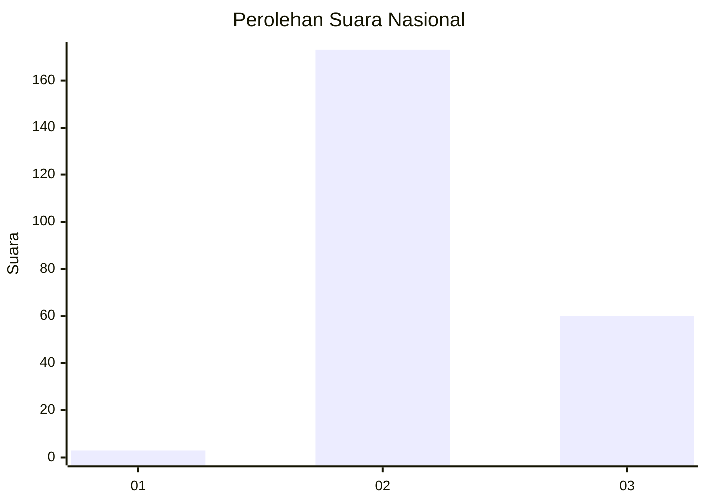
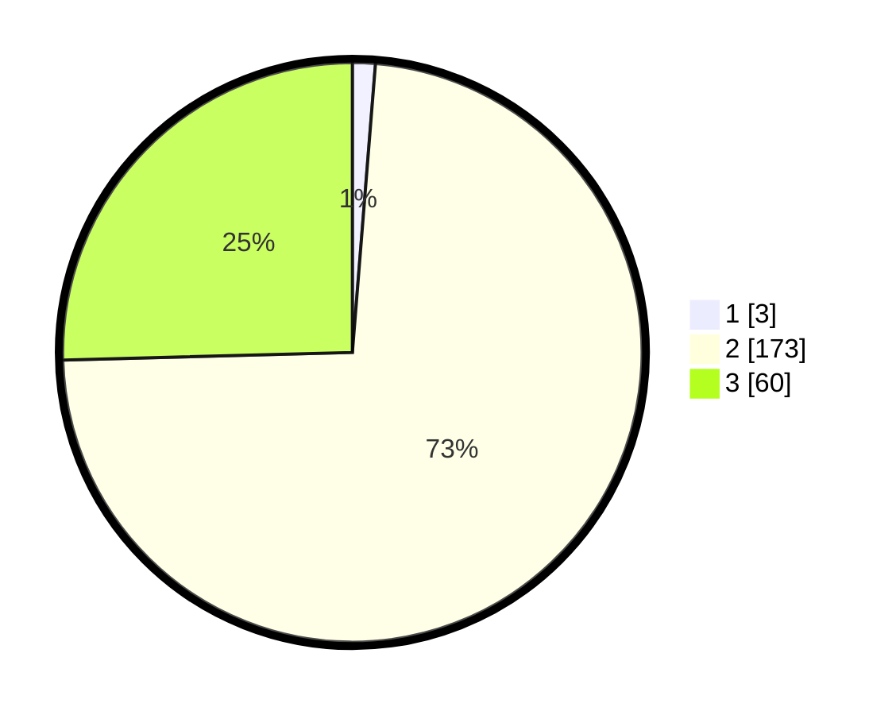

# Hasil

## Grafik

## Tabel

| No. | Nama Paslon    | Suara | Suara (raw) | Persentase |
|:--- |:-------------- | -----:| -----------:| ----------:|
| 1   | ANIES MUHAIMIN | 3     | [3][p-1]    | 1,27       |
| 2   | PRABOWO GIBRAN | 173   | [173][p-2]  | 73,31      |
| 3   | GANJAR MAHFUD  | 60    | [60][p-3]   | 25,42      |

[p-1]: https://github.com/gigit-pemilu/pemilu-2024/blob/main/pilpres/hitung-suara/sub/51-bali/sub/07-karangasem/sub/02-sidemen/sub/2002-talibeng/sub/008-tps/sub/paslon-1.txt
[p-2]: https://github.com/gigit-pemilu/pemilu-2024/blob/main/pilpres/hitung-suara/sub/51-bali/sub/07-karangasem/sub/02-sidemen/sub/2002-talibeng/sub/008-tps/sub/paslon-2.txt
[p-3]: https://github.com/gigit-pemilu/pemilu-2024/blob/main/pilpres/hitung-suara/sub/51-bali/sub/07-karangasem/sub/02-sidemen/sub/2002-talibeng/sub/008-tps/sub/paslon-3.txt

## Foto C Plano

https://sirekap-obj-formc.kpu.go.id/ac1c/pemilu/ppwp/51/07/02/20/02/5107022002008-20240224-121835--2fc486a8-c9f0-4ee1-b535-8d362eaa87fd.jpg

https://sirekap-obj-formc.kpu.go.id/ac1c/pemilu/ppwp/51/07/02/20/02/5107022002008-20240224-121851--a3044411-2285-4020-a1ca-cdfb3d1b042c.jpg

https://sirekap-obj-formc.kpu.go.id/ac1c/pemilu/ppwp/51/07/02/20/02/5107022002008-20240224-121918--54ec202d-2199-4c6d-950a-2d5985806ade.jpg

## Metadata

| Key        | Value               |
| ---------- | ------------------- |
| Time Stamp | 2024-02-24 22:31:28 |

