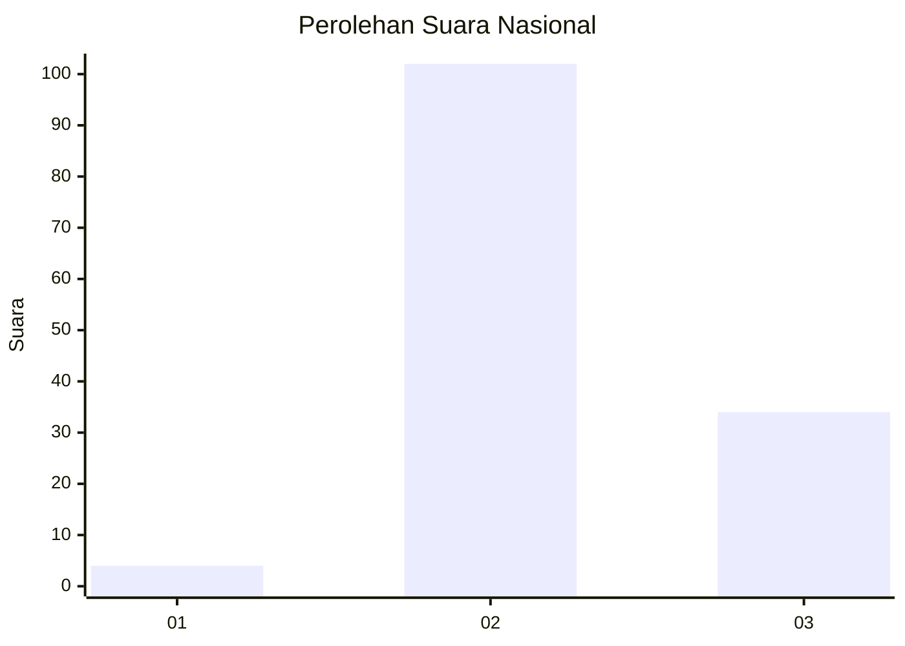
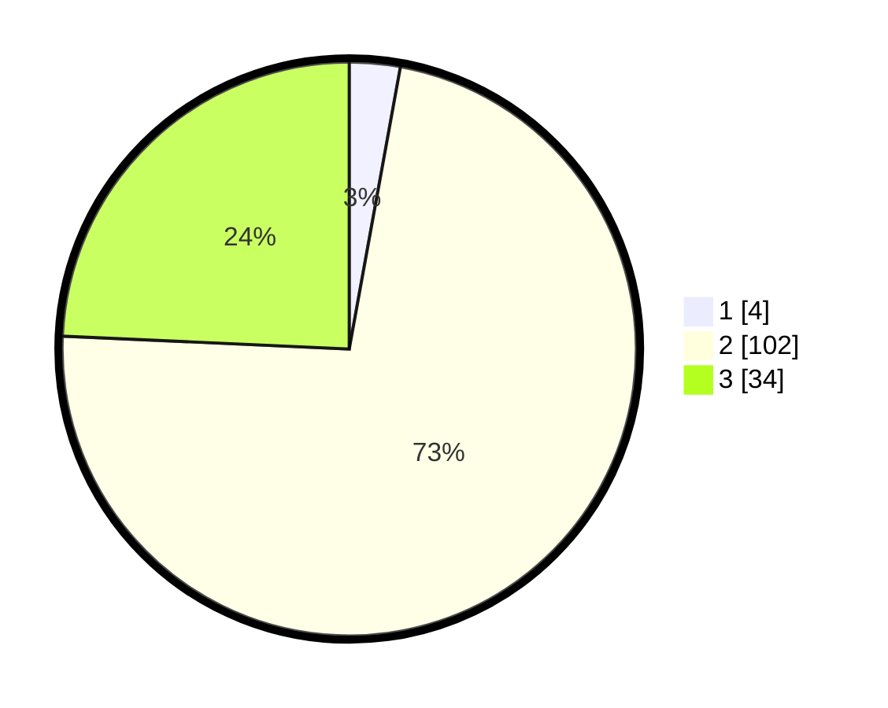

# Hasil

## Grafik

## Tabel

| No. | Nama Paslon    | Suara | Suara (raw) | Persentase |
|:--- |:-------------- | -----:| -----------:| ----------:|
| 1   | ANIES MUHAIMIN | 4     | [4][p-1]    | 2,86       |
| 2   | PRABOWO GIBRAN | 102   | [102][p-2]  | 72,86      |
| 3   | GANJAR MAHFUD  | 34    | [34][p-3]   | 24,29      |

[p-1]: https://github.com/gigit-pemilu/pemilu-2024/blob/main/pilpres/hitung-suara/sub/51-bali/sub/07-karangasem/sub/02-sidemen/sub/2002-talibeng/sub/013-tps/sub/paslon-1.txt
[p-2]: https://github.com/gigit-pemilu/pemilu-2024/blob/main/pilpres/hitung-suara/sub/51-bali/sub/07-karangasem/sub/02-sidemen/sub/2002-talibeng/sub/013-tps/sub/paslon-2.txt
[p-3]: https://github.com/gigit-pemilu/pemilu-2024/blob/main/pilpres/hitung-suara/sub/51-bali/sub/07-karangasem/sub/02-sidemen/sub/2002-talibeng/sub/013-tps/sub/paslon-3.txt

## Foto C Plano

https://sirekap-obj-formc.kpu.go.id/0f2e/pemilu/ppwp/51/07/02/20/02/5107022002013-20240214-230609--411acf6d-b051-43fd-a78e-641edebefdae.jpg

https://sirekap-obj-formc.kpu.go.id/0f2e/pemilu/ppwp/51/07/02/20/02/5107022002013-20240214-230515--d1d78a82-0e32-4af9-96c0-936d7415ec35.jpg

https://sirekap-obj-formc.kpu.go.id/0f2e/pemilu/ppwp/51/07/02/20/02/5107022002013-20240214-230357--a4aa1369-2808-4b6f-b5e1-db7b5bc0e009.jpg

## Metadata

| Key        | Value               |
| ---------- | ------------------- |
| Time Stamp | 2024-02-17 11:00:02 |

