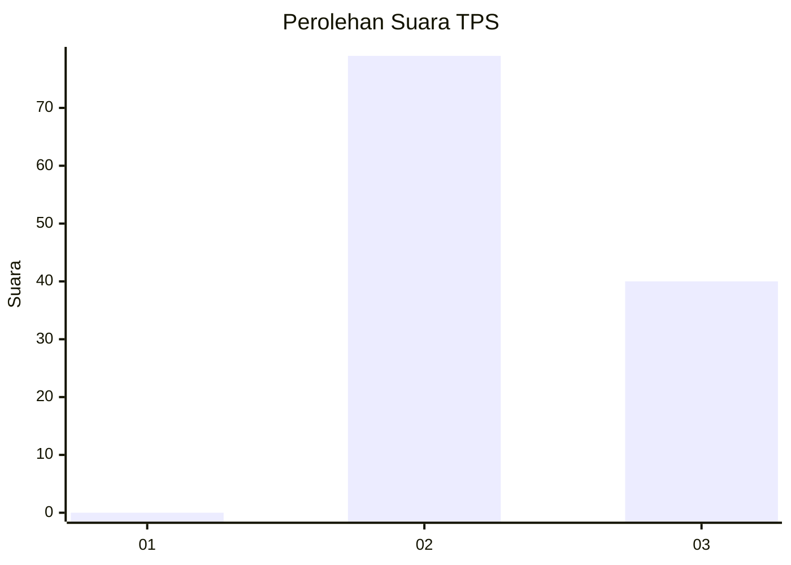
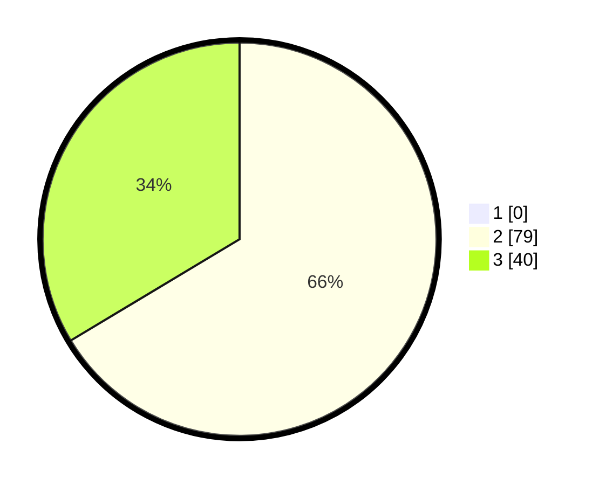

# Hasil

## Grafik

## Tabel

| No. | Nama Paslon    | Suara | Suara (raw) | Persentase |
|:--- |:-------------- | -----:| -----------:| ----------:|
| 1   | ANIES MUHAIMIN | 0     | [0][p-1]    | 0,00       |
| 2   | PRABOWO GIBRAN | 79    | [79][p-2]   | 66,39      |
| 3   | GANJAR MAHFUD  | 40    | [40][p-3]   | 33,61      |

[p-1]: https://github.com/gigit-pemilu/pemilu-2024-51-bali/blob/main/pilpres/hitung-suara/sub/51-bali/sub/07-karangasem/sub/02-sidemen/sub/2002-talibeng/sub/014-tps/sub/paslon-1.txt
[p-2]: https://github.com/gigit-pemilu/pemilu-2024-51-bali/blob/main/pilpres/hitung-suara/sub/51-bali/sub/07-karangasem/sub/02-sidemen/sub/2002-talibeng/sub/014-tps/sub/paslon-2.txt
[p-3]: https://github.com/gigit-pemilu/pemilu-2024-51-bali/blob/main/pilpres/hitung-suara/sub/51-bali/sub/07-karangasem/sub/02-sidemen/sub/2002-talibeng/sub/014-tps/sub/paslon-3.txt

## Foto C Plano

https://sirekap-obj-formc.kpu.go.id/b5ca/pemilu/ppwp/51/07/02/20/02/5107022002014-20240214-200914--d7bf833c-9326-4115-bc65-da432bcbd5f8.jpg

https://sirekap-obj-formc.kpu.go.id/b5ca/pemilu/ppwp/51/07/02/20/02/5107022002014-20240214-200908--40a6b82f-d5ec-4f00-9a96-5e845304145e.jpg

https://sirekap-obj-formc.kpu.go.id/b5ca/pemilu/ppwp/51/07/02/20/02/5107022002014-20240214-200857--f99bd4e4-6b6b-41ab-b3fc-6f87575a6792.jpg

## Metadata

| Key        | Value               |
| ---------- | ------------------- |
| Time Stamp | 2024-02-17 11:00:02 |

