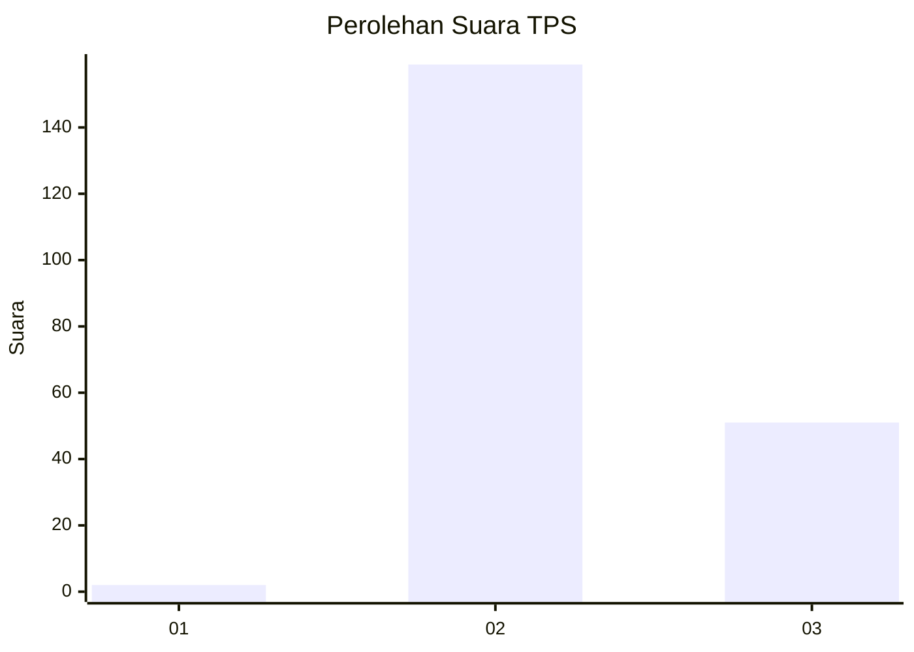
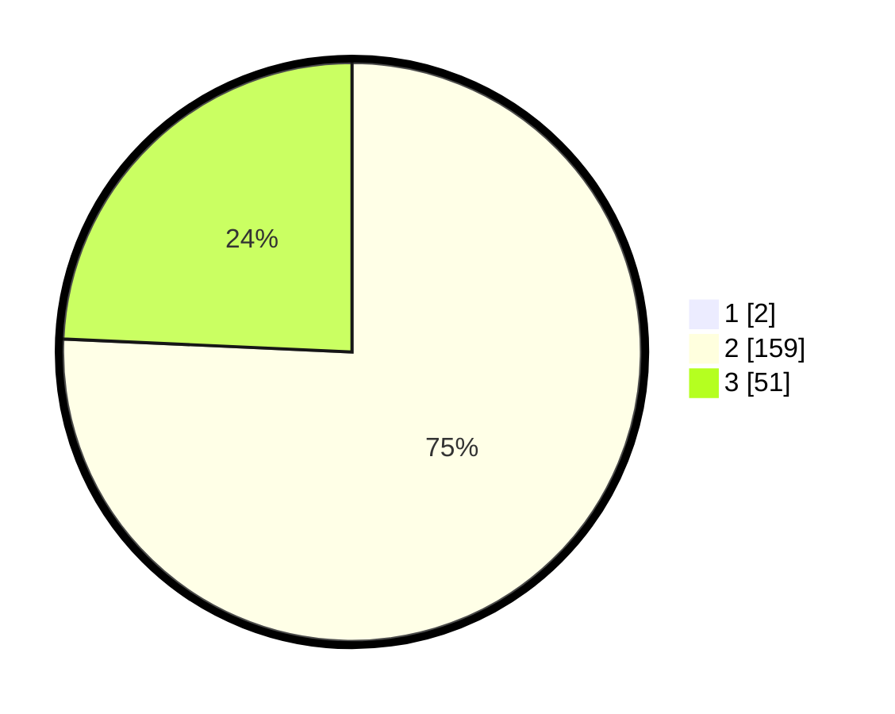

# Hasil

## Grafik

## Tabel

| No. | Nama Paslon    | Suara | Suara (raw) | Persentase |
|:--- |:-------------- | -----:| -----------:| ----------:|
| 1   | ANIES MUHAIMIN | 2     | [2][p-1]    | 0,94       |
| 2   | PRABOWO GIBRAN | 159   | [159][p-2]  | 75,00      |
| 3   | GANJAR MAHFUD  | 51    | [51][p-3]   | 24,06      |

[p-1]: https://github.com/gigit-pemilu/pemilu-2024-51-bali/blob/main/pilpres/hitung-suara/sub/51-bali/sub/07-karangasem/sub/02-sidemen/sub/2003-sidemen/sub/008-tps/sub/paslon-1.txt
[p-2]: https://github.com/gigit-pemilu/pemilu-2024-51-bali/blob/main/pilpres/hitung-suara/sub/51-bali/sub/07-karangasem/sub/02-sidemen/sub/2003-sidemen/sub/008-tps/sub/paslon-2.txt
[p-3]: https://github.com/gigit-pemilu/pemilu-2024-51-bali/blob/main/pilpres/hitung-suara/sub/51-bali/sub/07-karangasem/sub/02-sidemen/sub/2003-sidemen/sub/008-tps/sub/paslon-3.txt

## Foto C Plano

https://sirekap-obj-formc.kpu.go.id/74ab/pemilu/ppwp/51/07/02/20/03/5107022003008-20240215-024302--1f0d5328-4114-48b8-9268-fc5e04dc6bea.jpg

https://sirekap-obj-formc.kpu.go.id/74ab/pemilu/ppwp/51/07/02/20/03/5107022003008-20240215-024616--4330848c-eea0-4132-a851-bb1e1fdb44fc.jpg

https://sirekap-obj-formc.kpu.go.id/74ab/pemilu/ppwp/51/07/02/20/03/5107022003008-20240215-025142--9680c775-1282-4aac-9ce5-46957bd81b28.jpg

## Metadata

| Key        | Value               |
| ---------- | ------------------- |
| Time Stamp | 2024-02-19 06:16:00 |

