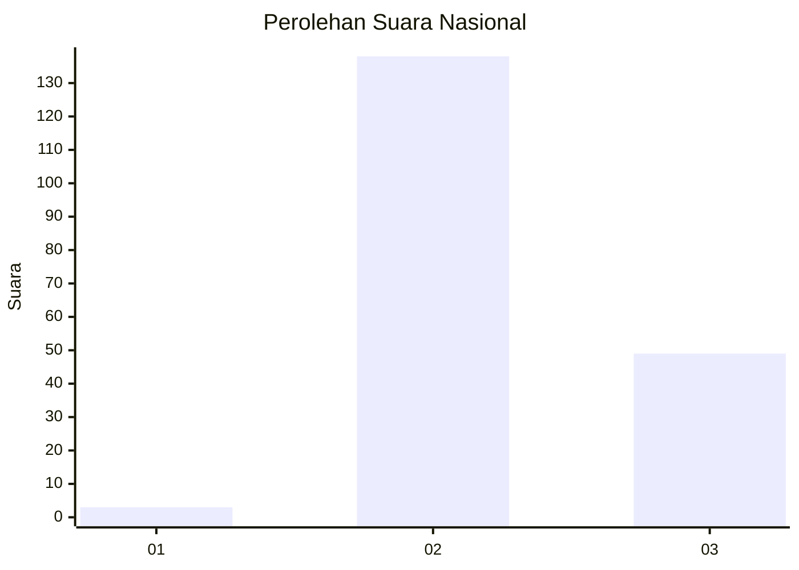
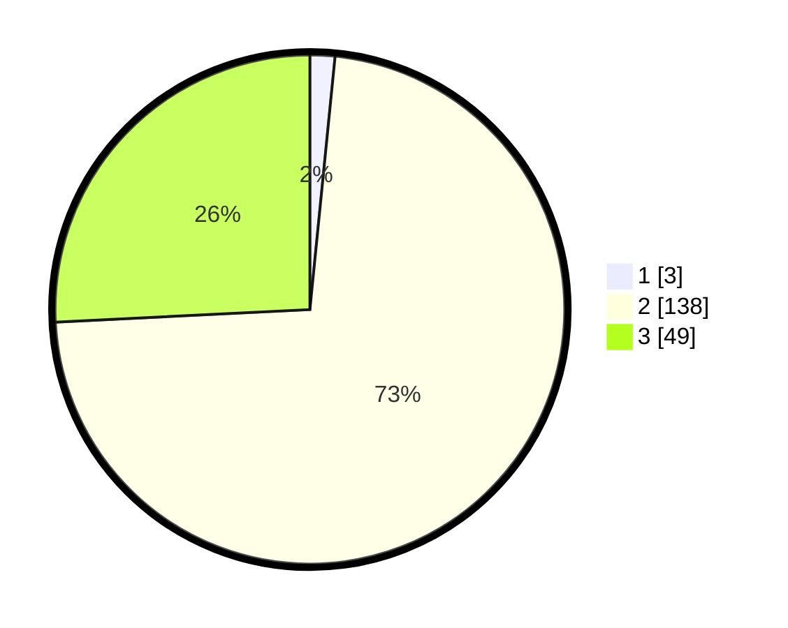

# Hasil

## Grafik

## Tabel

| No. | Nama Paslon    | Suara | Suara (raw) | Persentase |
|:--- |:-------------- | -----:| -----------:| ----------:|
| 1   | ANIES MUHAIMIN | 3     | [3][p-1]    | 1,58       |
| 2   | PRABOWO GIBRAN | 138   | [138][p-2]  | 72,63      |
| 3   | GANJAR MAHFUD  | 49    | [49][p-3]   | 25,79      |

[p-1]: https://github.com/gigit-pemilu/pemilu-2024/blob/main/pilpres/hitung-suara/sub/51-bali/sub/07-karangasem/sub/02-sidemen/sub/2004-sangkan-gunung/sub/006-tps/sub/paslon-1.txt
[p-2]: https://github.com/gigit-pemilu/pemilu-2024/blob/main/pilpres/hitung-suara/sub/51-bali/sub/07-karangasem/sub/02-sidemen/sub/2004-sangkan-gunung/sub/006-tps/sub/paslon-2.txt
[p-3]: https://github.com/gigit-pemilu/pemilu-2024/blob/main/pilpres/hitung-suara/sub/51-bali/sub/07-karangasem/sub/02-sidemen/sub/2004-sangkan-gunung/sub/006-tps/sub/paslon-3.txt

## Foto C Plano

https://sirekap-obj-formc.kpu.go.id/1fab/pemilu/ppwp/51/07/02/20/04/5107022004006-20240214-141052--cb5c06c4-86ef-40d3-b406-9e06b9df1807.jpg

https://sirekap-obj-formc.kpu.go.id/1fab/pemilu/ppwp/51/07/02/20/04/5107022004006-20240214-141120--a356c0df-c91e-4890-a562-6c9ba90dd02c.jpg

https://sirekap-obj-formc.kpu.go.id/1fab/pemilu/ppwp/51/07/02/20/04/5107022004006-20240215-014538--67b53864-427b-41d2-8913-4a5257c60ad8.jpg

## Metadata

| Key        | Value               |
| ---------- | ------------------- |
| Time Stamp | 2024-02-15 03:06:03 |

