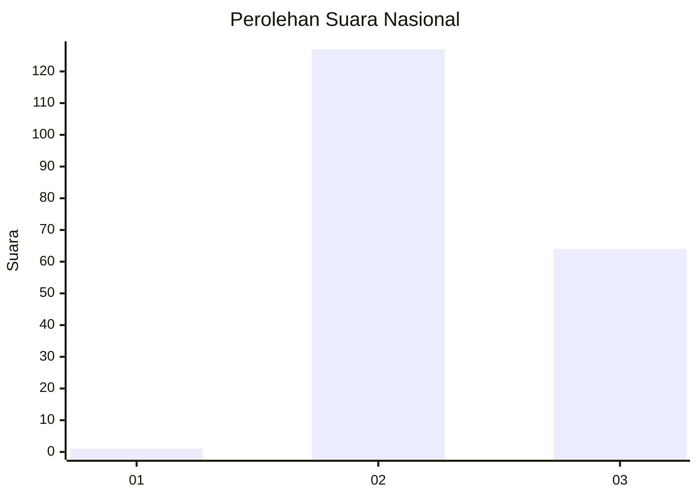
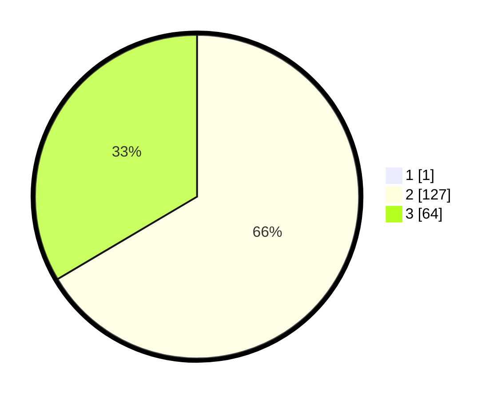

# Hasil

## Grafik

## Tabel

| No. | Nama Paslon    | Suara | Suara (raw) | Persentase |
|:--- |:-------------- | -----:| -----------:| ----------:|
| 1   | ANIES MUHAIMIN | 1     | [1][p-1]    | 0,52       |
| 2   | PRABOWO GIBRAN | 127   | [127][p-2]  | 66,15      |
| 3   | GANJAR MAHFUD  | 64    | [64][p-3]   | 33,33      |

[p-1]: https://github.com/gigit-pemilu/pemilu-2024/blob/main/pilpres/hitung-suara/sub/51-bali/sub/07-karangasem/sub/02-sidemen/sub/2004-sangkan-gunung/sub/007-tps/sub/paslon-1.txt
[p-2]: https://github.com/gigit-pemilu/pemilu-2024/blob/main/pilpres/hitung-suara/sub/51-bali/sub/07-karangasem/sub/02-sidemen/sub/2004-sangkan-gunung/sub/007-tps/sub/paslon-2.txt
[p-3]: https://github.com/gigit-pemilu/pemilu-2024/blob/main/pilpres/hitung-suara/sub/51-bali/sub/07-karangasem/sub/02-sidemen/sub/2004-sangkan-gunung/sub/007-tps/sub/paslon-3.txt

## Foto C Plano

https://sirekap-obj-formc.kpu.go.id/9eb8/pemilu/ppwp/51/07/02/20/04/5107022004007-20240214-212450--ca48ca7a-b4ab-4598-8fc9-9c56469e90b4.jpg

https://sirekap-obj-formc.kpu.go.id/9eb8/pemilu/ppwp/51/07/02/20/04/5107022004007-20240214-212513--516a939f-a9b7-4612-93f0-5081bfd877f0.jpg

https://sirekap-obj-formc.kpu.go.id/9eb8/pemilu/ppwp/51/07/02/20/04/5107022004007-20240214-212521--a6ded819-f210-424d-8cb7-ee5082a76a69.jpg

## Metadata

| Key        | Value               |
| ---------- | ------------------- |
| Time Stamp | 2024-02-15 15:00:29 |

