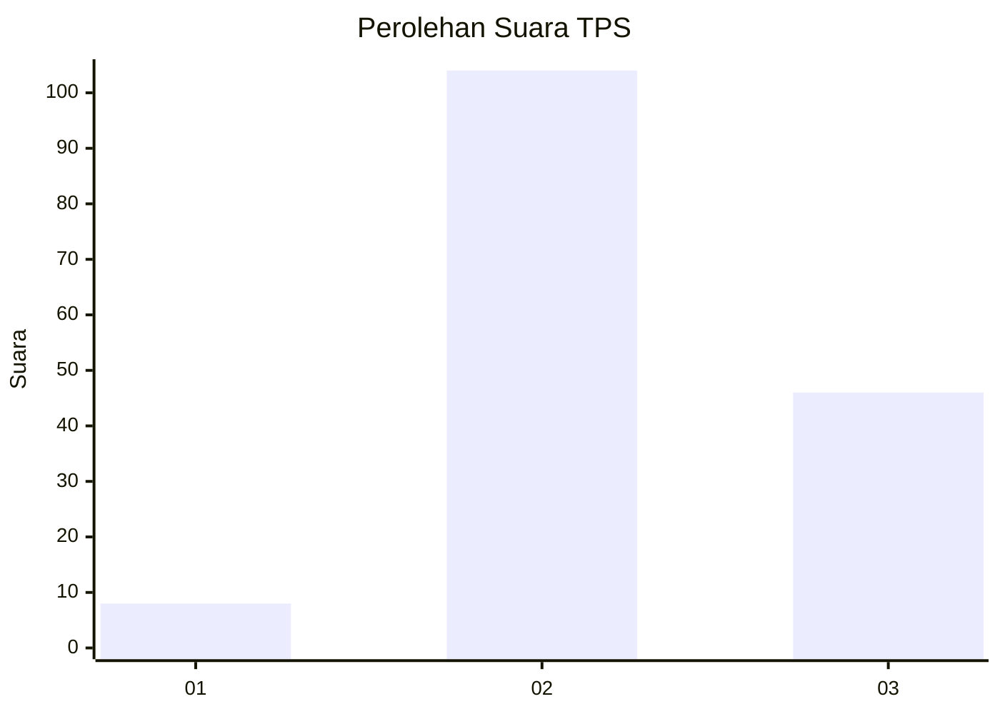

# Hasil

## Grafik

## Tabel

| No. | Nama Paslon    | Suara | Suara (raw) | Persentase |
|:--- |:-------------- | -----:| -----------:| ----------:|
| 1   | ANIES MUHAIMIN | 8     | [8][p-1]    | 5,06       |
| 2   | PRABOWO GIBRAN | 104   | [104][p-2]  | 65,82      |
| 3   | GANJAR MAHFUD  | 46    | [46][p-3]   | 29,11      |

[p-1]: https://github.com/gigit-pemilu/pemilu-2024-51-bali/blob/main/pilpres/hitung-suara/sub/51-bali/sub/07-karangasem/sub/02-sidemen/sub/2004-sangkan-gunung/sub/009-tps/sub/paslon-1.txt
[p-2]: https://github.com/gigit-pemilu/pemilu-2024-51-bali/blob/main/pilpres/hitung-suara/sub/51-bali/sub/07-karangasem/sub/02-sidemen/sub/2004-sangkan-gunung/sub/009-tps/sub/paslon-2.txt
[p-3]: https://github.com/gigit-pemilu/pemilu-2024-51-bali/blob/main/pilpres/hitung-suara/sub/51-bali/sub/07-karangasem/sub/02-sidemen/sub/2004-sangkan-gunung/sub/009-tps/sub/paslon-3.txt

## Foto C Plano

https://sirekap-obj-formc.kpu.go.id/f01e/pemilu/ppwp/51/07/02/20/04/5107022004009-20240214-211604--52e0a07b-02fb-4640-bed2-933c3dae4a06.jpg

https://sirekap-obj-formc.kpu.go.id/f01e/pemilu/ppwp/51/07/02/20/04/5107022004009-20240214-212834--0056644c-75f4-4d0d-acc5-48daf262800b.jpg

https://sirekap-obj-formc.kpu.go.id/f01e/pemilu/ppwp/51/07/02/20/04/5107022004009-20240214-213655--8a463cde-b1ed-4e0c-94bf-68e121f1c838.jpg

## Metadata

| Key        | Value               |
| ---------- | ------------------- |
| Time Stamp | 2024-02-17 16:00:02 |

## DATA PEMILIH TETAP

Jumlah pemilih dalam DPT: **263**.
 * L: **136**.
 * P: **127**.

## DATA PENGGUNA HAK PILIH

Jumlah pengguna hak pilih dalam DPT: **176**.
 * L: **90**.
 * P: **86**.

Jumlah pengguna hak pilih dalam DPTb: **0**.
 * L: **0**.
 * P: **0**.

Jumlah pengguna hak pilih dalam DPK: **0**.
 * L: **0**.
 * P: **0**.

Jumlah pengguna hak pilih: **176**.
 * L: **90**.
 * P: **86**.

## JUMLAH SUARA SAH DAN TIDAK SAH

JUMLAH SELURUH SUARA SAH: **158**.

JUMLAH SUARA TIDAK SAH: **18**.

JUMLAH SELURUH SUARA SAH DAN SUARA TIDAK SAH: **18**.

