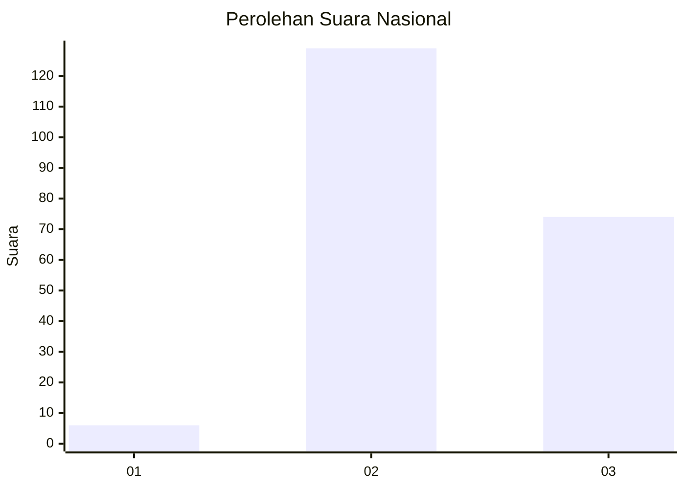
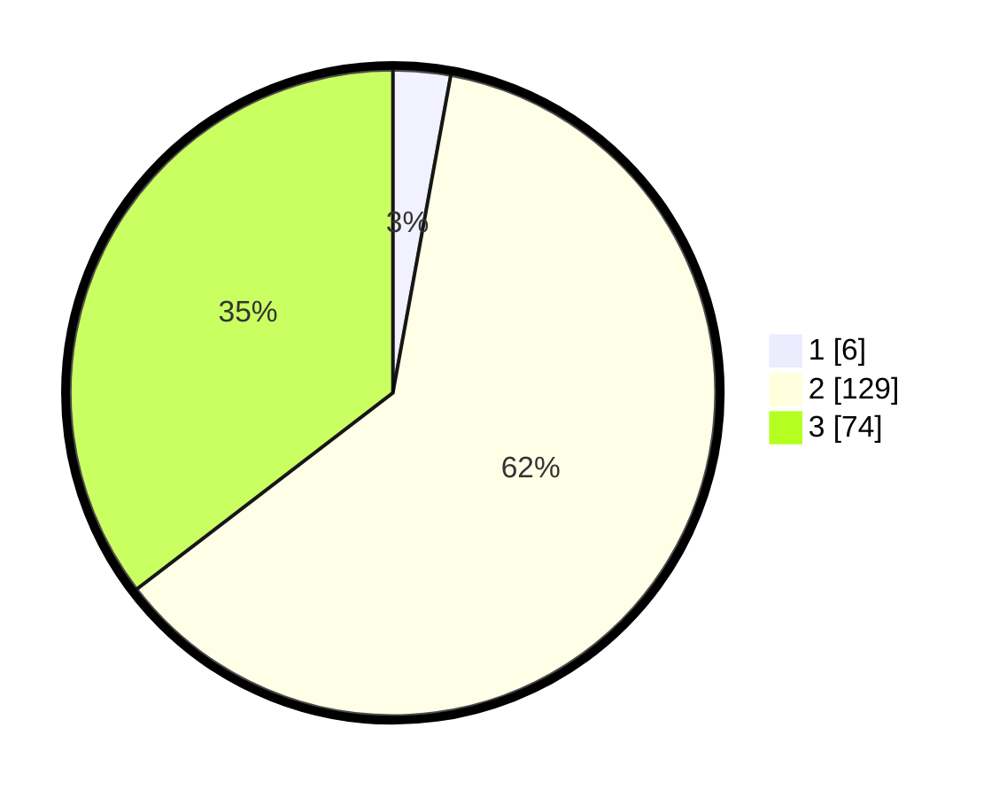

# Hasil

## Grafik

## Tabel

| No. | Nama Paslon    | Suara | Suara (raw) | Persentase |
|:--- |:-------------- | -----:| -----------:| ----------:|
| 1   | ANIES MUHAIMIN | 6     | [6][p-1]    | 2,87       |
| 2   | PRABOWO GIBRAN | 129   | [129][p-2]  | 61,72      |
| 3   | GANJAR MAHFUD  | 74    | [74][p-3]   | 35,41      |

[p-1]: https://github.com/gigit-pemilu/pemilu-2024/blob/main/pilpres/hitung-suara/sub/51-bali/sub/07-karangasem/sub/02-sidemen/sub/2004-sangkan-gunung/sub/017-tps/sub/paslon-1.txt
[p-2]: https://github.com/gigit-pemilu/pemilu-2024/blob/main/pilpres/hitung-suara/sub/51-bali/sub/07-karangasem/sub/02-sidemen/sub/2004-sangkan-gunung/sub/017-tps/sub/paslon-2.txt
[p-3]: https://github.com/gigit-pemilu/pemilu-2024/blob/main/pilpres/hitung-suara/sub/51-bali/sub/07-karangasem/sub/02-sidemen/sub/2004-sangkan-gunung/sub/017-tps/sub/paslon-3.txt

## Foto C Plano

https://sirekap-obj-formc.kpu.go.id/8f8f/pemilu/ppwp/51/07/02/20/04/5107022004017-20240215-185200--2d2fb722-569b-4f0f-bfd1-cf3c7a97d14b.jpg

https://sirekap-obj-formc.kpu.go.id/8f8f/pemilu/ppwp/51/07/02/20/04/5107022004017-20240214-200637--ba6d3b30-400b-4cfb-9c59-d57923dbbee2.jpg

https://sirekap-obj-formc.kpu.go.id/8f8f/pemilu/ppwp/51/07/02/20/04/5107022004017-20240215-185314--5e2be5af-1898-41cc-8fb8-2572837e2dcf.jpg

## Metadata

| Key        | Value               |
| ---------- | ------------------- |
| Time Stamp | 2024-02-16 11:00:29 |

