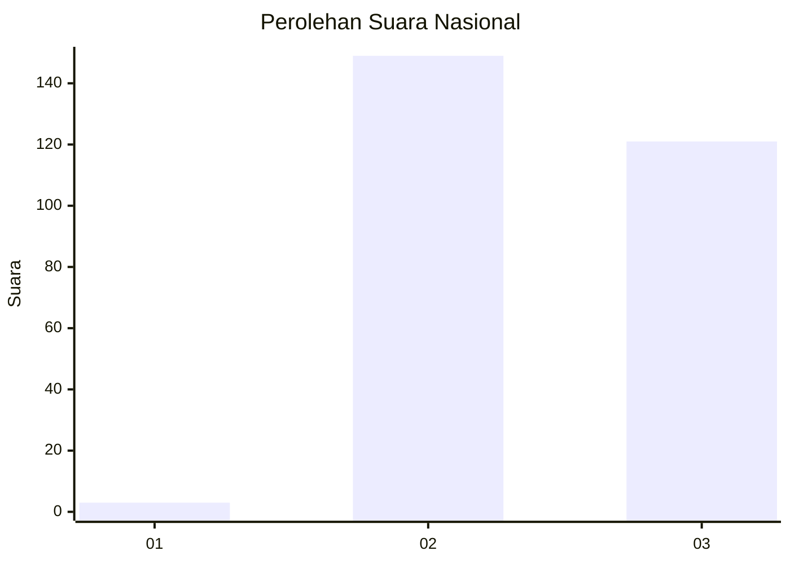
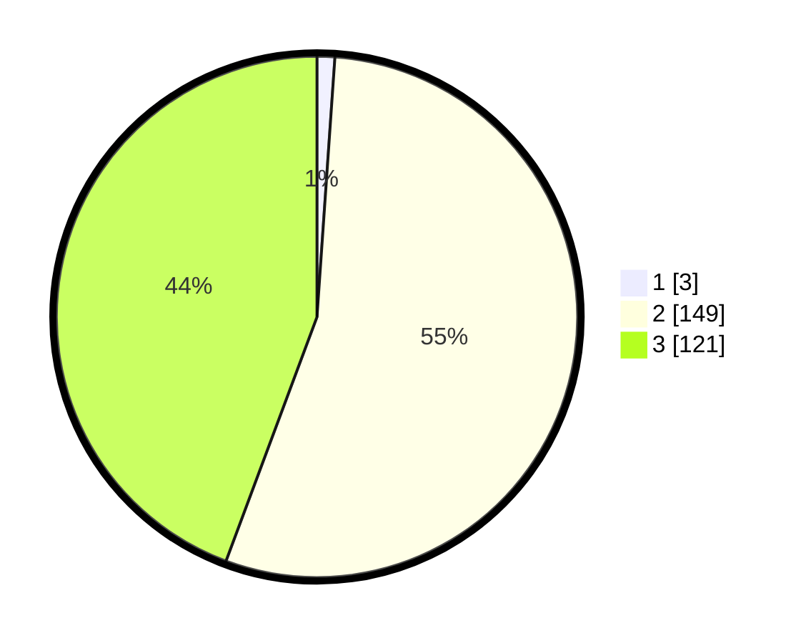

# Hasil

## Grafik

## Tabel

| No. | Nama Paslon    | Suara | Suara (raw) | Persentase |
|:--- |:-------------- | -----:| -----------:| ----------:|
| 1   | ANIES MUHAIMIN | 3     | [3][p-1]    | 1,10       |
| 2   | PRABOWO GIBRAN | 149   | [149][p-2]  | 54,58      |
| 3   | GANJAR MAHFUD  | 121   | [121][p-3]  | 44,32      |

[p-1]: https://github.com/gigit-pemilu/pemilu-2024/blob/main/pilpres/hitung-suara/sub/51-bali/sub/07-karangasem/sub/02-sidemen/sub/2004-sangkan-gunung/sub/019-tps/sub/paslon-1.txt
[p-2]: https://github.com/gigit-pemilu/pemilu-2024/blob/main/pilpres/hitung-suara/sub/51-bali/sub/07-karangasem/sub/02-sidemen/sub/2004-sangkan-gunung/sub/019-tps/sub/paslon-2.txt
[p-3]: https://github.com/gigit-pemilu/pemilu-2024/blob/main/pilpres/hitung-suara/sub/51-bali/sub/07-karangasem/sub/02-sidemen/sub/2004-sangkan-gunung/sub/019-tps/sub/paslon-3.txt

## Foto C Plano

https://sirekap-obj-formc.kpu.go.id/6288/pemilu/ppwp/51/07/02/20/04/5107022004019-20240214-230402--c6e847d9-d2fe-4550-9fbe-a514589d55a4.jpg

https://sirekap-obj-formc.kpu.go.id/6288/pemilu/ppwp/51/07/02/20/04/5107022004019-20240214-231821--e6af7fb6-7fb1-4138-bbcd-40f8f3b2c7c5.jpg

https://sirekap-obj-formc.kpu.go.id/6288/pemilu/ppwp/51/07/02/20/04/5107022004019-20240214-231848--fac9ecf4-0aae-4359-aa35-b586b9a1629e.jpg

## Metadata

| Key        | Value               |
| ---------- | ------------------- |
| Time Stamp | 2024-02-16 11:00:29 |

## DATA PEMILIH TETAP

Jumlah pemilih dalam DPT: **282**.
 * L: **137**.
 * P: **145**.

## DATA PENGGUNA HAK PILIH

Jumlah pengguna hak pilih dalam DPT: **269**.
 * L: **134**.
 * P: **135**.

Jumlah pengguna hak pilih dalam DPTb: **0**.
 * L: **0**.
 * P: **0**.

Jumlah pengguna hak pilih dalam DPK: **4**.
 * L: **4**.
 * P: **0**.

Jumlah pengguna hak pilih: **273**.
 * L: **138**.
 * P: **135**.

## JUMLAH SUARA SAH DAN TIDAK SAH

JUMLAH SELURUH SUARA SAH: **273**.

JUMLAH SUARA TIDAK SAH: **0**.

JUMLAH SELURUH SUARA SAH DAN SUARA TIDAK SAH: **273**.

