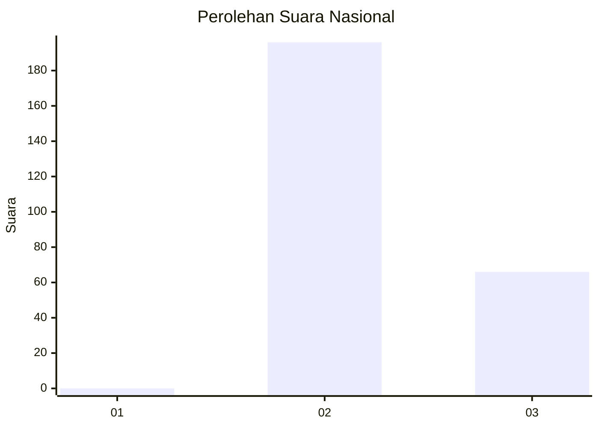
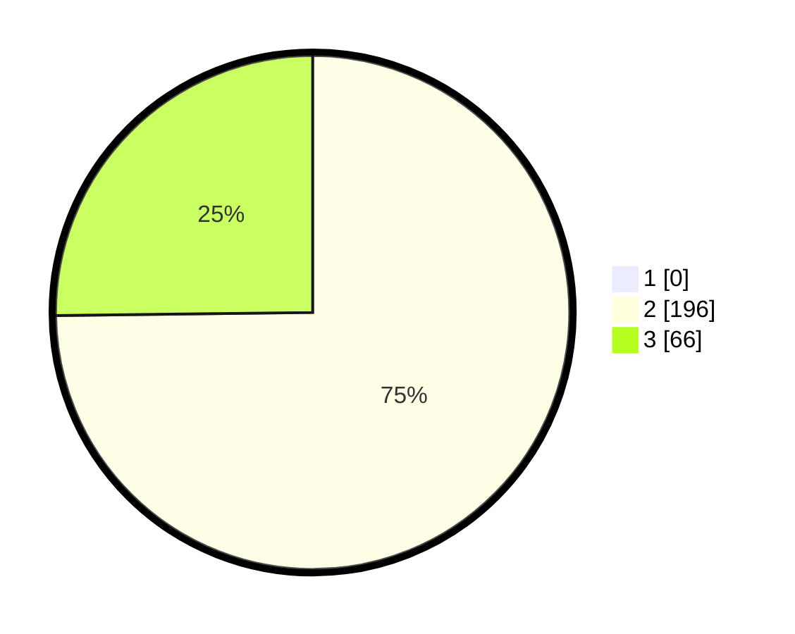

# Hasil

## Grafik

## Tabel

| No. | Nama Paslon    | Suara | Suara (raw) | Persentase |
|:--- |:-------------- | -----:| -----------:| ----------:|
| 1   | ANIES MUHAIMIN | 0     | [0][p-1]    | 0,00       |
| 2   | PRABOWO GIBRAN | 196   | [196][p-2]  | 74,81      |
| 3   | GANJAR MAHFUD  | 66    | [66][p-3]   | 25,19      |

[p-1]: https://github.com/gigit-pemilu/pemilu-2024/blob/main/pilpres/hitung-suara/sub/51-bali/sub/07-karangasem/sub/02-sidemen/sub/2004-sangkan-gunung/sub/020-tps/sub/paslon-1.txt
[p-2]: https://github.com/gigit-pemilu/pemilu-2024/blob/main/pilpres/hitung-suara/sub/51-bali/sub/07-karangasem/sub/02-sidemen/sub/2004-sangkan-gunung/sub/020-tps/sub/paslon-2.txt
[p-3]: https://github.com/gigit-pemilu/pemilu-2024/blob/main/pilpres/hitung-suara/sub/51-bali/sub/07-karangasem/sub/02-sidemen/sub/2004-sangkan-gunung/sub/020-tps/sub/paslon-3.txt

## Foto C Plano

https://sirekap-obj-formc.kpu.go.id/9e26/pemilu/ppwp/51/07/02/20/04/5107022004020-20240215-001018--86cbc3b9-1743-434b-80b0-d0973554eec3.jpg

https://sirekap-obj-formc.kpu.go.id/9e26/pemilu/ppwp/51/07/02/20/04/5107022004020-20240215-001147--d4a999a4-ecc5-4b64-b16e-1bab5fab47a1.jpg

https://sirekap-obj-formc.kpu.go.id/9e26/pemilu/ppwp/51/07/02/20/04/5107022004020-20240215-020100--fe21bebd-3870-4627-a26c-d249d0b4e69c.jpg

## Metadata

| Key        | Value               |
| ---------- | ------------------- |
| Time Stamp | 2024-02-17 11:00:02 |

