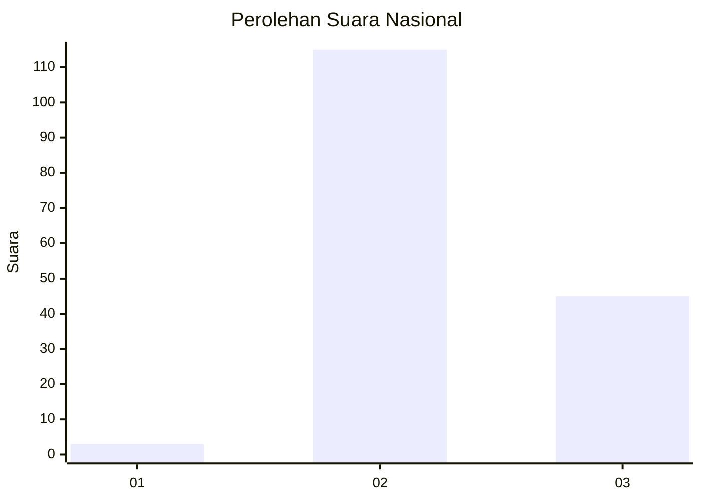
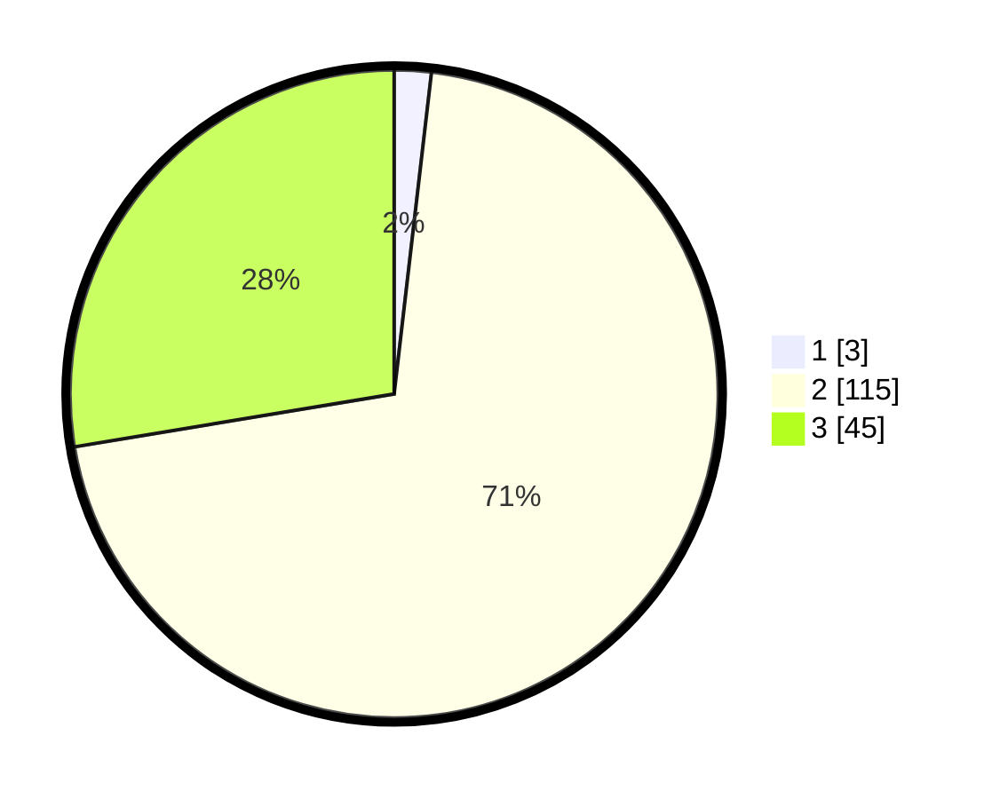

# Hasil

## Grafik

## Tabel

| No. | Nama Paslon    | Suara | Suara (raw) | Persentase |
|:--- |:-------------- | -----:| -----------:| ----------:|
| 1   | ANIES MUHAIMIN | 3     | [3][p-1]    | 1,84       |
| 2   | PRABOWO GIBRAN | 115   | [115][p-2]  | 70,55      |
| 3   | GANJAR MAHFUD  | 45    | [45][p-3]   | 27,61      |

[p-1]: https://github.com/gigit-pemilu/pemilu-2024/blob/main/pilpres/hitung-suara/sub/51-bali/sub/07-karangasem/sub/02-sidemen/sub/2004-sangkan-gunung/sub/021-tps/sub/paslon-1.txt
[p-2]: https://github.com/gigit-pemilu/pemilu-2024/blob/main/pilpres/hitung-suara/sub/51-bali/sub/07-karangasem/sub/02-sidemen/sub/2004-sangkan-gunung/sub/021-tps/sub/paslon-2.txt
[p-3]: https://github.com/gigit-pemilu/pemilu-2024/blob/main/pilpres/hitung-suara/sub/51-bali/sub/07-karangasem/sub/02-sidemen/sub/2004-sangkan-gunung/sub/021-tps/sub/paslon-3.txt

## Foto C Plano

https://sirekap-obj-formc.kpu.go.id/ed15/pemilu/ppwp/51/07/02/20/04/5107022004021-20240214-131438--16e87fff-dc73-4cda-9c9f-ba330291d664.jpg

https://sirekap-obj-formc.kpu.go.id/ed15/pemilu/ppwp/51/07/02/20/04/5107022004021-20240214-132322--1bc017b9-9bc7-4b75-8637-eb00e27228d4.jpg

https://sirekap-obj-formc.kpu.go.id/ed15/pemilu/ppwp/51/07/02/20/04/5107022004021-20240214-132422--5f9977c5-5cb1-40f8-91fb-3798ec713a04.jpg

## Metadata

| Key        | Value               |
| ---------- | ------------------- |
| Time Stamp | 2024-02-17 11:00:02 |

## DATA PEMILIH TETAP

Jumlah pemilih dalam DPT: **224**.
 * L: **111**.
 * P: **113**.

## DATA PENGGUNA HAK PILIH

Jumlah pengguna hak pilih dalam DPT: **175**.
 * L: **89**.
 * P: **86**.

Jumlah pengguna hak pilih dalam DPTb: **0**.
 * L: **0**.
 * P: **0**.

Jumlah pengguna hak pilih dalam DPK: **3**.
 * L: **3**.
 * P: **0**.

Jumlah pengguna hak pilih: **178**.
 * L: **92**.
 * P: **86**.

## JUMLAH SUARA SAH DAN TIDAK SAH

JUMLAH SELURUH SUARA SAH: **163**.

JUMLAH SUARA TIDAK SAH: **15**.

JUMLAH SELURUH SUARA SAH DAN SUARA TIDAK SAH: **178**.

