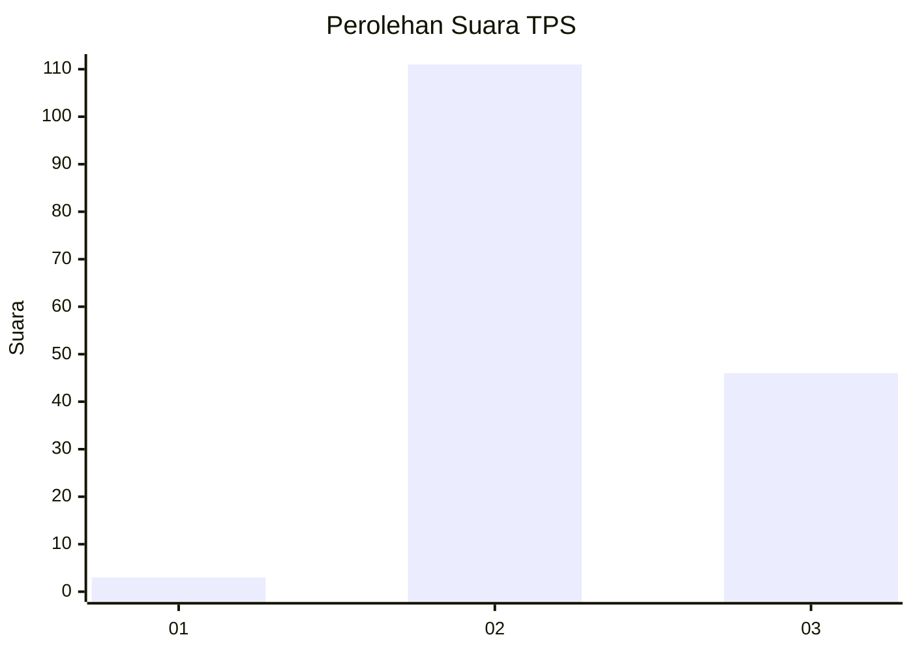

# Hasil

## Grafik

## Tabel

| No. | Nama Paslon    | Suara | Suara (raw) | Persentase |
|:--- |:-------------- | -----:| -----------:| ----------:|
| 1   | ANIES MUHAIMIN | 3     | [3][p-1]    | 1,88       |
| 2   | PRABOWO GIBRAN | 111   | [111][p-2]  | 69,38      |
| 3   | GANJAR MAHFUD  | 46    | [46][p-3]   | 28,75      |

[p-1]: https://github.com/gigit-pemilu/pemilu-2024-51-bali/blob/main/pilpres/hitung-suara/sub/51-bali/sub/07-karangasem/sub/02-sidemen/sub/2004-sangkan-gunung/sub/024-tps/sub/paslon-1.txt
[p-2]: https://github.com/gigit-pemilu/pemilu-2024-51-bali/blob/main/pilpres/hitung-suara/sub/51-bali/sub/07-karangasem/sub/02-sidemen/sub/2004-sangkan-gunung/sub/024-tps/sub/paslon-2.txt
[p-3]: https://github.com/gigit-pemilu/pemilu-2024-51-bali/blob/main/pilpres/hitung-suara/sub/51-bali/sub/07-karangasem/sub/02-sidemen/sub/2004-sangkan-gunung/sub/024-tps/sub/paslon-3.txt

## Foto C Plano

https://sirekap-obj-formc.kpu.go.id/a468/pemilu/ppwp/51/07/02/20/04/5107022004024-20240215-014852--db876901-63f3-4071-95e7-c3f45a2518ff.jpg

https://sirekap-obj-formc.kpu.go.id/a468/pemilu/ppwp/51/07/02/20/04/5107022004024-20240215-014855--5033c773-47fa-4e2b-a347-c9c41804c7bc.jpg

https://sirekap-obj-formc.kpu.go.id/a468/pemilu/ppwp/51/07/02/20/04/5107022004024-20240215-014919--a56b2999-bffe-4d22-8064-13c63565f32e.jpg

## Metadata

| Key        | Value               |
| ---------- | ------------------- |
| Time Stamp | 2024-02-17 11:30:03 |

