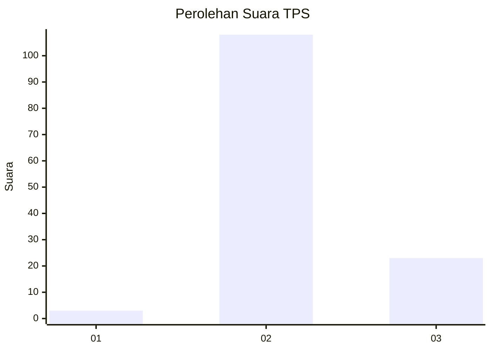

# Hasil

## Grafik

## Tabel

| No. | Nama Paslon    | Suara | Suara (raw) | Persentase |
|:--- |:-------------- | -----:| -----------:| ----------:|
| 1   | ANIES MUHAIMIN | 3     | [3][p-1]    | 2,24       |
| 2   | PRABOWO GIBRAN | 108   | [108][p-2]  | 80,60      |
| 3   | GANJAR MAHFUD  | 23    | [23][p-3]   | 17,16      |

[p-1]: https://github.com/gigit-pemilu/pemilu-2024-51-bali/blob/main/pilpres/hitung-suara/sub/51-bali/sub/07-karangasem/sub/02-sidemen/sub/2005-telagatawang/sub/001-tps/sub/paslon-1.txt
[p-2]: https://github.com/gigit-pemilu/pemilu-2024-51-bali/blob/main/pilpres/hitung-suara/sub/51-bali/sub/07-karangasem/sub/02-sidemen/sub/2005-telagatawang/sub/001-tps/sub/paslon-2.txt
[p-3]: https://github.com/gigit-pemilu/pemilu-2024-51-bali/blob/main/pilpres/hitung-suara/sub/51-bali/sub/07-karangasem/sub/02-sidemen/sub/2005-telagatawang/sub/001-tps/sub/paslon-3.txt

## Foto C Plano

https://sirekap-obj-formc.kpu.go.id/9bd0/pemilu/ppwp/51/07/02/20/05/5107022005001-20240215-004042--ab70a9f2-31ae-4723-997c-38f56a3c2ffe.jpg

https://sirekap-obj-formc.kpu.go.id/9bd0/pemilu/ppwp/51/07/02/20/05/5107022005001-20240215-004158--48abfc24-21e5-428c-81a4-4fa90213998c.jpg

https://sirekap-obj-formc.kpu.go.id/9bd0/pemilu/ppwp/51/07/02/20/05/5107022005001-20240215-004242--8cdc8ce1-77d0-4fd5-9969-f4014a4e220a.jpg

## Metadata

| Key        | Value               |
| ---------- | ------------------- |
| Time Stamp | 2024-02-17 11:30:03 |

